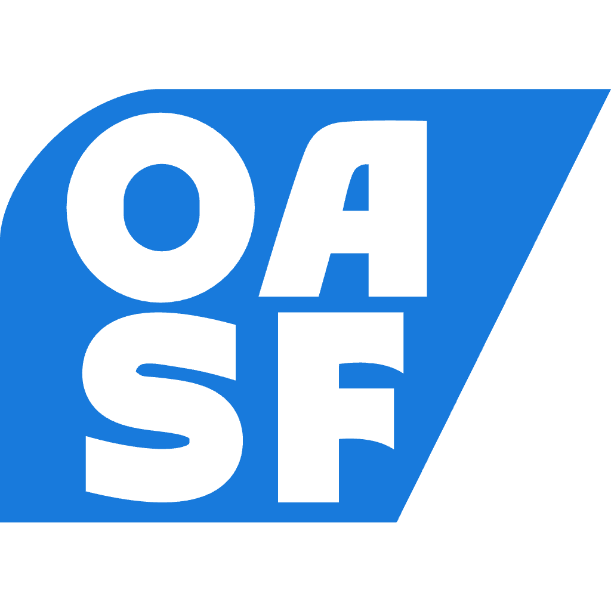
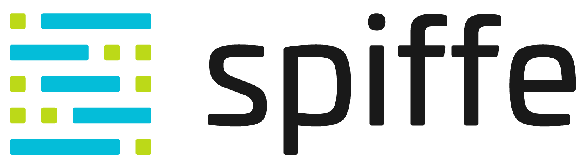

# openEAGO - Enterprise Multi-Agent Communication & Orchestration Protocol

<p align="center">
  <br />
  <a href="https://finos-labs.github.io/open-eago/">
    
  </a>
  <br />
</p>

---

<div align="center" style="display: flex; gap: 10px; justify-content: center;">
  
  
  
  
</div>

---

**Enterprise Multi-Agent Communication & Orchestration Protocol (openEAGO)** is an open standard for secure, scalable, and compliant communication and orchestration among AI agents in enterprise environments.

- Authors: Jan Rock (<jan.rock@citi.com>), Denis Urusov (<denis.urusov@citi.com>), Paul Groves (<paul.groves@citi.com>)
- Date: 18/02/2026 - Version: 0.1

## Overview

openEAGO addresses the critical gap in enterprise AI infrastructure by providing a universal standard for AI agent interoperability that operates within regulatory boundaries and enterprise security requirements.

The protocol enables:

- **Framework-Agnostic Integration** - Support for LangChain, LangGraph, custom agents, and legacy system wrappers
- **Enterprise-Grade Security** - Built-in authentication (OAuth2, SAML, mTLS), authorization (RBAC/ABAC), and encryption
- **Regulatory Compliance** - Native support for GDPR, HIPAA, PCI-DSS, CCPA, and financial services regulations
- **Resilient Orchestration** - Multi-agent workflow coordination with circuit breakers, fallback routing, and compensating transactions
- **AI Governance** - Human-in-the-loop controls, explainability, and bias monitoring aligned with EU AI Act and NIST AI RMF
- **Arbitrary Complex Orchestration** - Support for complex workflows involving multiple agents, tasks, and dependencies
- **Cross-Border Data Governance** - Automated compliance with data sovereignty and localization requirements
- **Agent Farms** - Dynamic agent discovery, registration (with mTLS), bi-directional communication, and reliability scoring

## Protocol Architecture

openEAGO orchestrates multi-agent workflows through a comprehensive protocol architecture:

**Client Interface:**

- **Request** - Client applications (API, CLI, SDK) submit business requests to work contracts

**Protocol:**

- **Contract** - The contract validates inputs, establishes terms, and manages agent capabilities.
- **Planning** - The system discovers optimal agents, determines the execution pattern, and creates a comprehensive execution plan.
- **Negotiation** - Plan validation with required Authorization, SLA/SLO, Cross-border Data Clearance, KYC Check, AML Check, Policy Compliance, Credit Risk etc.
- **Execution** - The orchestrator runs tasks according to the plan, managing dependencies and context propagation.
- **Context** - Agents' progress and states are captured and maintained across session, conversation, and agent layers.
- **Communication** - Agents communicate using standardized protocols, ensuring interoperability and context sharing.

## Prerequisites

In the openEAGO framework, **Agent Identity** serves as a **core building block** for ensuring secure and reliable communication between AI agents. The identity management system, in conjunction with the **Agent Registry**, establishes a robust foundation for trust and security. By leveraging advanced mechanisms such as mutual TLS (mTLS), certificate-based authentication, and continuous monitoring, the framework ensures that only verified agents can participate in the ecosystem.

The **Agent Registry** acts as a centralized service discovery and capability management hub, enabling seamless integration and orchestration of AI agents. Together, the identity and registry components form a secure and scalable infrastructure that prevents unauthorized access, ensures compliance with regulatory requirements, and fosters trust in multi-agent interactions.

## Documentation

### Getting Started

- [Documentation Index](docs/README.md) - Protocol introduction and navigation
- [Overview](docs/overview/overview.md) - Comprehensive protocol overview
- [Architecture](docs/overview/architecture.md) - High-level architecture overview
- [Security Considerations](docs/overview/security.md) - Security architecture and requirements

### Core Specification

- [Contract Capability](docs/capabilities/01_contract/contract.md) - Contract negotiation and management
- [Planning Capability](docs/capabilities/02_planning/planning.md) - Execution planning and optimization  
- [Validation Capability](docs/capabilities/03_validation/validation.md) - Validation and compliance checking
- [Execution Capability](docs/capabilities/04_execution/execution.md) - Task execution and orchestration
- [Context Capability](docs/capabilities/05_context/context.md) - Context management and sharing
- [Communication Capability](docs/capabilities/06_communication/communication.md) - Agent communication protocols

### Advanced Topics

- [openEAGO Proposal](docs/overview/openEAGO_proposal.md) - Detailed proposal with distinctive features
- [Identity Management](docs/overview/identity.md) - Agent identity and trust establishment

## Why openEAGO

openEAGO addresses the critical gap in enterprise AI infrastructure by providing a universal communication standard that preserves framework choice while enabling seamless integration across regulatory boundaries. As organizations scale their AI deployments beyond single agents to complex multi-agent systems, openEAGO provides the foundation for secure, observable, and compliant agent ecosystems that operate within the constraints of global data protection and privacy regulations.

The protocol's design prioritizes real-world enterprise requirements—regulatory compliance, data sovereignty, cross-border governance, security, and operational resilience—while maintaining the flexibility needed to support diverse implementation approaches and evolving AI technologies. By incorporating data localization, consent management, and automated compliance validation into its core architecture, openEAGO enables organizations to deploy AI agents globally while meeting local regulatory requirements.

By adopting openEAGO, organizations can build agent networks that transcend departmental, vendor, and jurisdictional boundaries while maintaining strict compliance with data protection regulations.

## Philosophy

openEAGO is built on the principles of transparency, collaboration, and user empowerment. We believe in creating an open ecosystem where AI agents can interact seamlessly while respecting user privacy and data sovereignty. Our approach emphasizes the importance of regulatory compliance and ethical considerations in AI development and deployment.

**Our goal is to create an enterprise-grade protocol for AI agent interoperability that fosters innovation while ensuring security and regulatory compliance, building upon existing open source projects and industry standards.**

## Linked Projects

<table align="center">
  <tr>
    <td align="center">
      <a href="https://agntcy.org/">
        
      </a>
    </td>
    <td style="width: 36px;"></td>
    <td align="center">
      <a href="https://schema.oasf.outshift.com/">
        
      </a>
    </td>
    <td style="width: 36px;"></td>
    <td align="center">
      <a href="https://spiffe.io/">
        
      </a>
    </td>
  </tr>
</table>

## Roadmap

See [ROADMAP.md](ROADMAP.md) for the detailed development roadmap.

## Contributing

**All commits** must be signed with a DCO signature to avoid being flagged by the DCO Bot. This means that your commit log message must contain a line that looks like the following one, with your actual name and email address:

```sh
Signed-off-by: John Doe <john.doe@example.com>
```

See [CONTRIBUTING.md](CONTRIBUTING.md) for detailed contribution guidelines.

**Community Resources:**

- [Git Tools - Signing Your Work](https://git-scm.com/book/en/v2/Git-Tools-Signing-Your-Work)
- [GitHub - Signing Commits](https://docs.github.com/en/github/authenticating-to-github/signing-commits)

## License & Legal

- **Copyright** 2025 FINOS
- **License** [Apache License, Version 2.0](http://www.apache.org/licenses/LICENSE-2.0)
- **SPDX-License-Identifier** [Apache-2.0](https://spdx.org/licenses/Apache-2.0)

## Contact

- **Project Team** - <jan.rock@citi.com> / <rock@linux.com>
- **FINOS** - [finos.org](https://www.finos.org/)
- **GitHub** - [github.com/finos-labs/open-eago](https://github.com/finos-labs/open-eago)
