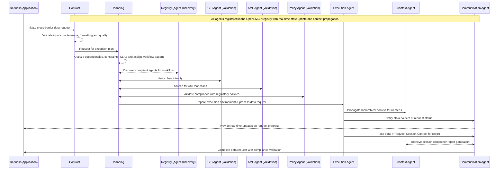

# OpenEMCP - Architecture

## Overview

The OpenEMCP (Open Enterprise Multi-Agent Communication Protocol) implements a six-phase logical architecture that enables secure, scalable, and compliant multi-agent collaboration across enterprise environments. This architecture presents the logical view of the system architecture, focusing on component responsibilities, data flow, and integration patterns.

## External Interface (Request)

### Client Interface Layer (External to Protocol)

**Purpose**: Entry point for external applications and services to initiate multi-agent workflows

**Components**:

- **Enterprise Applications**: Core business systems (CRM, ERP, Banking)
- **Business Systems**: Departmental applications and specialized tools
- **User Interfaces**: Web portals, mobile apps for employees and customers
- **APIs & SDKs**: Programmatic access interfaces
- **Command Line Interfaces (CLI)**: Administrative and operational tools
- **Service Mesh**: Inter-service communication layer

**Responsibilities**:

- Submit contract requests with business requirements
- Authenticate using enterprise credentials (OAuth2, SAML, mTLS)
- Define workflow objectives and deliverables
- Specify execution constraints (cost, duration, compliance)
- Identify key performance indicators (KPIs) for success
- Receive status updates and final results
- Handle error responses and exceptions
- Manage user notifications and alerts
- Maintain audit trails and compliance logs
- Ensure data privacy and protection measures are in place
- Implement rate limiting and throttling
- Support multi-tenancy and data isolation
- Enable cross-organizational collaboration

## Six-Phases of the Protocol

### Phase 1: Contract Management

**Purpose**: Gateway for validating and processing incoming workflow requests

**Components**:

- **Contract Receiver**: Initial request processing and parsing
- **Contract Validator**: Comprehensive validation and feasibility checking
- **Security Validator**: Authentication and authorization verification

Contract agent is using Generator > Evaluator > Optimizer Pattern.

**Logical Flow**:

```text
Request → Parse & Validate → Security & Compliance → Task Detection → OASF Enrichment → Route to Planner
```

**Responsibilities**:

- Accept any input format (structured JSON, API calls, or natural language)
- Parse business requirements and extract workflow tasks
- Review security context and compliance requirements
- Detect task type and determine workflow patterns
- Enrich to OASF-compliant contracts
- Route enriched contracts to planning phase

### Phase 2: Planning & Negotiation

**Purpose**: Intelligent workflow orchestration and agent selection

**Components**:

- **Agent Registry**: Central catalog of available agents and capabilities
- **Dynamic Discovery**: Intelligent agent selection algorithm
- **Execution Planner**: Workflow optimization and task sequencing
- **Constraint Engine**: Regulatory and resource constraint enforcement
- **Task Assigner**: Agent-to-task mapping with fallback options

**Logical Flow**:

```text
Contract → Capability Discovery → Agent Selection → Execution Planning → Constraint Application → Task Assignment
```

**Key Algorithms**:

- **Discovery Algorithm**: Capability → Compliance → Residency → Performance ranking
- **Planning Strategy**: Sequential, Parallel, or Mixed execution patterns
- **Assignment Logic**: Primary agent + fallback options with load balancing

### Phase 3: Validation (Evaluation)

**Purpose**: Human-in-the-loop or automated review checkpoint

**Components**:

- **Plan Reviewer**: Execution plan validation and approval
- **Risk Assessor**: Sensitivity and compliance risk evaluation
- **Policy Engine**: Business rule and regulatory policy checking

**Review Criteria**:

- Cost estimates vs. budget constraints
- Compliance validation completeness
- Risk assessment for sensitive data handling
- SLA feasibility analysis

**Decision Outcomes**:

- **Approved**: Proceed to execution
- **Rejected**: Return to planning with feedback
- **Modified**: Apply additional constraints and re-plan

### Phase 4: Execution

**Purpose**: Orchestrated workflow execution across agent ecosystem

**Components**:

- **Workflow Orchestrator**: Multi-agent task coordination
- **Resilience Manager**: Failure handling and recovery
- **Agent Ecosystem**: Framework-agnostic agent implementations
- **Completion Handler**: Result validation and contract fulfillment

**Execution Patterns**:

- **Sequential**: Tasks execute in dependency order
- **Parallel**: Independent tasks run concurrently
- **Mixed**: Combination of sequential stages with parallel task groups

**Sub-Components**:

- **Result Validator**: Output schema and quality validation
- **Contract Fulfillment**: Final deliverable packaging
- **Recovery Handler**: Failure scenario management

### Phase 5: Context Management

**Purpose**: Hierarchical context preservation throughout workflow execution

**Components**:

- **Context Manager**: Multi-tier context coordination
- **Session Manager**: Global session state management
- **Data Lineage Tracker**: Complete audit trail maintenance

**Context Hierarchy**:

```text
Session Context (Global)
├── Conversation Context (Topic-specific)
    ├── Agent Context (Agent-specific state)
        └── Task Context (Atomic operations)
```

**Context Operations**:

- **Create**: Initialize new context tiers
- **Read**: Provide context to agents during invocation
- **Update**: Accumulate results from agent responses
- **Archive**: Store completed context for audit
- **Persist**: Replicate final context to blockchain

### Phase 6: Communication

**Purpose**: Secure, compliant message exchange and coordination

**Components**:

- **Message Router**: Protocol-compliant message routing
- **Security Gateway**: Authentication and encryption enforcement
- **Compliance Monitor**: Regulatory adherence validation
- **Blockchain Anchor**: Immutable audit trail creation

**Communication Patterns**:

- **Resource Discovery**: Agent capability advertisement and discovery
- **Invocation**: Secure agent-to-agent communication
- **Context Propagation**: Hierarchical state management
- **Audit Anchoring**: Blockchain-based tamper-proof logging

## Security & Governance Layer

The OpenEMCP framework implements enterprise-grade security through a comprehensive multi-layered approach. This section provides an overview of security components - for detailed implementation flows, certificate structures, and technical specifications, see [security.md](security.md).

**Components**:

- **Identity & Authentication**: SPIRE/SPIFFE-based zero-trust identity verification with automatic X.509 certificate management, mTLS for all service-to-service communication, and multi-factor authentication for human users
- **Authorization & Access Control**: Role-based permissions (RBAC), attribute-based access control (ABAC), fine-grained task permissions with execution tokens, and capability-based authorization for agent interactions
- **Data Protection**: Data classification and labeling, encryption at rest and in transit using AES-256-GCM, data residency controls with jurisdiction-specific routing, and cross-border data governance
- **Regulatory Compliance**: Automated adherence validation against SOX/GDPR/HIPAA requirements, jurisdiction-specific compliance checking, data sovereignty enforcement, and immutable audit trails
- **AI Risk Management**: AI governance policy enforcement, mandatory human oversight controls for sensitive operations, algorithmic bias monitoring and detection, and alignment with emerging AI regulations
- **Audit & Traceability**: Blockchain-anchored immutable audit trails, comprehensive compliance reporting, distributed logging with tamper-proof guarantees, and complete data lineage tracking
- **Agent Interoperability**: Framework-agnostic agent integration with standardized security interfaces, conformance testing for security protocols, and unified authentication across diverse agent implementations

**Security Architecture Overview**:

The security model operates on three distinct authentication levels to provide comprehensive protection against different threat vectors:

1. **Level 1: Agent-to-Registry Authentication** - Eliminates malicious agents through SPIRE-based certificate validation, behavioral monitoring, and continuous threat assessment before agents can register in the system

2. **Level 2: User/Application-to-Framework Authentication** - Prevents malicious applications and unauthorized users through OAuth2/OIDC authentication, client certificate validation, and application integrity verification

3. **Level 3: Task-to-Contract/Planner Authorization** - Enforces fine-grained permissions for specific task execution through capability-based authorization, resource constraints, and execution token validation

**Security Model Flow**:

```text
Request → Authentication → Authorization → Data Classification → Processing → Audit → Response
```

**Key Security Features**:

- **SPIRE/SPIFFE Identity Framework**: Production-ready implementation providing automatic X.509 certificate issuance, rotation, and management for all workloads. Certificates have 48-hour TTL for enhanced security and include SPIFFE IDs in Subject Alternative Names for cryptographic identity verification.

- **Mutual TLS (mTLS) Communication**: All inter-service communication uses mTLS where both client and server prove their identities cryptographically, eliminating reliance on network perimeter security and enabling true zero-trust architecture.

- **Multi-Tier Context Security**: Hierarchical context management with session-level encryption, conversation-specific access controls, agent-level isolation, and task-specific permission enforcement throughout the execution pipeline.

- **Blockchain Audit Anchoring**: Critical security events and audit trails are anchored to blockchain infrastructure providing tamper-proof logging, immutable compliance records, and cryptographic proof of system integrity.

- **Automated Certificate Management**: Short-lived certificates (48-hour default TTL) with automatic rotation eliminate manual certificate management overhead while reducing the blast radius of potential compromises.

- **Compliance-Aware Routing**: Intelligent message routing based on data classification, jurisdiction requirements, and regulatory constraints ensures compliance with data sovereignty laws and industry regulations.

**Security Benefits**:

- **Zero-Trust Architecture**: Services authenticate based on cryptographic identity rather than network location, providing security across hybrid and multi-cloud deployments
- **Defense in Depth**: Multiple security layers ensure that compromise at one level doesn't compromise the entire system
- **Automatic Threat Mitigation**: Short certificate lifetimes and continuous monitoring provide automatic remediation of compromised credentials
- **Regulatory Compliance**: Built-in compliance validation and audit trails meet strict enterprise and regulatory requirements
- **Scalable Security**: Framework-agnostic security model scales across diverse agent implementations and deployment environments

**Threat Model Coverage**:

The security architecture addresses comprehensive threat scenarios including malicious agents attempting system infiltration, compromised applications trying to access unauthorized resources, privilege escalation attacks, data exfiltration attempts, resource abuse, and insider threats. Each security layer provides specific protections while the combined system offers overlapping defensive measures.

For detailed security flows including SPIRE certificate issuance sequences, mTLS handshake processes, three-level authentication workflows, certificate structure specifications, and complete end-to-end security validation procedures, refer to the comprehensive [Security Documentation](security.md).

## Agent Ecosystem Architecture

**Agent Types**:

- **LangChain Agents**: Python-based with tool integrations
- **Custom Agents**: Any language/framework implementation
- **LangGraph Agents**: Complex stateful workflows
- **Legacy System Proxies**: Integration adapters

**Common Requirements**:

- EMCP message format compliance
- Authentication and authorization support
- Data classification and encryption
- Blockchain audit event generation
- Graceful degradation capabilities

## Data Flow Architecture

### Six-Phase Flow Pattern

**Complete Protocol Flow**:

```text
Client Request → Contract Validation → Planning → Validation → Execution → Context Update → Communication → Response
```

**Phase Interactions**:

- **Contract → Planning**: Validated contracts trigger agent discovery and planning
- **Planning → Validation**: Execution plans undergo review and approval
- **Validation → Execution**: Approved plans initiate workflow orchestration
- **Execution ↔ Context**: Continuous context updates throughout execution
- **Execution ↔ Communication**: Secure message exchange with agents
- **Communication → Context**: Audit events and state updates

### Message Flow Patterns

**Contract Lifecycle**:

```text
Client Request → Contract Validation → Planning → Validation → Execution → Completion → Response
```

**Agent Discovery**:

```text
Capability Query → Registry Search → Compliance Filter → Performance Ranking → Agent Selection
```

**Execution Coordination**:

```text
Task Assignment → Agent Invocation → Context Propagation → Result Collection → Status Update
```

### Context Flow Architecture

**Hierarchical Context Propagation**:

- Session ID propagated to all phases and components
- Child contexts inherit from parent (read-only)
- Results accumulate upward through hierarchy
- Parallel branches maintain unique identifiers

**Context Data Structure**:

```text
Session Context: {session_id, user_identity, global_state, metadata}
├── Conversation Context: {conversation_id, topic, history, results}
    ├── Agent Context: {agent_id, state, tools_used, intermediate_results}
        └── Task Context: {task_id, input, output, execution_trace}
```

### Example Flow



## Integration Architecture

### Enterprise Integration Points

**Identity Systems**:

- Active Directory / LDAP
- OAuth2 providers
- SAML identity providers
- Certificate authorities

**Data Systems**:

- Enterprise databases
- Data lakes and warehouses
- Document management systems
- API gateways

**Compliance Systems**:

- GRC (Governance, Risk, Compliance) platforms
- Data loss prevention (DLP)
- Privacy management systems
- Audit and logging infrastructure

### External Integration

**Blockchain Platforms**:

- Hyperledger Fabric (permissioned networks)
- Ethereum (public blockchain)
- Corda (financial services)

**Cloud Services**:

- Multi-cloud deployment support
- Edge computing integration
- Hybrid cloud architectures

## Scalability & Performance Architecture

### Horizontal Scaling

**Phase-Specific Scaling**:

- **Contract Phase**: Multiple validator instances with load balancing
- **Planning Phase**: Distributed registry with consistent hashing
- **Execution Phase**: Stateless orchestrator design with queue-based distribution
- **Context Phase**: Distributed context storage with replication
- **Communication Phase**: Message routing clusters with circuit breakers

### Performance Optimization

**Caching Strategy**:

- Agent capability metadata caching
- Context data caching
- Compliance rule caching
- Plan template caching

**Load Distribution**:

- Agent load balancing algorithms
- Geographic routing for data residency
- Circuit breakers for failure isolation

## Deployment Architecture

### Logical Deployment Units

**Core Protocol Services**:

- Contract Management Service
- Planning & Discovery Service
- Validation Service
- Orchestration Service
- Context Management Service
- Communication Gateway Service

**Supporting Services**:

- Agent Registry Service
- Security & Governance Service
- Blockchain Anchor Service
- Monitoring & Observability Service

### Configuration Management

**Phase-Specific Configuration**:

- Contract validation rules and schemas
- Planning algorithms and constraint definitions
- Validation policies and approval workflows
- Execution patterns and resilience settings
- Context retention and archival policies
- Communication security and routing rules

## Monitoring & Observability Architecture

### Phase-Level Telemetry

**Contract Phase Metrics**:

- Validation latency and success rates
- Schema compliance rates
- Regulatory check performance

**Planning Phase Metrics**:

- Agent discovery efficiency
- Plan generation time
- Constraint satisfaction rates

**Validation Phase Metrics**:

- Review processing time
- Approval/rejection rates
- Risk assessment accuracy

**Execution Phase Metrics**:

- Task completion rates
- Agent invocation latency
- Failure recovery effectiveness

**Context Phase Metrics**:

- Context propagation latency
- Data lineage completeness
- Storage utilization

**Communication Phase Metrics**:

- Message routing efficiency
- Security validation performance
- Blockchain anchoring latency

### Distributed Tracing

**End-to-End Request Tracing**:

- Phase transition tracking
- Context propagation monitoring
- Agent invocation chains
- Performance bottleneck identification

## Summary

The OpenEMCP logical architecture provides a comprehensive six-phase framework for enterprise multi-agent systems:

**Core Six-Phases**:

1. **Contract**: Secure validation and processing gateway
2. **Planning**: Intelligent agent discovery and workflow optimization
3. **Validation**: Risk assessment and approval checkpoint
4. **Execution**: Orchestrated multi-agent workflow coordination
5. **Context**: Hierarchical state and lineage management
6. **Communication**: Secure, compliant message exchange

**Key Architectural Principles**:

- **Phase Separation**: Clear boundaries and responsibilities between phases
- **Interoperability**: Framework-agnostic agent integration
- **Security**: Enterprise-grade authentication, authorization, and encryption
- **Compliance**: Automated regulatory adherence and data sovereignty
- **Scalability**: Horizontal scaling and performance optimization
- **Resilience**: Failure handling and graceful degradation
- **Auditability**: Immutable blockchain-anchored audit trails

This logical architecture serves as the foundation for implementing secure, scalable, and compliant multi-agent systems that can operate across organizational and jurisdictional boundaries while meeting the strictest enterprise and regulatory requirements.
