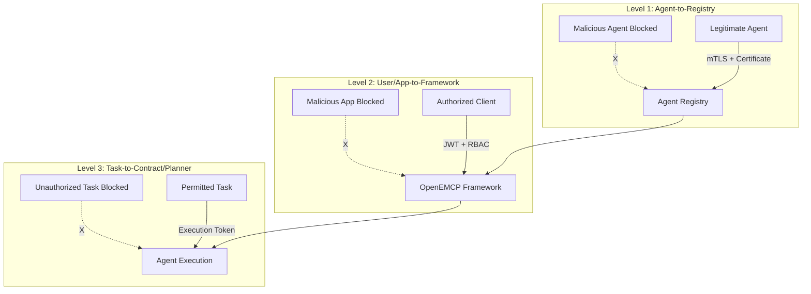
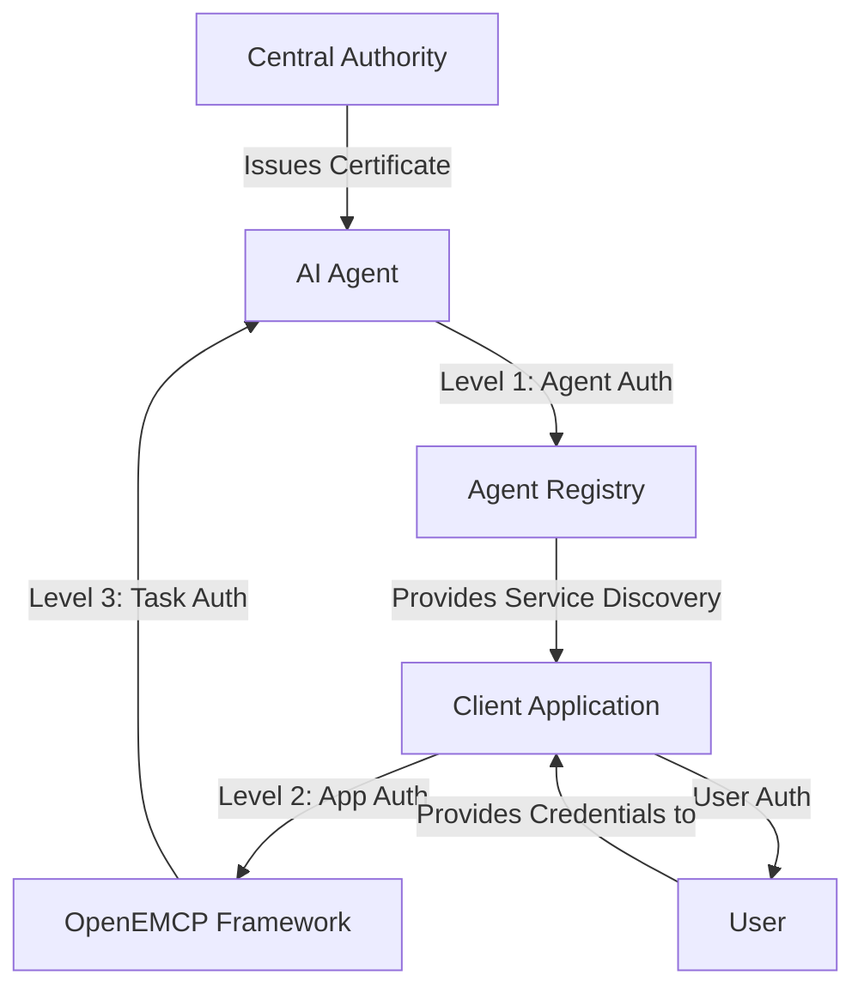

# Defining Agent Identity for OpenEMCP

This document serves as a proposed baseline standard for identity in OpenEMCP deployments.

In the rapidly evolving landscape of agentic AI, autonomous systems powered by advanced models perform complex tasks such as planning and decision-making. For regulated enterprises like banks, establishing a robust agent identity framework is critical to fostering trust, security, and compliance. Agent identity serves as the foundational "code" enabling reliability, traceability, and adherence to regulations including BSA/AML, GLBA, and GDPR.

The agent identity framework within the Open Enterprise Multi-agent Communication Protocol (OpenEMCP) leverages open-source contributions from the AGNTCY project under the Linux Foundation (<https://agntcy.org>). This framework promotes verifiable, secure identities to support interoperable multi-agent systems, forming the basis for secured enterprise and hybrid agents suitable for high-stakes environments such as intra/inter-banking or cross-industry collaborations for services like fraud detection and credit risk assessment.

## Introduction: Foundations of Agent Identity in Agentic AI

Agentic AI represents a paradigm shift from reactive tools to proactive systems capable of reasoning, planning, and executing actions in dynamic environments. In banking applications, agents can collaborate on tasks such as transaction monitoring, customer identity verification (KYC), customer lifecycle management (e.g., contracts), and risk assessment. However, without a solid agent identity framework, these systems may introduce risks of unreliability or non-compliance.

Agent identity encapsulates a unique, verifiable profile for each agent, analogous to a digital passport. This approach ensures traceability of actions back to authenticated sources, which is vital given the machine-scale speed and volume of agent operations involving sensitive data. Prioritizing identity addresses key challenges in multi-agent systems: secure interactions across internal systems, alignment with legal standards, and prevention of issues such as unauthorized access or accidental data misplacement.

OpenEMCP adopts a decentralized approach to identity management, avoiding single points of failure. This approach is essential for scalable banking deployments spanning multiple organizations. The framework embeds identity as a trust layer, facilitating secure discovery, communication, and transparency. The Identity component supports onboarding, creation, and verification of identities for agents, Model Context Protocol (MCP) servers, and Multi-Agent Systems (MASs), leveraging decentralized technologies for trustworthy interactions.

## Three-Level Authentication Architecture

The OpenEMCP framework implements a comprehensive three-level authentication system to ensure security and prevent malicious access at different layers, aligning with the enterprise-grade security requirements outlined in the overall architecture.

### Level 1: Agent-to-Registry Authentication

**Purpose**: Eliminate malicious agents from entering the system

- **What it protects**: The agent registry and service discovery infrastructure
- **Threat prevention**: Prevents rogue, compromised, or unauthorized AI agents from registering and offering services
- **Authentication method**: Mutual TLS (mTLS) with CA-issued certificates and capability validation using SPIRE/SPIFFE identity framework

### Level 2: User/App-to-Framework Authentication

**Purpose**: Prevent malicious applications from accessing the framework

- **What it protects**: The entire OpenEMCP framework from unauthorized client access
- **Threat prevention**: Prevents malicious applications, unauthorized users, or compromised clients from making requests
- **Authentication method**: OAuth2/OIDC with JWT tokens, role-based access control (RBAC), and client certificate validation

### Level 3: Task-to-Contract/Planner Authorization

**Purpose**: Decide if user/app has permission to run specific tasks

- **What it protects**: Individual agent capabilities and sensitive operations
- **Threat prevention**: Prevents authorized users from executing unauthorized tasks or accessing capabilities beyond their permissions
- **Authentication method**: Fine-grained capability-based authorization with execution tokens and policy enforcement



### Identity and Authorization Flow Overview

The identity and authorization flow involves five main actors:

1. **Central Authority** - Identity provider and certificate authority (SPIRE Server)
2. **AI Agent** - The service requesting identity and registration
3. **Agent Registry** - Service discovery and capability registry  
4. **Client Application** - User-facing application requesting agent services
5. **User** - End user with authentication credentials



## Rule-Based Definition of Agent Identity

Agent identity in OpenEMCP is defined as a unique, verifiable identifier assigned to each agent, drawing from standards like Decentralized Identifiers (DIDs) or equivalent mechanisms in the Identity system. This identifier links to credentials specifying the agent's origins, capabilities, and constraints, preventing collisions and enabling cryptographic verification.

**Rules for Definition:**

- Uniqueness and Verifiability: Each agent must have a persistent identifier verifiable through cryptographic proofs, ensuring no impersonation.
- Persistence and Revocation: Identities remain stable but support revocation and re-issuance via standardized processes to handle compromises.
- Behavioral Constraints: Embed rules within the identity, such as least-privilege access (e.g., read-only for compliance agents), to enforce boundaries.
- Compliance Extensions: Incorporate "know-your-agent" (KYA) attributes, extending KYC/AML principles to AI entities for accountability in regulated sectors.

These rules are fundamental because they mitigate security risks in multi-agent setups, where outputs chain across agents. Decentralized identity management ensures non-repudiation, supporting audit trails critical for banking regulatory reporting. By integrating ethics and risk controls, this definition allows confident deployment without extensive human intervention.

## Integration with Standards and Protocols

OpenEMCP integrates agent identity with established protocols to ensure secure interactions, building upon the AGNTCY project (Linux Foundation, <https://agntcy.org>) — an open-source Internet of Agents (IoA) infrastructure initiated by Outshift by Cisco and donated to the Linux Foundation in July 2025 with founding members including Cisco, Dell Technologies, Google Cloud, Oracle, and Red Hat. The protocol emphasizes interoperability via common protocols, security through authentication, authorization, and encryption, scalability with cloud-native architecture, and standardization of data models and schemas. This decentralized approach avoids single points of failure, making it ideal for regulated environments like banking where secure, verifiable interactions are paramount.

For the Model Context Protocol (MCP)—a standard for connecting AI models to external tools and data—OpenEMCP embeds identity checks in every invocation, such as during tool calls. MCP integration leverages Identity and Directory components, using verifiable credentials for authorization. Recommendations include OAuth-based tokens bound to agent identities, preventing data leaks in sensitive banking operations like querying transaction histories. The Identity Service facilitates this by connecting to identity providers, creating agentic service identities, verifying them, and enforcing policies, all while utilizing Decentralized Identifiers (DIDs) and verifiable credentials. This includes badges for agents and MCP servers, ensuring trusted assertions that align with compliance and traceability requirements.

A key enabler of this integration is the Open Agent Schema Framework (OASF), which provides a standardized schema system for defining and managing AI agent capabilities, interactions, and metadata. OASF uses a core "record object" as the primary data structure, annotated with skills, domains, and extensible modules to describe agent attributes in a consistent, validated manner. Protocol Buffer definitions ensure language-agnostic interoperability, with versioning policies maintaining backward compatibility. In OpenEMCP, OASF standardizes agent descriptions within identity profiles, allowing seamless validation and refinement of records. For instance, OASF integrates with the Directory component for LLM-assisted schema discovery, record generation from codebases, and format conversions (e.g., from MCP or A2A to OASF), enabling agents to be registered and discovered reliably.

This deep integration extends to multi-agent communication via the Secure Low-Latency Interactive Messaging (SLIM) protocol, which mandates identity presentation in sessions. SLIM, implemented in Rust and extending gRPC with MLS and quantum-safe encryption, supports patterns like pub/sub, request/reply, streaming, and fire-and-forget, facilitating secure handoffs such as fraud alerts in banking. OpenEMCP binds identities to messages, ensuring low-latency, reliable communication without exposing raw data. OASF further enhances this by providing metadata for agent capabilities, allowing validation of compatibility during interactions.

Alignment with governance frameworks, such as NIST AI Risk Management, involves ongoing identity verification through the underlying API, SDK, and protofiles, which interconnect Identity, Directory, SLIM, and OASF. In regulated sectors, this unified stack promotes proactive risk mitigation, turning fragmented systems into resilient, interoperable ones. By embedding OASF's extensible schemas into the identity layer, OpenEMCP supports custom extensions for banking-specific needs while maintaining core standards, fostering an adaptive IoA ecosystem.

## Framework for Multi-Agent Protocols, Compliance, and Risk Mitigation in Banking

In OpenEMCP, multi-agent protocols begin with discovery, where agents use directories to locate partners, verifying identities first through the Agent Directory. This aligns with zero-trust models, essential for banking scenarios like KYC agents interfacing with risk assessors.

During interactions, SLIM provides secure, low-latency messaging with embedded identities, minimizing data exposure. For execution, actions are bound to identities for traceability, logging contributions in workflows like loan processing. This framework enables coordinated efficiency in regulated environments, leveraging interoperable tools to prevent breaches and ensure compliance.

OpenEMCP mandates KYA through verifiable credentials, extending AML/KYC to AI via the decentralized identity system. This ensures action attribution for audits, reducing regulatory fines. For data protection (e.g., GDPR), ephemeral tokens limit exposure in agent data sharing, supported by robust authentication, authorization, and encryption.

Proactive monitoring via the Observability SDK detects anomalies, aligning with NIST guidelines. This mitigates threats like privilege abuse, building trust in autonomous banking systems.

## OpenEMCP Agent Identity Model (Proposed Standard)

OpenEMCP defines agent identity as a layered model with five required elements:

- Identifier Layer: A globally unique identifier (e.g., DID or equivalent) bound to cryptographic key material.
- Credential Layer: Verifiable credentials asserting ownership, operator, environment, role, and compliance attributes.
- Capability Layer: Machine-readable declarations of skills, tools, data scopes, and policy constraints.
- Session Layer: Short-lived proofs and tokens used during runtime interactions across MCP and SLIM.
- Audit Layer: Tamper-evident records linking identity, decision context, and execution outcomes.

This model ensures identity is not a static label but an operational control plane spanning discovery, authorization, execution, and audit.

## Normative Identity Requirements

The following requirements are intended as normative language for OpenEMCP identity compliance:

- Identity issuance: Every production agent MUST have a unique identifier and at least one active signing key.
- Proof of control: Agents MUST prove control of identity keys during registration and session establishment.
- Credential validation: Verifiable credentials MUST be checked for issuer trust, expiry, revocation status, and audience binding.
- Least privilege: Agents MUST receive only the minimum capabilities required for declared tasks.
- Token security: Runtime access tokens MUST be short-lived, audience-scoped, and bound to agent identity.
- Key rotation: Deployments MUST support key rotation and emergency revocation without breaking audit traceability.
- Data minimization: Identity claims shared between agents SHOULD be minimized to purpose-required fields.
- Non-repudiation: Sensitive actions MUST be attributable to an authenticated agent identity with signed evidence.
- Interoperability: Identity metadata SHOULD be serialized using a common schema profile to preserve cross-vendor compatibility.
- Human governance: High-risk actions MUST support policy gates for approval, dual control, or workflow interruption.

## Standard Claims Profile for Agent Identity

To standardize interoperability, OpenEMCP should adopt a common claims profile grouped as follows:

- Core claims (required): `agent_id`, `issuer`, `subject`, `key_fingerprint`, `issued_at`, `expires_at`, `status`.
- Trust claims (required): `assurance_level`, `verification_method`, `attestation_type`.
- Capability claims (required): `skills`, `allowed_tools`, `data_access_scope`, `execution_limits`.
- Governance claims (recommended): `operator_org`, `regulatory_domain`, `policy_bundle`, `risk_tier`.
- Runtime claims (required for session): `session_id`, `audience`, `nonce`, `token_binding`, `trace_id`.

Suggested assurance levels:

- AL1: Basic registration and key possession.
- AL2: Verified issuer plus policy-scoped access control.
- AL3: Strong attestation, hardware/rooted trust, and continuous monitoring.

## Identity Lifecycle State Machine

Each agent identity should move through explicit lifecycle states:

- Draft: Identity requested but not yet issued.
- Issued: Identifier and credentials minted and discoverable.
- Active: Authorized for runtime interactions.
- Suspended: Temporarily blocked pending policy/security review.
- Revoked: Permanently invalidated; not valid for authentication.
- Archived: Retained for audit but excluded from runtime operations.

State transitions MUST be logged with actor, reason, timestamp, and approval context where applicable.

## Threat Model and Required Controls

OpenEMCP identity controls should explicitly address common threats:

- Impersonation: Mitigate with mutual authentication, signed challenges, and key-bound credentials.
- Credential replay: Mitigate with nonce checks, short token TTLs, and audience scoping.
- Privilege escalation: Mitigate with policy-based authorization and deny-by-default rules.
- Unauthorized delegation: Mitigate with explicit delegation claims and constrained delegation depth.
- Data exfiltration: Mitigate with scoped claims, redaction policies, and monitored egress controls.
- Supply-chain tampering: Mitigate with signed artifacts, provenance attestation, and integrity checks.

## Conformance Profiles for Implementers

To accelerate adoption, OpenEMCP can define three conformance profiles:

- Foundation Profile: Core identifier, credential validation, basic audit logging.
- Regulated Profile: Full lifecycle controls, KYA attributes, continuous monitoring, stronger non-repudiation.
- Cross-Organization Profile: Federation-ready trust anchors, interoperable schema profile, delegated authorization controls.

Each profile should include protocol test vectors for MCP tool invocation, directory lookup, SLIM messaging, revocation handling, and audit evidence verification.

## Detailed Authentication Implementation Flows

### Phase 1: Level 1 Authentication - Agent Bootstrap and Registration

#### Step 1: Agent Bootstrap and Identity Generation

```text
1.1. Agent starts up and reads configuration (agent_config.yaml)
1.2. Agent generates or loads existing private/public key pair
1.3. Agent creates Certificate Signing Request (CSR) with:
     - Agent name and instance ID
     - Skills codes (must match approved skills list)
     - Jurisdiction requirements
     - Public key
     - Metadata (version, data center, compliance certifications)
     - Security attestations and integrity measurements
```

#### Step 2: Request Identity from Central Authority (SPIRE Server)

```text
2.1. Agent sends CSR to Central Authority endpoint:
     POST /api/v1/identity/request
     {
       "csr": "<base64-encoded-csr>",
       "agent_name": "contract_agent_001",
       "instance_id": "uuid4-string",
       "skills": [
         {
           "skill_id": "contract_analysis",
           "skill_category": "document_processing",
           "domain_category": "legal",
           "proficiency_level": "advanced",
           "supported_formats": ["pdf", "docx", "txt"],
           "performance_metrics": {
             "average_processing_time": "45s",
             "accuracy_rate": 0.96,
             "throughput": "20 docs/hour"
           }
         },
         {
           "skill_id": "nlp_processing",
           "skill_category": "text_analysis",
           "domain_category": "general",
           "proficiency_level": "intermediate",
           "supported_formats": ["txt", "json"]
         }
       ],
       "jurisdiction": "US-EAST",
       "data_center": "dc-us-east-1",
       "compliance": ["SOX", "GDPR", "HIPAA"],
       "version": "1.2.3",
       "security_attestation": "<signed-integrity-measurement>",
       "deployment_metadata": {
         "container_hash": "sha256:abc123...",
         "build_signature": "<verified-build-signature>"
       }
     }

2.2. Central Authority validates request against malicious agent threats:
     - Verifies CSR signature and cryptographic validity
     - Validates agent against known malicious agent signatures
     - Checks skill definitions against approved OASF skill schemas
     - Verifies jurisdiction and compliance requirements
     - Validates security attestation and integrity measurements
     - Performs behavioral analysis against known attack patterns
     - Checks deployment metadata for unauthorized modifications

2.3. Central Authority issues signed certificate (if validation passes):
     - Creates X.509 certificate with agent identity (SPIFFE ID)
     - Embeds skill metadata in certificate extensions
     - Includes security policy constraints
     - Sets appropriate validity period (48 hours for high security)
     - Signs with CA private key

2.4. Central Authority returns response:
     {
       "status": "approved",
       "certificate": "<base64-encoded-cert>",
       "ca_certificate": "<base64-ca-cert>",
       "certificate_chain": ["<intermediate-cert-1>", "..."],
       "validity_period": "48h",
       "agent_id": "spiffe://example.org/agent/contract/001",
       "security_policy": {
         "allowed_skills": [
           {
             "skill_id": "contract_analysis",
             "skill_category": "document_processing",
             "domain_category": "legal",
             "constraints": {
               "max_document_size": "10MB",
               "allowed_formats": ["pdf", "docx"],
               "classification_levels": ["confidential", "internal"],
               "max_execution_time": "300s"
             }
           }
         ],
         "resource_limits": { 
           "max_memory": "4GB", 
           "max_cpu": "2cores",
           "max_execution_time": "300s"
         },
         "network_policy": ["registry.emcp.local", "auth.emcp.local"]
       }
     }
```

#### Step 3: Agent Registry Registration with Anti-Malicious Validation

```text
3.1. Agent validates received certificate chain
3.2. Agent stores certificate and private key securely (HSM preferred)
3.3. Agent creates registration payload with signed attestation:
     {
       "agent_id": "spiffe://example.org/agent/contract/001",
       "certificate": "<base64-certificate>",
       "address": "192.168.1.100:8080",
       "endpoints": {
         "health": "/health",
         "execute": "/api/execute",
         "metrics": "/metrics",
         "skills": "/api/skills"
       },
       "skills": [
         {
           "skill_id": "contract_analysis",
           "skill_category": "document_processing",
           "domain_category": "legal",
           "proficiency_level": "advanced",
           "metadata": {
             "description": "Advanced contract analysis with ML-powered risk assessment",
             "supported_formats": ["pdf", "docx", "txt"],
             "performance_metrics": {
               "average_processing_time": "45s",
               "accuracy_rate": 0.96,
               "throughput": "20 docs/hour"
             },
             "resource_requirements": {
               "min_memory": "2GB",
               "min_cpu": "1core",
               "gpu_required": false
             }
           }
         }
       ],
       "jurisdiction": "US-EAST",
       "data_center": "dc-us-east-1",
       "compliance": ["SOX", "GDPR", "HIPAA"],
       "metadata": {
         "version": "1.2.3",
         "last_seen": 1643723400,
         "health_status": "healthy",
         "reliability": 0.999,
         "security_score": 0.95
       },
       "signature": "<agent-signed-attestation>",
       "behavioral_profile": {
         "normal_operation_patterns": ["weekday_business_hours", "batch_processing"],
         "resource_usage_baseline": { "cpu": 0.3, "memory": "1GB" }
       }
     }

3.4. Agent sends registration to bootstrap servers:
     POST /register
     - Registry validates agent certificate against CA (Level 1 Auth)
     - Registry verifies signature on attestation
     - Registry performs malicious agent detection:
       * Checks agent against known malicious agent database
       * Validates behavioral profile against suspicious patterns
       * Confirms skill definitions match certificate extensions
       * Verifies network address against geolocation policies
     - Registry stores agent in service discovery database
     - Registry begins continuous monitoring for malicious behavior
     - Registry returns registration confirmation with monitoring token

3.5. Agent begins monitored heartbeat loop:
     - Send status updates every 30 seconds with behavioral metrics
     - Report resource usage patterns for anomaly detection
     - Update reliability and security scores
     - Submit to continuous malicious behavior monitoring
     - Renew certificate before expiration (automated via SPIRE Agent)
```

### Phase 2: Level 2 Authentication - User/Application Authentication

#### Step 4: User Authentication

```text
4.1. User accesses client application
4.2. Client application redirects to authentication provider (OAuth2/OIDC)
4.3. User provides credentials (username/password, MFA, biometric, etc.)
4.4. Authentication provider validates credentials against:
     - User identity database
     - Multi-factor authentication systems
     - Risk-based authentication (device, location, behavior)
     - Account compromise detection systems
4.5. Authentication provider issues JWT token with verified claims:

    ************************************************************ Verify the struct!!!

     {
       "sub": "user123",
       "name": "John Doe",
       "email": "john.doe@company.com",
       "roles": ["contract_analyst", "manager"],
       "permissions": ["read:contracts", "execute:analysis"],
       "department": "legal",
       "clearance_level": "confidential",
       "jurisdiction": "US-EAST",
       "security_context": {
         "device_trusted": true,
         "location_verified": true,
         "risk_score": 0.1
       },
       "exp": 1643726000,
       "iat": 1643722400
     }
4.6. Client application receives and validates JWT token
4.7. Client application proves its own identity with client certificate
```

#### Step 5: API Request with Anti-Malicious App Validation

```text
5.1. User initiates action in client application (e.g., "Analyze this contract")
5.2. Client application prepares request with comprehensive context:
     {
       "user_token": "<jwt-token>",
       "client_certificate": "<client-app-certificate>",
       "request_id": "req-uuid4",
       "action": "analyze_contract",
       "parameters": {
         "document_id": "doc-12345",
         "analysis_type": "risk_assessment"
       },
       "required_skills": [
         {
           "skill_id": "contract_analysis",
           "skill_category": "document_processing",
           "domain_category": "legal",
           "proficiency_level": "advanced"
         }
       ],
       "jurisdiction_constraint": "US-EAST",
       "compliance_requirements": ["SOX"],
       "client_metadata": {
         "app_version": "2.1.0",
         "app_hash": "sha256:def456...",
         "session_id": "session-uuid4",
         "request_origin": "webapp.company.com"
       }
     }

5.3. Client application signs request with its own certificate:
     - Creates request hash with anti-tampering measures
     - Signs with client private key
     - Attaches client certificate for Level 2 validation
```

#### Step 6: Framework-Level Authorization (Malicious App Detection)

```text
6.1. OpenEMCP Framework receives signed request at Level 2 gateway
6.2. Framework performs malicious application detection:
     - Validates client application certificate against trusted CA
     - Verifies client certificate is not in revocation list
     - Checks client app hash against known malicious applications
     - Validates request signature and integrity
     - Performs rate limiting and abuse detection
     - Analyzes request patterns for suspicious behavior

6.3. Framework validates user authentication:
     - Verifies JWT token signature and expiration
     - Validates token issuer against trusted identity providers
     - Checks user account status (active, not compromised)
     - Validates user permissions against requested action
     - Confirms jurisdiction compatibility
     - Verifies compliance requirements alignment

6.4. Framework extracts and validates user context:
     {
       "user_id": "user123",
       "roles": ["contract_analyst", "manager"],
       "permissions": ["read:contracts", "execute:analysis"],
       "department": "legal",
       "clearance_level": "confidential",
       "jurisdiction": "US-EAST",
       "validated": true,
       "security_score": 0.9
     }

6.5. Framework determines if request proceeds to Level 3:
     - All Level 2 validations must pass
     - Client application must be trusted and verified
     - User must have appropriate base-level permissions
     - Request must pass malicious pattern detection
```

### Phase 3: Level 3 Authentication - Task Authorization and Execution

#### Step 7: Agent Discovery and Capability Matching

```text
7.1. Authorization service queries agent registry for qualified agents:
     GET /agents?skill_id=contract_analysis&skill_category=document_processing&domain_category=legal&jurisdiction=US-EAST&compliance=SOX

7.2. Registry returns qualified agents that passed Level 1 authentication:
     [
       {
         "agent_id": "spiffe://example.org/agent/contract/001",
         "address": "192.168.1.100:8080",
         "skills": [
           {
             "skill_id": "contract_analysis",
             "skill_category": "document_processing",
             "domain_category": "legal",
             "proficiency_level": "advanced",
             "performance_metrics": {
               "average_processing_time": "45s",
               "accuracy_rate": 0.96,
               "throughput": "20 docs/hour"
             }
           }
         ],
         "jurisdiction": "US-EAST",
         "compliance": ["SOX", "GDPR"],
         "reliability": 0.999,
         "security_score": 0.95,
         "load_factor": 0.3
       }
     ]

7.3. Authorization service selects optimal agent based on:
     - Skill match score for specific task requirements
     - Security score and trust level from SPIRE attestation
     - Current load and availability metrics
     - Reliability metrics and historical performance
     - Geographic and compliance proximity requirements
```

#### Step 8: Task-Level Permission Validation (Level 3 Authorization)

```text
8.1. Contract/Planner service receives task authorization request
8.2. Service performs fine-grained permission validation:
     - Validates specific task against user's detailed permissions
     - Checks task complexity against user's authorization level
     - Verifies data access permissions for specific documents
     - Validates task parameters against security policies
     - Confirms resource allocation permissions
     - Checks historical task execution patterns for anomalies

8.3. Contract/Planner creates execution authorization:
     {
       "execution_id": "exec-uuid4",
       "agent_id": "spiffe://example.org/agent/contract/001",
       "task_authorization": {
         "required_skill": {
           "skill_id": "contract_analysis",
           "skill_category": "document_processing",
           "domain_category": "legal",
           "proficiency_level": "advanced"
         },
         "subtasks_allowed": ["risk_assessment", "clause_extraction"],
         "data_access_permissions": {
           "documents": ["doc-12345"],
           "classification_level": "confidential",
           "data_retention": "7y"
         },
         "resource_permissions": {
           "max_execution_time": "300s",
           "max_memory": "2GB",
           "max_cpu_cores": 2,
           "network_access": ["secure.datasource.com"]
         },
         "skill_constraints": {
           "allowed_formats": ["pdf"],
           "max_document_size": "5MB",
           "output_format": "structured_json",
           "quality_threshold": 0.95
         }
       },
       "user_context": {
         "user_id": "user123",
         "roles": ["contract_analyst"],
         "permissions": ["execute:contract_analysis"],
         "clearance_level": "confidential",
         "task_history": "verified_patterns"
       },
       "audit_requirements": {
         "log_level": "full",
         "compliance_logging": ["SOX"],
         "retention_period": "7y",
         "real_time_monitoring": true
       },
       "exp": 1643723100  // Short-lived execution token
     }

8.4. Contract/Planner signs execution authorization token with private key
```

#### Step 9: Secure Command Execution with Three-Level Validation

```text
9.1. Agent receives execution request with Level 3 authorization token
9.2. Agent performs final validation:
     - Verifies execution token signature (Level 3 validation)
     - Confirms agent_id matches self (Level 1 validation)
     - Validates token expiration and replay protection
     - Checks authorized skills against request

9.3. Agent applies security controls based on three-level context:
     - Level 1: Operates within registered skill constraints
     - Level 2: Respects client application and user authentication context
     - Level 3: Enforces fine-grained task permissions and resource limits

9.4. Agent executes authorized command with full audit trail:
     - Processes document analysis within permission boundaries
     - Applies user-specific business rules and security policies
     - Maintains detailed audit trail linking all three authentication levels
     - Monitors for policy violations in real-time

9.5. Agent returns results with comprehensive metadata:
     {
       "execution_id": "exec-uuid4",
       "status": "completed",
       "results": {
         "risk_score": 7.5,
         "key_findings": ["...", "..."],
         "recommendations": ["...", "..."]
       },
       "execution_metadata": {
         "authentication_levels": {
           "level_1_agent_auth": "verified",
           "level_2_app_user_auth": "verified", 
           "level_3_task_auth": "verified"
         },
         "start_time": "2026-02-01T10:00:00Z",
         "end_time": "2026-02-01T10:02:30Z",
         "resources_used": {
           "cpu_seconds": 45,
           "memory_mb": 512
         },
         "data_accessed": ["doc-12345"],
         "compliance_validations": ["SOX"],
         "security_events": []
       }
     }
```

## Security Benefits of Three-Level Authentication

### Level 1 Benefits (Agent-to-Registry)

- **Prevents rogue agents**: Malicious or compromised AI agents cannot register
- **Capability validation**: Only agents with verified capabilities can offer services
- **Continuous monitoring**: Behavioral analysis detects compromised agents post-registration
- **Certificate-based trust**: Strong cryptographic identity using SPIFFE IDs for all agents

### Level 2 Benefits (User/App-to-Framework)

- **Application verification**: Only trusted client applications can access the framework
- **User authentication**: Multi-factor authentication prevents unauthorized access
- **Request integrity**: Digital signatures prevent request tampering
- **Rate limiting**: Prevents abuse and DoS attacks from malicious applications

### Level 3 Benefits (Task-to-Contract/Planner)

- **Fine-grained control**: Precise permission control for specific tasks and resources
- **Principle of least privilege**: Users can only execute tasks they are specifically authorized for
- **Dynamic authorization**: Real-time permission validation based on current context
- **Audit compliance**: Detailed logging for regulatory compliance and forensics

## Threat Model Coverage

| Threat Type | Level 1 Protection | Level 2 Protection | Level 3 Protection |
|-------------|-------------------|-------------------|-------------------|
| Malicious Agent | Certificate validation, behavioral monitoring | N/A | Capability enforcement |
| Compromised Agent | Continuous monitoring, certificate revocation | N/A | Resource limits, audit trails |
| Malicious Application | N/A | Client certificate validation, app verification | Task-specific permissions |
| Unauthorized User | N/A | Authentication, JWT validation | Fine-grained authorization |
| Privilege Escalation | Capability constraints | Role-based access control | Task-level permissions |
| Data Exfiltration | Agent network policies | User data access controls | Document-level permissions |
| Resource Abuse | Agent resource limits | Rate limiting | Execution time/memory limits |

## OpenEMCP Agent Identity Model (Extended)

OpenEMCP defines agent identity as a layered model with five required elements, enhanced with three-level authentication:

- **Identifier Layer**: A globally unique identifier (SPIFFE ID) bound to cryptographic key material and managed by SPIRE infrastructure.
- **Credential Layer**: Verifiable credentials asserting ownership, operator, environment, role, and compliance attributes with automatic rotation.
- **Capability Layer**: Machine-readable declarations of skills, tools, data scopes, and policy constraints using OASF schemas.
- **Session Layer**: Short-lived proofs and tokens used during runtime interactions across MCP and SLIM with three-level validation.
- **Audit Layer**: Tamper-evident records linking identity, decision context, and execution outcomes to blockchain anchors.

This model ensures identity is not a static label but an operational control plane spanning discovery, authorization, execution, and audit.

## Normative Identity Requirements (Enhanced)

The following requirements are intended as normative language for OpenEMCP identity compliance:

- **Identity issuance**: Every production agent MUST have a unique SPIFFE identifier and at least one active signing key managed by SPIRE.
- **Proof of control**: Agents MUST prove control of identity keys during registration and session establishment using mTLS.
- **Credential validation**: Verifiable credentials MUST be checked for issuer trust, expiry, revocation status, and audience binding at all three levels.
- **Least privilege**: Agents MUST receive only the minimum capabilities required for declared tasks as enforced by execution tokens.
- **Token security**: Runtime access tokens MUST be short-lived (48 hours maximum), audience-scoped, and bound to agent SPIFFE identity.
- **Key rotation**: Deployments MUST support automatic key rotation via SPIRE Agent and emergency revocation without breaking audit traceability.
- **Data minimization**: Identity claims shared between agents SHOULD be minimized to purpose-required fields as defined by task authorization.
- **Non-repudiation**: Sensitive actions MUST be attributable to an authenticated agent identity with signed evidence across all three authentication levels.
- **Interoperability**: Identity metadata SHOULD be serialized using OASF schema profiles to preserve cross-vendor compatibility.
- **Human governance**: High-risk actions MUST support policy gates for approval, dual control, or workflow interruption as defined in Level 3 authorization.

## Standard Claims Profile for Agent Identity (Enhanced)

To standardize interoperability across the three authentication levels, OpenEMCP adopts a common claims profile grouped as follows:

- **Core claims (required)**: `agent_id` (SPIFFE ID), `issuer`, `subject`, `key_fingerprint`, `issued_at`, `expires_at`, `status`.
- **Trust claims (required)**: `assurance_level`, `verification_method`, `attestation_type`, `certificate_chain`.
- **Capability claims (required)**: `skills`, `allowed_tools`, `data_access_scope`, `execution_limits`, `capability_codes`.
- **Governance claims (recommended)**: `operator_org`, `regulatory_domain`, `policy_bundle`, `risk_tier`, `jurisdiction`.
- **Runtime claims (required for session)**: `session_id`, `audience`, `nonce`, `token_binding`, `trace_id`, `execution_id`.

Suggested assurance levels aligned with three-level authentication:

- **AL1**: Basic registration and key possession (Level 1 Agent Auth)
- **AL2**: Verified issuer plus policy-scoped access control (Level 2 User/App Auth)
- **AL3**: Strong attestation, hardware/rooted trust, and continuous monitoring (Level 3 Task Auth)

## Identity Lifecycle State Machine (Enhanced)

Each agent identity moves through explicit lifecycle states with blockchain-anchored state transitions:

- **Draft**: Identity requested but not yet issued by SPIRE Server.
- **Issued**: SPIFFE identifier and credentials minted and discoverable in registry.
- **Active**: Authorized for runtime interactions with all three authentication levels operational.
- **Suspended**: Temporarily blocked pending policy/security review with Level 1 authentication disabled.
- **Revoked**: Permanently invalidated; not valid for authentication at any level.
- **Archived**: Retained for audit but excluded from runtime operations.

State transitions MUST be logged with actor, reason, timestamp, and approval context where applicable, with critical transitions anchored to blockchain for immutability.

## Certificate Structure and SPIRE Integration

### X.509 SVID Certificate Structure

```text
Subject: CN=agent-contract-001
Issuer: SPIRE CA
Validity: 48 hours (automatic rotation)
Extensions:
  - Subject Alternative Name (SAN): 
    * URI: spiffe://example.org/agent/contract/001
    * DNS: localhost, agent-contract-001.emcp.local
  - Key Usage: Digital Signature, Key Encipherment
  - Extended Key Usage: Client Authentication, Server Authentication
  - Certificate Policies: OpenEMCP Agent Identity Policy
Public Key: RSA 2048-bit or ECDSA P-256
Signature Algorithm: SHA256withRSA or SHA256withECDSA
```

### SPIRE Agent Integration Flow

```text
1. SPIRE Server acts as Certificate Authority for OpenEMCP agents
2. SPIRE Agent runs on each node, attests workload identity
3. Workload API provides certificates via Unix domain socket
4. Automatic certificate rotation every 48 hours
5. Agent registry validates certificates against SPIRE CA bundle
6. mTLS communication using SPIRE-issued certificates
7. SLIM protocol leverages SPIRE identities for secure messaging
```

## Threat Model and Required Controls (Extended)

OpenEMCP identity controls explicitly address common threats through the three-level authentication system:

- **Impersonation**: Mitigate with mutual authentication (Level 1), signed challenges (Level 2), and key-bound credentials (Level 3).
- **Credential replay**: Mitigate with nonce checks, short token TTLs (48h max), and audience scoping across all levels.
- **Privilege escalation**: Mitigate with policy-based authorization (Level 2) and deny-by-default rules (Level 3).
- **Unauthorized delegation**: Mitigate with explicit delegation claims and constrained delegation depth in execution tokens.
- **Data exfiltration**: Mitigate with scoped claims (Level 3), redaction policies, and monitored egress controls.
- **Supply-chain tampering**: Mitigate with signed artifacts, provenance attestation, and SPIRE-based integrity checks.
- **Malicious agents**: Mitigate with Level 1 certificate validation, behavioral monitoring, and continuous threat assessment.
- **Compromised applications**: Mitigate with Level 2 client certificate validation and application integrity verification.
- **Task-level abuse**: Mitigate with Level 3 fine-grained permissions and resource constraint enforcement.

## Conformance Profiles for Implementers (Enhanced)

To accelerate adoption, OpenEMCP defines three conformance profiles aligned with the three-level authentication architecture:

### Foundation Profile

- Core SPIFFE identifier with basic certificate validation (Level 1)
- Basic credential validation and audit logging
- Essential agent discovery and registration capabilities
- Minimum viable security for development environments

### Regulated Profile

- Full three-level authentication system implementation
- Complete lifecycle controls with KYA attributes
- Continuous monitoring and stronger non-repudiation
- Blockchain-anchored audit trails for compliance
- Enhanced threat detection and response capabilities

### Cross-Organization Profile

- Federation-ready trust anchors across organizational boundaries
- Interoperable OASF schema profile for multi-vendor environments
- Delegated authorization controls for cross-border operations
- Advanced jurisdictional compliance and data sovereignty controls

Each profile includes protocol test vectors for:

- MCP tool invocation with identity validation
- Directory lookup with capability verification  
- SLIM messaging with embedded identity verification
- Certificate revocation handling across all three levels
- Audit evidence verification and blockchain anchoring

## Implementation Considerations

### Security Architecture Integration

The identity standard integrates with OpenEMCP's comprehensive security architecture:

- **SPIRE/SPIFFE Foundation**: Provides zero-trust identity verification with automatic X.509 certificate management
- **Multi-Tier Context Security**: Hierarchical context management with session-level encryption and agent-level isolation
- **Blockchain Audit Anchoring**: Critical identity events anchored to blockchain for tamper-proof compliance records
- **Compliance-Aware Routing**: Identity-based message routing considering data classification and jurisdiction requirements

### Performance and Scalability

- **Certificate Caching**: Agent capability metadata and certificate validation results cached for performance
- **Load Distribution**: Identity validation distributed across multiple SPIRE Servers with geographic routing
- **Horizontal Scaling**: Registry services scale independently with consistent hashing for agent discovery
- **Circuit Breakers**: Identity service failures isolated to prevent cascading system impacts

### Operational Requirements

- **Certificate Management**: Automatic rotation every 48 hours with zero-downtime updates
- **Monitoring and Alerting**: Real-time monitoring of identity validation failures and certificate expiration
- **Disaster Recovery**: Multi-region SPIRE Server deployment with consistent identity state replication
- **Compliance Reporting**: Automated generation of identity-related compliance reports for regulatory examination

## Conclusion

This comprehensive agent identity standard positions identity as the essential foundation for secure, compliant multi-agent systems in banking and other regulated industries under OpenEMCP. By implementing a three-level authentication architecture built on SPIRE/SPIFFE foundations and integrated with OASF schemas, SLIM messaging, and blockchain audit trails, the standard enables enterprise-grade agentic AI deployment while maintaining strict governance and compliance requirements.

The framework leverages open-source standards and infrastructure from the AGNTCY project (Linux Foundation) to enable innovation while mitigating risks through defense-in-depth security architecture. The three conformance profiles ensure scalable adoption from development environments to cross-organizational production deployments.

Enterprises are encouraged to contribute to the ongoing refinement of these standards, particularly in areas of cross-border identity federation, regulatory compliance automation, and emerging AI governance frameworks. This collaborative approach ensures the identity standard evolves with the rapidly advancing landscape of agentic AI while maintaining the trust and security essential for regulated enterprise adoption.
