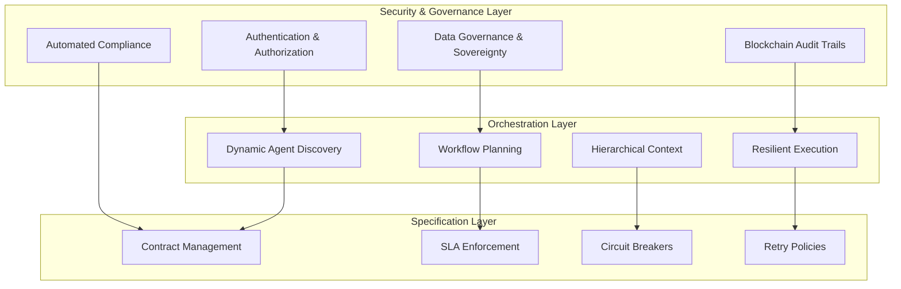

# OpenEAGO - Specification Overview

## 1. The Need for Enterprise Agent Governance & Orchestration

### 1.1 Complex Enterprise Flows Demand Sophisticated Orchestration

Modern enterprises, particularly in regulated industries like financial services, face unprecedented complexity in their operational workflows. Bank-to-bank transactions, cross-border payments, trade finance, process documentation, process explainability, and regulatory reporting require intricate choreography of multiple systems, compliance checks, and real-time decision-making across jurisdictional boundaries.

Traditional AI implementations fall short when dealing with:

- **Multi-step compliance workflows** spanning multiple regulatory jurisdictions
- **Service Level Agreements (SLAs)** requiring guaranteed response times and availability
- **Risk management process** demanding real-time monitoring and circuit breakers
- **Complex orchestrations** involving dozens of specialized agents and systems
- **Cross-organizational coordination** between banks, regulators, and service providers

### 1.2 Bank-to-Bank Use Cases Illustrate the Challenge

Consider a typical cross-border corporate banking scenario where a UK bank branch needs to request data about a Singapore-registered company owned by a director with dual Singapore and USA citizenship:

**Cross-Border Corporate Data Request Workflow:**

```text
UK Data Request → Customer Identity Verification (UK GDPR) → 
Corporate Beneficiary Analysis → Singapore Corporate Registry Query → 
USA Beneficial Ownership Screening → Enhanced Due Diligence → 
FATCA Compliance Check → AML/Sanctions Screening → 
Cross-Border Data Transfer Validation → Data Authorization → 
Information Retrieval → Regulatory Reporting
```

**Multi-Jurisdictional Complexity Example:**

- **UK Agent** initiates data request processing under FCA regulations
- **Singapore Agent** queries ACRA corporate registry (Singapore PDPA compliance required)  
- **USA Agent** performs enhanced due diligence on 40% US beneficial ownership (FATCA obligations)
- **Clearance Requirements**: Each data transfer requires explicit authorization under:
  
  - UK GDPR Article 49 derogations for necessary transfers
  - Singapore PDPA cross-border transfer provisions  
  - US FATCA reporting and sanctions screening requirements
  - DOJ Final Rule restrictions on bulk sensitive data transfers

Each step involves:

- **Multiple specialized AI agents** across three jurisdictions (fraud detection, compliance validation, beneficial ownership analysis)
- **Cascading regulatory requirements** (FCA prudential rules, MAS corporate governance, FinCEN beneficial ownership)
- **Real-time SLA commitments** (sub-second sanctions screening, same-day corporate verification, 24-hour FATCA reporting)
- **Risk management across borders** (circuit breakers for suspicious ownership patterns, automated escalation for high-risk jurisdictions)
- **Immutable audit trails** spanning multiple regulatory frameworks for examination by FCA, MAS, and FinCEN
- **Data sovereignty enforcement** ensuring Singapore corporate data remains PDPA-compliant while enabling US FATCA reporting

### 1.3 Why MCP Doesn't Work for Enterprise

While the Model Context Protocol (MCP) provides valuable capabilities for feeding external context into language models, it falls critically short for enterprise agentic systems. Our comprehensive analysis in the [OpenEAGO Proposal](openeago_proposal.md) identifies fundamental gaps:

**MCP's Design Limitations:**

- **Single-model focus**: MCP optimizes for feeding context to individual LLMs, not orchestrating multi-agent workflows
- **No enterprise security**: Lacks comprehensive authentication, authorization, and audit capabilities required for financial services
- **No regulatory compliance**: Missing data sovereignty, cross-border controls, and automated compliance validation
- **No SLA management**: Cannot guarantee response times or availability commitments
- **No resilience patterns**: Lacks circuit breakers, retry logic, and graceful degradation for enterprise reliability
- **No business orchestration**: Cannot handle complex multi-step workflows with dependencies and rollback capabilities

**Enterprise Requirements MCP Cannot Address:**

- Cross-border data transfer restrictions (GDPR, DORA, DOJ Final Rule)
- Real-time compliance validation (EU AI Act, Basel III, AML regulations)
- Agent identity management and non-human authentication
- Hierarchical context propagation across organizational boundaries
- Immutable audit trails for regulatory examination
- Dynamic service discovery and load balancing across agent ecosystems

## 2. OpenEAGO: Born from Enterprise Necessity

OpenEAGO emerges to fill this critical gap, providing enterprise-grade capabilities that enable secure, compliant, and scalable multi-agent systems for regulated industries.

### 2.1 Core Enterprise Capabilities



### 2.2 How Capabilities Interconnect

OpenEAGO's architecture creates a cohesive ecosystem where enterprise capabilities reinforce each other:

1. **Security Foundation**: Authentication and authorization enable trusted agent discovery
2. **Compliance Integration**: Data governance policies drive workflow planning decisions
3. **Resilient Execution**: Circuit breakers and retry policies maintain SLA commitments
4. **Audit Continuity**: Blockchain trails provide immutable records across all interactions
5. **Context Preservation**: Hierarchical context ensures compliance metadata flows with business data

## 3. OpenEAGO Agent Classifications

### 3.1 Framework Agents

**Purpose**: Agents built using established AI frameworks, adapted for enterprise use

**Examples**:

- **LangChain Agents**: Customer service bots, document analyzers, research assistants

  ```json
  {
    "agent_type": "framework",
    "framework": "langchain",
    "capabilities": ["document_analysis", "customer_inquiry", "research"]
  }
  ```

- **LangGraph Agents**: Complex stateful workflows, approval processes, case management
- **AutoGPT Agents**: Autonomous task completion, report generation, data synthesis
- **Custom Framework Agents**: Specialized implementations using TensorFlow, PyTorch, or proprietary frameworks

### 3.2 Core Agents

**Purpose**: Essential enterprise services that provide foundational capabilities

**Examples**:

- **Identity Verification Agent**: KYC/AML compliance, document verification, biometric validation

  ```json
  {
    "agent_type": "core",
    "specialization": "identity_verification",
    "certifications": ["SOC2", "GDPR_Article_25", "KYC_AML"]
  }
  ```

- **Risk Assessment Agent**: Credit scoring, fraud detection, regulatory risk calculation
- **Compliance Validation Agent**: Policy enforcement, regulatory checking, audit preparation
- **Data Classification Agent**: Sensitivity labeling, residency enforcement, retention management

### 3.3 Utility Agents

**Purpose**: Supporting services that enable core business functions

**Examples**:

- **Address Standardization Agent**: USPS validation, international formatting, geocoding

  ```json
  {
    "agent_type": "utility",
    "function": "address_standardization",
    "data_residency": ["US", "CA", "MX"]
  }
  ```

- **Currency Conversion Agent**: Real-time FX rates, historical data, regulatory reporting rates
- **Document Translation Agent**: Multi-language support, legal document translation, cultural adaptation
- **Encryption/Decryption Agent**: Data protection, key management, compliance encryption

### 3.4 Flow Agents

**Purpose**: Orchestration and workflow management agents that coordinate complex business processes

**Examples**:

- **Payment Processing Flow**: Orchestrates end-to-end payment workflows across multiple banks

  ```json
  {
    "agent_type": "flow",
    "workflow": "cross_border_payment",
    "orchestrates": ["aml_agent", "fx_agent", "settlement_agent", "reporting_agent"]
  }
  ```

- **Loan Origination Flow**: Manages application, underwriting, approval, and funding processes
- **Customer Onboarding Flow**: Coordinates KYC, account opening, product enrollment, and activation
- **Regulatory Reporting Flow**: Aggregates data, validates compliance, generates reports, manages submissions

## 4. Enterprise Benefits

OpenEAGO delivers transformative capabilities for regulated industries:

- **Eliminates manual coordination** through automated agent discovery and optimal execution planning
- **Reduces operational overhead** with self-organizing agent ecosystems and dynamic workflow orchestration  
- **Provides end-to-end regulatory compliance** with immutable blockchain audit trails
- **Ensures data sovereignty** and cross-border compliance through automated governance controls
- **Guarantees high availability SLAs** with automatic failover and intelligent resource allocation

## 5. Conclusion

OpenEAGO represents the evolution from simple AI assistants to enterprise-grade agentic systems capable of handling the complexity, compliance, and reliability demands of modern financial services. By providing a universal standard that works across all agent types—from framework implementations to specialized flow orchestrators—OpenEAGO enables the next generation of banking innovation while maintaining the strict governance required in regulated environments.

The specification's design recognizes that enterprise AI is not about individual agents, but about ecosystems of specialized capabilities working together to deliver business outcomes that would be impossible to achieve manually or through traditional automation approaches.
