# Performance SLA, SLO, and KPI Framework

Category: Cross-Cutting Concern — Applies to all six openEAGO protocol phases

## Overview

Performance accountability is a **first-class protocol goal** in openEAGO. Regulated enterprise environments require measurable, contractually-enforceable service commitments, not aspirational guidelines. This document defines:

- The normative distinction between **SLA** and **SLO** as used throughout the protocol
- A formal **SLO objective taxonomy** covering the four dimensions that MUST be specified for every execution plan
- The canonical **`sla_guarantees` schema** — the single normative definition that unifies all per-phase references
- A normative **SLA breach state machine** governing the lifecycle of a breach from detection to resolution
- The protocol-level **KPI catalog** — what the protocol itself MUST track and emit, grouped by category
- The **agent registry minimum performance bar** that every registered agent MUST meet

This document is the canonical cross-phase reference for performance. For the risk scoring model that incorporates SLA breach probability into Operational Risk, see [Risk Management Framework](./risk-management.md).

## SLA vs. SLO — Normative Definitions

openEAGO uses these terms with precise, distinct meanings throughout all protocol documents and schemas. Implementations MUST NOT use them interchangeably.

| Term | openEAGO Definition |
| --- | --- |
| **SLA** (Service Level Agreement) | A contractual commitment made between an agent provider and its consumer, agreed during Phase 2 (Planning & Negotiation). Breaching an SLA is a reportable event requiring escalation per the breach state machine. |
| **SLO** (Service Level Objective) | An internal protocol target for a specific measurable property at a defined percentile. SLOs are the mechanism by which SLA commitments are operationalized. An SLA is only met when all constituent SLOs are met. |
| **SLI** (Service Level Indicator) | The raw measured value of a specific property (e.g., observed p99 latency in ms). SLIs are compared against SLO targets at runtime to determine SLO status. |

**Relationship**: SLA ⊇ one or more SLOs. Each SLO is backed by one SLI. An SLA is `met` only when all of its constituent SLOs are `met`.

## SLO Objective Taxonomy

Every `sla_guarantees` object MUST specify all four SLO objective types. These are the four dimensions that Phase 2 negotiation MUST assess for feasibility, and that Phase 4 execution MUST monitor in real time.

### 1. Latency SLO

Measures the elapsed time from request submission to the delivery of a valid response at a given percentile.

| Property | Definition |
| --- | --- |
| `latency_p50_ms` | Median (50th percentile) response time, in milliseconds |
| `latency_p95_ms` | 95th percentile response time, in milliseconds |
| `latency_p99_ms` | 99th percentile response time, in milliseconds — this is the **primary SLA gate** |

Phase-specific normative targets (default; MAY be overridden per contract):

| Phase | `latency_p99_ms` Target |
| --- | --- |
| Phase 1 — Contract Management | ≤ 200 ms |
| Phase 2 — Planning & Negotiation | ≤ 1,000 ms |
| Phase 3 — Validation & Compliance (automated path) | ≤ 500 ms |
| Phase 4 — Execution & Resilience (per-task latency) | ≤ 5,000 ms (task-level); ≤ 30,000 ms (workflow) |
| Phase 5 — Context & State Management | ≤ 100 ms |
| Phase 6 — Communication & Delivery | ≤ 300 ms |

### 2. Availability SLO

Measures the fraction of time in a rolling window during which an agent is reachable and providing valid responses.

| Property | Definition |
| --- | --- |
| `availability_pct` | Required availability as a decimal fraction, e.g., `0.9900` = 99.00% |
| `measurement_window` | Rolling window over which availability is measured, e.g., `"30d"` |

Normative minimum: `availability_pct ≥ 0.9900` (99.00%) for all agents registered in the Agent Registry. This maps to a maximum allowed downtime of approximately 7.3 hours per 30-day period.

### 3. Throughput SLO

Measures the sustained rate of requests an agent MUST be capable of handling.

| Property | Definition |
| --- | --- |
| `throughput_rps` | Minimum guaranteed requests per second under normal load conditions |
| `burst_rps` | Maximum requests per second the agent MUST handle without degrading below Latency SLO |

### 4. Error Rate SLO

Measures the fraction of requests that result in an error response (5xx equivalent or protocol-level failure).

| Property | Definition |
| --- | --- |
| `error_rate_max` | Maximum tolerable fraction of requests that may result in an error, e.g., `0.05` = 5.00% max error rate |

Normative maximum: `error_rate_max ≤ 0.05` (5.00%) for all registered agents. An `error_rate_max = 0.01` (1.00%) is RECOMMENDED for agents handling regulated or high-impact workflows.

## Canonical `sla_guarantees` Schema

This is the single normative definition of `sla_guarantees` used across all protocol phases. All per-phase references (planning.md, execution.md, spec.json, and the schemas) MUST conform to this structure.

```json
{
  "sla_guarantees": {
    "sla_id": "SLA_A7B8C9",
    "sla_version": "1.0",
    "agreed_at": "2026-02-27T10:00:00Z",
    "valid_until": "2027-02-27T10:00:00Z",
    "provider_agent_id": "spiffe://example.org/agent/pii-validator",
    "consumer_contract_id": "CONTRACT_E7D3A1",
    "latency": {
      "p50_ms": 150,
      "p95_ms": 400,
      "p99_ms": 800
    },
    "availability": {
      "availability_pct": 0.9950,
      "measurement_window": "30d"
    },
    "throughput": {
      "throughput_rps": 50,
      "burst_rps": 200
    },
    "error_rate": {
      "error_rate_max": 0.02
    },
    "breach_policy": {
      "at_risk_threshold_pct": 0.90,
      "breach_response": "pause_and_review",
      "escalation_contact": "sre-oncall@example.org"
    }
  }
}
```

### Required Fields

All fields in `latency`, `availability`, `throughput`, and `error_rate` are REQUIRED. `breach_policy` is REQUIRED when `sla_guarantees` is part of a regulated-profile execution plan.

## SLA Breach State Machine

The SLA breach state machine governs the lifecycle of an SLA from healthy operation through potential breach and resolution. All Phase 4 (Execution & Resilience) implementations MUST implement this state machine.

```mermaid
stateDiagram-v2
    [*] --> Active : SLA agreed in Phase 2; execution begins

    Active --> AtRisk : SLI approaches threshold\n(SLI > at_risk_threshold_pct × SLO target)
    AtRisk --> Active : SLI recovers within window
    AtRisk --> Breached : SLI crosses SLO target

    Active --> Breached : SLI crosses SLO target directly (step change)
    Breached --> PauseAndReview : breach_response = "pause_and_review"
    Breached --> FallbackActivated : breach_response = "activate_fallback"
    Breached --> Escalated : breach_response = "escalate"

    PauseAndReview --> Active : Human clears; execution resumes with modified SLA
    PauseAndReview --> Terminated : Human rejects; execution terminated
    FallbackActivated --> Active : Fallback agent meets SLO; monitoring continues
    FallbackActivated --> Escalated : Fallback also breaches SLO
    Escalated --> Terminated : Risk management review; execution aborted
    Escalated --> Active : Emergency override approved; SLA renegotiated

    Active --> Completed : Execution completes; all SLOs met
    Terminated --> [*] : Breach recorded; risk event emitted
    Completed --> [*] : SLA compliance = "met" recorded in Phase 6 output
```



### Breach State Definitions

| State | Definition | Required Protocol Action |
| --- | --- | --- |
| `active` | All SLIs are within their SLO targets | Continue execution; standard monitoring |
| `at_risk` | One or more SLIs have exceeded `at_risk_threshold_pct` of their SLO target | Increase monitoring frequency; emit `sla_at_risk` event |
| `breached` | One or more SLIs have crossed their SLO target | Emit `sla_breach_event`; execute `breach_response` |
| `pause_and_review` | Execution paused; awaiting human decision | Freeze cost-generating tasks; notify escalation contact |
| `fallback_activated` | Fallback agent substituted for failing agent | Emit `fallback_activation_event`; re-evaluate SLO feasibility |
| `escalated` | Breach cannot be resolved automatically | Emit high-priority alert; trigger risk escalation protocol |
| `completed` | Execution finished with all SLOs met throughout | Record `sla_compliance_status = "met"` |
| `terminated` | Execution aborted due to unresolvable breach | Record `sla_compliance_status = "breached"`; include in risk report |

### SLA Breach Event Payload

When the breach state machine transitions to `breached` or beyond, implementations MUST emit the following event to the audit trail:

```json
{
  "event_type": "sla_breach_event",
  "event_timestamp": "2026-02-27T11:45:22.000Z",
  "execution_id": "EXEC_X5Y6Z7",
  "breach_state": "breached",
  "sla_id": "SLA_A7B8C9",
  "breached_slo": "latency_p99_ms",
  "slo_target": 800,
  "sli_observed": 1240,
  "breach_response": "activate_fallback",
  "risk_event_emitted": true,
  "risk_dimension": "operational_risk"
}
```

## Protocol-Level KPI Catalog

These are the KPIs the openEAGO protocol itself MUST track and emit. They are protocol-level observability requirements — distinct from business-level KPIs defined by individual implementations.

All implementations MUST expose these KPIs via the declared observability stack (OpenTelemetry + Prometheus per `spec/v0.1.0/spec.json`). KPI data MUST be available for query by authorized monitoring systems.

### Reliability KPIs

| KPI | Definition | Normative Target | Phase |
| --- | --- | --- | --- |
| `phase_success_rate` | Fraction of phase executions that complete without error, per phase | ≥ 0.99 | Each phase |
| `workflow_e2e_success_rate` | Fraction of six-phase workflows that complete successfully end-to-end | ≥ 0.95 | All phases |
| `agent_uptime` | Availability of each registered agent over a 30-day rolling window | ≥ 0.9900 | Phase 4 |
| `circuit_breaker_trip_rate` | Fraction of executions that trip the Phase 4 circuit breaker | ≤ 0.01 (1%) | Phase 4 |
| `fallback_activation_rate` | Fraction of executions that activate a fallback agent | ≤ 0.05 (5%) | Phase 4 |

### Performance KPIs

| KPI | Definition | Normative Target | Phase |
| --- | --- | --- | --- |
| `phase_latency_p99_ms` | 99th percentile end-to-end latency for each phase | See Latency SLO table | Each phase |
| `phase_latency_p95_ms` | 95th percentile end-to-end latency for each phase | 80% of `p99` target | Each phase |
| `agent_queue_depth` | Current pending request queue depth per agent | ≤ 100 (alert threshold) | Phase 4 |
| `workflow_throughput_rps` | Completed workflows per second across the deployment | Deployment-specific; declare in conformance profile | All phases |
| `planning_agent_selection_time_ms` | Time for the Planning Agent to complete agent discovery and scoring | ≤ 500 ms p99 | Phase 2 |
| `validation_latency_ms` | Time for the Validation Agent to compute composite risk score and decision | ≤ 500 ms p99 (automated path) | Phase 3 |

### Compliance KPIs

| KPI | Definition | Normative Target | Phase |
| --- | --- | --- | --- |
| `policy_pass_rate` | Fraction of execution plans that pass all policy checks in Phase 3 | Baseline; alert on ≥ 10% drop week-over-week | Phase 3 |
| `hitl_intervention_rate` | Fraction of executions that trigger the HITL gate | Track; target determined by organizational risk appetite | Phase 3 |
| `hitl_response_time_hours` | Time from HITL trigger to human decision | ≤ 4 hours (SLA) | Phase 3 |
| `risk_prediction_accuracy` | Fraction of risk tier assessments that match post-execution actual outcomes | ≥ 0.85 (85%) | Phase 3, measured in arrears |
| `sla_compliance_rate` | Fraction of executions where all SLOs remain in `active` or `completed` state | ≥ 0.95 | Phase 4 |
| `audit_completeness_rate` | Fraction of executions with fully populated `risk_context` in audit trail | 1.00 (100% — mandatory) | Phase 5/6 |

### Financial KPIs

| KPI | Definition | Normative Target | Phase |
| --- | --- | --- | --- |
| `acu_budget_adherence_rate` | Fraction of executions where actual ACU consumption stays within approved budget | ≥ 0.95 | Phase 4 |
| `cost_overrun_rate` | Fraction of executions where actual USD cost exceeds approved limit | ≤ 0.05 | Phase 4 |
| `cost_per_successful_workflow` | Average USD cost of a successfully completed six-phase workflow | Deployment-specific baseline; alert on ≥ 20% week-over-week increase | All phases |

### Security KPIs

| KPI | Definition | Normative Target | Phase |
| --- | --- | --- | --- |
| `auth_failure_rate` | Fraction of inter-agent communication attempts that fail authentication | ≤ 0.001 (0.1%) | All phases |
| `certificate_rotation_compliance_rate` | Fraction of agent certificates rotated within their 48-hour TTL | 1.00 (100% — mandatory) | Phase 1 setup |
| `anomaly_detection_rate` | Fraction of executions flagged by anomaly detection | Track; alert on sudden increase | Phase 4 |
| `policy_override_rate` | Fraction of `critical`-tier rejections that were subsequently overridden | ≤ 0.005 (0.5%); each override MUST carry board/legal approval reference | Phase 3 |

## Agent Registry Minimum Performance Bar

Every agent registered in the openEAGO Agent Registry MUST meet the following minimum performance bar. The Planning Agent MUST NOT select an agent that fails any of these minimums for an execution plan, regardless of cost or capability fit score.

| Property | Minimum Required Value | Eviction Rule |
| --- | --- | --- |
| `reliability_score` | ≥ 0.95 | Agent removed from registry if rolling 7-day score drops below 0.90 |
| `availability_pct` (30d) | ≥ 0.9900 (99.00%) | Agent marked `degraded` if drops below 0.9900; removed if below 0.9500 |
| `error_rate` (7d rolling) | ≤ 0.05 (5.00%) | Agent marked `degraded` if exceeds 0.05; removed if exceeds 0.10 |
| `latency_p99_ms` (7d rolling) | ≤ declared `latency.p99_ms` × 1.20 | Agent marked `degraded` if exceeds declared SLO; removed if exceeds 2× declared SLO |
| `compliance_certification_valid` | `true` | Agent suspended immediately if certification expires |

Registry states: `healthy` → `degraded` → `suspended` → `removed`. Agents in `degraded` state MAY be selected for non-critical workflows only. Agents in `suspended` or `removed` state MUST NOT be selected.

## SLA/SLO Feasibility Check in Phase 2

During Phase 2 (Planning & Negotiation), the Planning Agent MUST perform an explicit SLA/SLO feasibility check as a required negotiation sub-step **before** forwarding the execution plan to Phase 3.

The feasibility check MUST verify all four SLO objective types for every selected agent:

```text
For each selected_agent in execution_plan.selected_agents:
  1. Retrieve agent.sla_guarantees from Agent Registry
  2. Check latency_p99_ms: agent.sla_guarantees.latency.p99_ms ≤ plan.latency_requirement.p99_ms
  3. Check availability_pct: agent.sla_guarantees.availability.availability_pct ≥ plan.availability_requirement
  4. Check throughput_rps: agent.sla_guarantees.throughput.throughput_rps ≥ plan.throughput_requirement
  5. Check error_rate_max: agent.sla_guarantees.error_rate.error_rate_max ≤ plan.error_rate_tolerance
  6. Derive sla_breach_probability = f(historical_sli_variance, agent_reliability_score)
  7. If sla_breach_probability > 0.20: mark agent as "sla_at_risk"; select fallback
  8. If no compliant agent available: return negotiation.status = "rejected" with reason "sla_slo_infeasible"
```

Negotiation checks MUST include `"sla_slo"` in the `checks` array. A negotiation result with `status = "accepted"` MUST mean that all four SLO objective checks passed for every selected agent.

## Performance Metrics for This Framework

| Metric | Definition | Target |
| --- | --- | --- |
| SLO Feasibility Check Latency | Time to complete the Phase 2 SLA/SLO feasibility sub-step | ≤ 100 ms p99 |
| Breach Detection Latency | Time from SLO target breach to `sla_breach_event` emission | ≤ 5 seconds |
| Breach Recovery Time (Fallback) | Time from fallback activation to `sla_state = active` restoration | ≤ 30 seconds |
| KPI Export Latency | Maximum age of KPI data available to Prometheus scrape | ≤ 60 seconds |

## Summary

Performance accountability in openEAGO is enforced through three concrete mechanisms:

1. **SLA Negotiation (Phase 2)**: Every execution plan MUST pass a formal four-dimension SLO feasibility check. Plans where agent SLOs cannot be met are rejected at negotiation, not discovered at runtime.

2. **SLA Monitoring (Phase 4)**: The breach state machine provides a normative lifecycle — `active` → `at_risk` → `breached` → `[pause/fallback/escalate]` — with mandatory event emission at each transition. SLA status is a first-class field in execution outputs.

3. **KPI Catalog (All Phases)**: The protocol mandates 20+ KPIs across reliability, performance, compliance, financial, and security dimensions, exposed via OpenTelemetry/Prometheus. These KPIs are protocol-level requirements, not optional instrumentation.

For the risk model that incorporates SLA breach probability into the Operational Risk dimension, see [Risk Management Framework](./risk-management.md).

For machine-readable schema definitions of `sla_guarantees` and `sla_compliance_status`, see [spec/v0.1.0/schemas/planning-negotiation.schema.json](../../spec/v0.1.0/schemas/planning-negotiation.schema.json) and [spec/v0.1.0/schemas/execution-resilience.schema.json](../../spec/v0.1.0/schemas/execution-resilience.schema.json).
