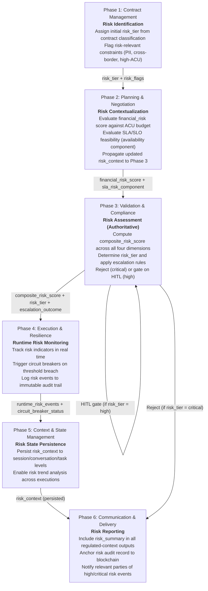

# Risk Management Framework

Category: Cross-Cutting Concern — Applies to all six OpenEMCP protocol phases

## Overview

Risk management is a **first-class protocol goal** in OpenEMCP, not an optional quality measure. Every request processed by an OpenEMCP-compliant implementation MUST traverse a documented risk lifecycle that spans all six phases, from initial risk identification at Phase 1 (Contract Management) through runtime risk monitoring at Phase 4 (Execution & Resilience) and final risk reporting at Phase 6 (Communication & Delivery).

OpenEMCP targets regulated enterprise environments — primarily financial services — where unmanaged risk directly translates to regulatory fines (DORA, BCBS 239, EU AI Act), operational failures, and reputational harm. The risk management framework defined here provides:

- A normative four-dimension **risk taxonomy** with quantitative thresholds
- A **cross-phase risk lifecycle** ensuring risk context is propagated and re-evaluated at every phase transition
- A normative **risk escalation protocol** defining automatic rejection, Human-in-the-Loop (HITL), and monitoring trigger conditions
- Alignment mappings to key regulatory frameworks (SR 11-7, EU AI Act, NIST AI RMF, BCBS 239)

This document is the canonical cross-phase reference for risk. Per-phase implementation details are covered in the individual capability documents; this document governs the shared vocabulary, thresholds, and lifecycle rules that all phases MUST comply with.

## Risk Taxonomy

OpenEMCP defines exactly **four primary risk dimensions**. Every risk score and tier label used in the protocol MUST reference this taxonomy.

### Dimension Definitions

| Dimension | Definition | Primary Phase | Weight (default) |
| --- | --- | --- | --- |
| **Financial Risk** | Probability and magnitude of cost overruns, ACU budget violations, or unintended financial exposure | Phase 2 (Planning), Phase 3 (Validation) | 0.25 |
| **Operational Risk** | Probability of agent failures, performance degradation, timeout cascades, or workflow breakdown | Phase 4 (Execution) | 0.20 |
| **Compliance Risk** | Probability of regulatory violation, policy breach, audit finding, or jurisdiction non-compliance | Phase 3 (Validation), Phase 6 (Communication) | 0.30 |
| **Security Risk** | Probability of unauthorized data access, identity spoofing, secret leakage, or integrity compromise | Phase 1 (Contract), Phase 4 (Execution) | 0.25 |

> **Note on Availability Risk**: Availability risk (SLA violation probability) was historically tracked as a fifth dimension. In OpenEMCP v0.1, availability risk is **subsumed into Operational Risk** with an explicit `sla_breach_probability` sub-field. See [Performance SLA/SLO and KPIs](./performance-sla-slo-kpi.md) for the full SLA model.

The default weights above reflect a compliance-first posture appropriate for regulated financial services. Implementations **MAY** adjust weights to match their organizational risk appetite by declaring the adjusted weights in their conformance profile, but MUST document any deviation and MUST NOT reduce `compliance_risk` weight below **0.25**.

### Composite Risk Score

The composite risk score is computed as a weighted sum across all four dimensions:

```text
composite_risk_score = Σ (dimension_score_i × weight_i)  for i in {financial, operational, compliance, security}
```

`composite_risk_score` MUST be normalized to the range `[0.0, 1.0]`, where `0.0` represents no risk and `1.0` represents maximum risk.

### Risk Tier Thresholds

| Tier | `composite_risk_score` Range | Description | Default Action |
| --- | --- | --- | --- |
| `low` | 0.00 – 0.39 | Routine operations; automated approval eligible | Proceed with standard monitoring |
| `medium` | 0.40 – 0.59 | Elevated concern; supervisor-level awareness required | Proceed with enhanced monitoring |
| `high` | 0.60 – 0.79 | Significant risk; HITL **MUST** be triggered | Pause; require human approval before execution |
| `critical` | 0.80 – 1.00 | Unacceptable risk; automatic rejection **MUST** occur | Reject; require board/legal-level escalation |

These tier boundaries are **normative**. Implementations MUST NOT approve execution for any `critical`-tier request without explicit override and audit justification.

## Cross-Phase Risk Lifecycle

Risk context is a **first-class payload field** at every phase transition. Each phase MUST read the risk context established by prior phases, augment it with phase-specific findings, and propagate the updated context to the next phase.



### Phase-by-Phase Risk Requirements

#### Phase 1 — Risk Identification

- Implementations MUST assign an initial `risk_tier` to every validated contract based on the presence of risk-relevant flags: `pii_present`, `cross_border`, `high_acu_budget`, `regulated_capability`, `financial_transaction`.
- The initial `risk_tier` at Phase 1 is a preliminary classification only; it MUST be overridden by the authoritative Phase 3 composite score.
- Phase 1 MUST populate a `risk_flags` array and propagate it in the contract output envelope.

#### Phase 2 — Risk Contextualization

- Implementations MUST evaluate `financial_risk_score` against the declared `acu_budget` and cost estimates during negotiation.
- Implementations MUST assess the `sla_breach_probability` component (part of Operational Risk) for every SLO objective in the execution plan. See [Performance SLA/SLO and KPIs](./performance-sla-slo-kpi.md).
- Negotiation MUST be rejected and the plan returned to the requester if `financial_risk_score ≥ 0.80` before reaching Phase 3.

#### Phase 3 — Authoritative Risk Assessment

This is the **authoritative checkpoint** for all four risk dimensions.

- Implementations MUST compute `composite_risk_score` using the weighted formula defined in this document.
- Implementations MUST NOT proceed to Phase 4 if `composite_risk_score ≥ 0.80` (`critical` tier) without an explicit override containing a `board_approval_ref` or `legal_review_ref`.
- Implementations MUST trigger the HITL gate if `composite_risk_score ≥ 0.60` (`high` tier). HITL approval is required before Phase 4 can begin.
- Implementations MUST include `risk_tier`, `composite_risk_score`, and all four dimension scores in the validation decision output.

#### Phase 4 — Runtime Risk Monitoring

- Implementations MUST monitor the following runtime risk indicators during execution:
  - `agent_failure_rate` — triggers Operational Risk escalation if `> 0.05`
  - `cost_overrun_ratio` — triggers Financial Risk escalation if current cost `> 1.20 × approved_budget`
  - `sla_breach_indicator` — triggers Operational Risk escalation per SLA state machine
  - `anomaly_score` — triggers Security Risk escalation if `> 0.70`
- When any runtime risk indicator crosses its threshold, the Execution Agent MUST emit a `risk_event` record to the audit trail and evaluate whether to pause execution (escalate) or activate a fallback (compensate).
- Implementations MUST implement a **circuit breaker** that trips if two or more runtime risk indicators breach their thresholds simultaneously.

#### Phase 5 — Risk State Persistence

- Implementations MUST persist the `composite_risk_score`, `risk_tier`, and all `risk_events` emitted during Phase 4 into the task-level context.
- Persisted risk context MUST be available for audit queries for a minimum of **7 years** in regulated financial profiles.

#### Phase 6 — Risk Reporting

- All outputs in regulated profiles MUST include a `risk_summary` object containing: final `risk_tier`, `composite_risk_score`, number of `risk_events` during execution, and circuit-breaker trip count.
- High and critical risk events MUST trigger stakeholder notifications per the communication routing rules.
- Risk audit records MUST be anchored to the blockchain audit trail.

## Risk Escalation Protocol

The following state machine governs risk escalation decisions. All implementations MUST implement this state machine as the authoritative source for "proceed vs. pause vs. reject" decisions.

```mermaid
stateDiagram-v2
    [*] --> RiskIdentified : Phase 1 contract intake
    RiskIdentified --> RiskContextualized : Phase 2 negotiation complete
    RiskContextualized --> RiskAssessed : Phase 3 composite score computed

    RiskAssessed --> Approved : composite_risk_score < 0.60 (low/medium)
    RiskAssessed --> HITLPending : 0.60 ≤ composite_risk_score < 0.80 (high)
    RiskAssessed --> AutoRejected : composite_risk_score ≥ 0.80 (critical)

    HITLPending --> Approved : Human approves
    HITLPending --> Rejected : Human rejects
    HITLPending --> Modified : Human modifies plan → return to Phase 2

    Approved --> RuntimeMonitored : Phase 4 execution begins
    RuntimeMonitored --> RuntimeEscalated : Runtime risk indicator breach
    RuntimeEscalated --> RuntimeMonitored : Fallback activated; risk mitigated
    RuntimeEscalated --> ExecutionPaused : Two or more indicators breach (circuit breaker trips)
    ExecutionPaused --> HITLPending : Escalated to human review
    ExecutionPaused --> CompensationApplied : Compensating transaction executed
    CompensationApplied --> Completed : Risk resolved
    RuntimeMonitored --> Completed : Execution completes within risk bounds

    AutoRejected --> [*] : Rejection recorded; requester notified
    Rejected --> [*] : Rejection recorded; requester notified
    Completed --> [*] : Risk summary reported in Phase 6
```



### Escalation Decision Table

| Trigger | Tier | Protocol Response | MUST / SHOULD |
| --- | --- | --- | --- |
| `composite_risk_score ≥ 0.80` | `critical` | Automatic rejection before Phase 4 | **MUST** |
| `composite_risk_score ∈ [0.60, 0.80)` | `high` | HITL gate; require named human approver | **MUST** |
| `composite_risk_score ∈ [0.40, 0.60)` | `medium` | Enhanced runtime monitoring; no HITL required | **SHOULD** |
| `composite_risk_score < 0.40` | `low` | Standard monitoring | MAY |
| `agent_failure_rate > 0.05` (runtime) | runtime | Emit `risk_event`; evaluate fallback | **MUST** |
| `cost_overrun_ratio > 1.20` (runtime) | runtime | Emit `risk_event`; pause cost-generating tasks | **MUST** |
| `anomaly_score > 0.70` (runtime) | runtime | Emit `risk_event`; trigger security review | **MUST** |
| Circuit breaker trips (≥ 2 indicators) | runtime | Pause execution; escalate to HITL | **MUST** |

## Regulatory Framework Alignment

OpenEMCP's risk management framework is designed to satisfy or directly support compliance with the following regulatory and governance frameworks.

| Framework | Relevant Requirements | OpenEMCP Mapping |
| --- | --- | --- |
| **SR 11-7** (Federal Reserve — Model Risk Management) | Model validation, governance, ongoing monitoring | Phase 3 composite risk score, HITL gate, Phase 4 runtime monitoring |
| **EU AI Act** (High-Risk AI classification) | Risk assessment before deployment; human oversight; incident reporting | Phase 1 risk identification, Phase 3 critical/high tier controls, Phase 6 risk reporting |
| **NIST AI RMF** (Govern, Map, Measure, Manage) | Govern: policies; Map: context; Measure: metrics; Manage: response | All six phases; risk taxonomy maps to NIST Measure function; escalation protocol maps to NIST Manage function |
| **BCBS 239** (Risk Data Aggregation & Reporting) | Data accuracy, timeliness, completeness for risk reporting | Phase 5 risk state persistence (7-year minimum); Phase 6 risk reporting with blockchain anchoring |
| **DORA** (Digital Operational Resilience Act) | ICT risk management, incident classification, continuity planning | Phase 4 circuit breaker and runtime risk indicators; Phase 4 compensating transactions; operational resilience controls |
| **Basel III** (Operational Risk — Pillar 2) | Internal capital adequacy for operational risk | Operational Risk dimension (weight 0.20); ACU-based financial risk scoring |

### Operational Resilience and Continuity Planning

DORA Article 5 requires financial entities to have ICT risk management frameworks that cover identification, protection, detection, response, and recovery. OpenEMCP maps these to:

- **Identification** → Phase 1 risk identification (`risk_flags`) and Phase 3 four-dimension assessment
- **Protection** → Phase 3 rejection and HITL controls; agent registry minimum reliability bar
- **Detection** → Phase 4 runtime risk indicator monitoring
- **Response** → Phase 4 circuit breaker, fallback routing, and compensating transactions
- **Recovery** → Phase 4 automatic recovery and Phase 5 state persistence enabling restart

### Model Risk Management (SR 11-7)

SR 11-7 requires documented model risk management encompassing model development, validation, and ongoing governance. OpenEMCP addresses this as follows:

- **Pre-execution validation** → Phase 3 authoritative risk assessment with audit trail
- **Runtime monitoring** → Phase 4 `agent_failure_rate`, `anomaly_score` tracking
- **Governance gate** → HITL for `high`-tier; automatic rejection for `critical`-tier
- **Audit and lineage** → Phase 5 persistence (7-year minimum) + Phase 6 blockchain anchoring

## Risk Context Payload Reference

The `risk_context` object is a **first-class field** in all phase transition payloads. The canonical structure is:

```json
{
  "risk_context": {
    "phase_assessed": "validation_compliance",
    "composite_risk_score": 0.34,
    "risk_tier": "medium",
    "dimension_scores": {
      "financial_risk": 0.25,
      "operational_risk": 0.40,
      "compliance_risk": 0.20,
      "security_risk": 0.15
    },
    "dimension_weights": {
      "financial_risk": 0.25,
      "operational_risk": 0.20,
      "compliance_risk": 0.30,
      "security_risk": 0.25
    },
    "risk_flags": ["pii_present", "cross_border"],
    "escalation_outcome": "approved_with_enhanced_monitoring",
    "hitl_required": false,
    "hitl_decision": null,
    "risk_events": [],
    "circuit_breaker_trips": 0,
    "assessment_timestamp": "2026-02-27T10:30:18.789Z",
    "assessed_by": "validation_agent_001"
  }
}
```

### Required Fields

| Field | Type | Required At | Description |
| --- | --- | --- | --- |
| `composite_risk_score` | `number [0.0–1.0]` | Phase 3 output | Weighted composite score |
| `risk_tier` | `enum: low\|medium\|high\|critical` | Phase 1 (preliminary), Phase 3 (authoritative) | Tier classification |
| `dimension_scores` | `object` | Phase 3 output | All four dimension scores |
| `dimension_weights` | `object` | Phase 3 output | Weights used; enables auditability of custom weight profiles |
| `risk_flags` | `array[string]` | Phase 1 output | Risk-relevant contract flags |
| `escalation_outcome` | `string` | Phase 3 output | Disposition: `approved` / `approved_with_enhanced_monitoring` / `hitl_pending` / `rejected` |
| `hitl_required` | `boolean` | Phase 3 output | Whether HITL gate was triggered |
| `risk_events` | `array[object]` | Phase 4 output | Runtime risk events with timestamp and indicator type |
| `circuit_breaker_trips` | `integer` | Phase 4 output | Count of circuit breaker activations during execution |

## Performance Metrics for Risk Management

| Metric | Definition | Target | Phase |
| --- | --- | --- | --- |
| Risk Assessment Latency | Time to compute composite risk score | ≤ 50ms p99 | Phase 3 |
| Risk Prediction Accuracy | % of risk assessments where actual outcome matches predicted tier | ≥ 85% | Phase 3, measured post-execution |
| HITL Response Time | Time from HITL trigger to human decision | ≤ 4 hours (SLA) | Phase 3 |
| Runtime Risk Event Rate | Risk events per 1,000 executions | Baseline + alert on 2× deviation | Phase 4 |
| Circuit Breaker Trip Rate | % of executions that trip the circuit breaker | ≤ 1% of executions | Phase 4 |
| Risk Audit Completeness | % of executions with fully populated `risk_context` in audit trail | 100% (mandatory) | Phase 5/6 |

## Summary

Risk management in OpenEMCP is a first-class protocol concern, not an advisory feature:

- **Every execution MUST carry a `risk_context`** propagated across all six phases
- **Phase 3 is the authoritative risk checkpoint** — composite scores govern automatic rejection (`critical`) and HITL gating (`high`)
- **Phase 4 monitors risk in real time** — circuit breakers trip when multiple indicators breach simultaneously
- **Risk data is immutably persisted** — 7-year minimum in regulated profiles; blockchain-anchored audit records in Phase 6
- **Regulatory alignment is explicit** — SR 11-7, EU AI Act, NIST AI RMF, BCBS 239, DORA all mapped to specific protocol controls

For SLA/SLO definitions and the KPI catalog (including the `sla_breach_probability` component of Operational Risk), see [Performance SLA/SLO and KPIs](./performance-sla-slo-kpi.md).

For the machine-readable schema definitions of `risk_context`, see [spec/v1.0.0/schemas/validation-compliance.schema.json](../../spec/v1.0.0/schemas/validation-compliance.schema.json) and [spec/v1.0.0/spec.json](../../spec/v1.0.0/spec.json).
