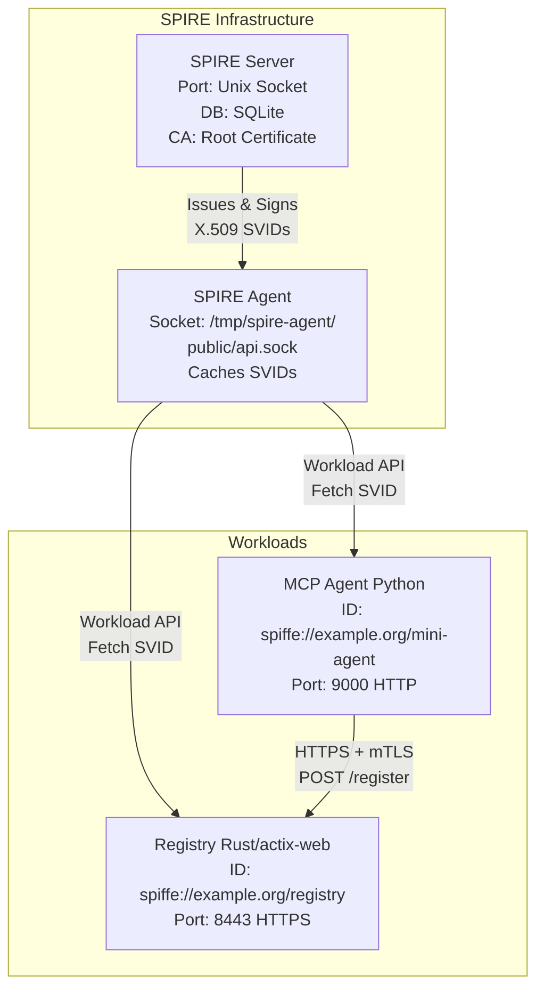
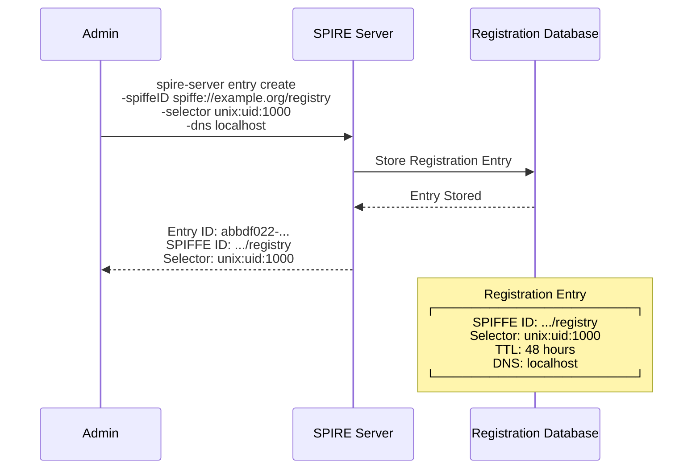
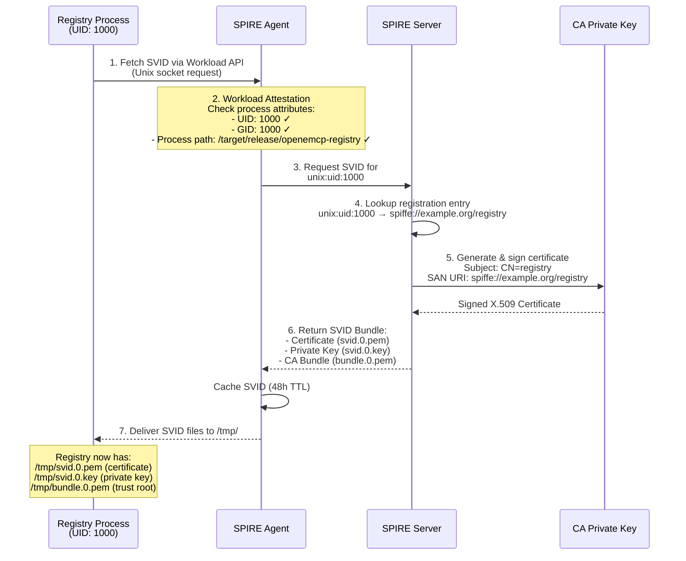
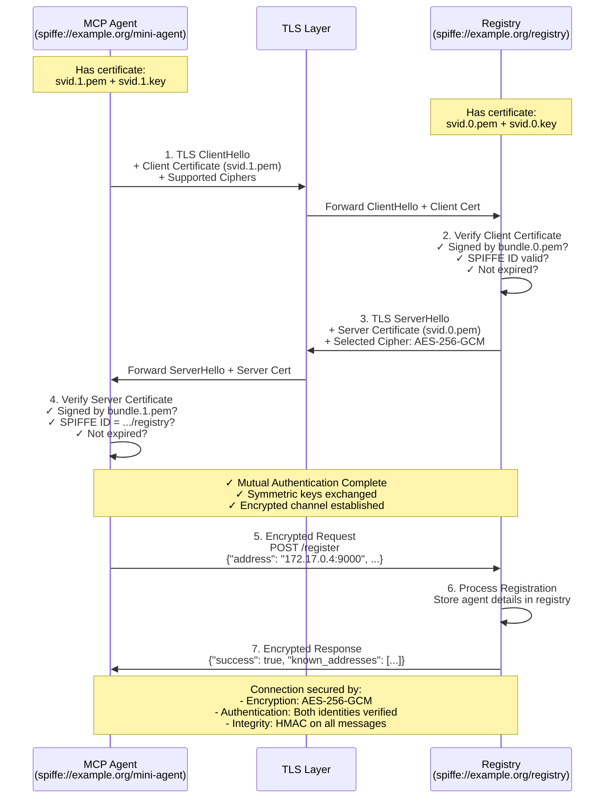
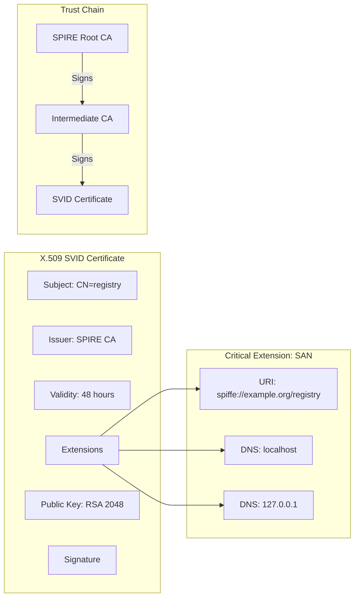
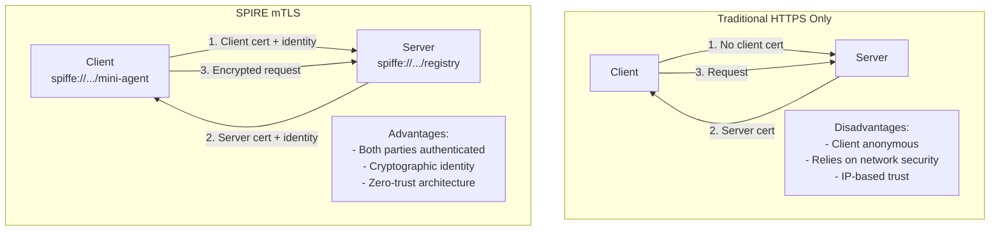
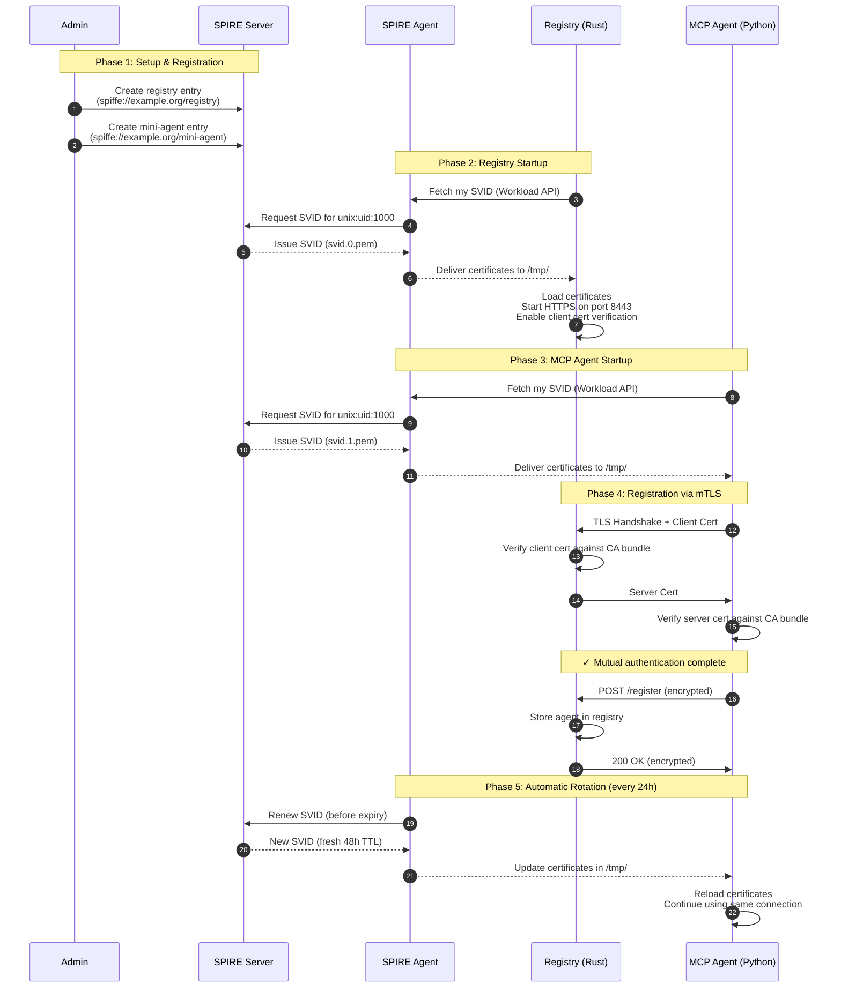

# Component Security Overview

## What is SPIRE?

**SPIRE** (SPIFFE Runtime Environment) is a production-ready implementation of the SPIFFE (Secure Production Identity Framework For Everyone) specification. It provides a unified identity control plane that automatically issues, rotates, and manages X.509 certificates (called SVIDs - SPIFFE Verifiable Identity Documents) for workloads in dynamic, heterogeneous environments.
Think of SPIRE as an "identity factory" for your services - instead of managing SSH keys, passwords, or API tokens, every service gets a cryptographically verifiable identity that proves who it is, not just where it runs.

## Architecture Overview

**Key Components:**
- **SPIRE Server**: Acts as the Certificate Authority (CA) and identity control plane. It stores registration entries (which workloads are allowed) and issues signed certificates.
- **SPIRE Agent**: Runs on each node, attests workload identity (verifies "you are who you say you are"), and delivers certificates via a Unix domain socket.
- **Registry**: Rust service that accepts agent registrations over HTTPS, requires client certificates for authentication.
- **MCP Agent**: Python service that registers with the registry, fetches its identity from SPIRE, and uses mTLS for secure communication.

## Flow 1: Registration Entry Creation

**What's happening:**
1. Administrator creates a "registration entry" - a policy that says "any process running as UID 1000 can get an identity of `spiffe://example.org/registry`"
2. SPIRE Server stores this entry in its database
3. The entry includes selectors (attestation criteria), TTL (certificate lifetime), and DNS names
**Why it matters:** This is the authorization step - you're telling SPIRE "these workloads are allowed to exist in my infrastructure."

## Flow 2: SVID Issuance (Getting Certificates)

**What's happening:**
1. **Registry requests identity**: Process calls SPIRE Agent via Unix socket
2. **Agent attests workload**: Verifies the process matches the selector (UID 1000)
3. **Agent requests certificate**: Asks SPIRE Server for an SVID
4. **Server looks up policy**: Finds the matching registration entry
5. **Server signs certificate**: Creates an X.509 cert with the SPIFFE ID in the Subject Alternative Name (SAN)
6. **SVID delivered**: Certificate, private key, and CA bundle returned
7. **Files written**: Agent writes certificates to `/tmp/` for the workload to use
**Why it matters:** This is the authentication step - SPIRE cryptographically proves the workload's identity without passwords or API keys.

## Flow 3: mTLS Communication

**What's happening:**

1. **Client initiates**: MCP Agent starts TLS handshake and presents its certificate
2. **Server verifies client**: Registry checks if client cert is signed by trusted CA and contains valid SPIFFE ID
3. **Server responds**: Registry presents its own certificate
4. **Client verifies server**: MCP Agent validates registry's certificate
5. **Encrypted communication**: After mutual authentication, all data is encrypted with symmetric keys
6. **Application logic**: Registry processes the registration request
7. **Encrypted response**: Registry sends response back through encrypted channel
   
**Why it matters:**

- **Traditional HTTPS**: Only server proves identity (client could be anyone)
- **mTLS**: Both parties prove identity cryptographically
- **Zero-Trust**: No reliance on network perimeter, VPN, or IP whitelist

## Certificate Structure

**Key Fields:**
- **Subject**: Common Name (CN) - human-readable identifier
- **Issuer**: The SPIRE CA that signed this certificate
- **Validity**: 48-hour lifetime (default) - forces automatic rotation
- **Subject Alternative Name (SAN)**: Contains the SPIFFE ID URI - this is the actual identity!
- **Public Key**: Used for encryption and signature verification
- **Signature**: Proves the certificate was issued by the trusted CA
**SPIFFE ID Format**: `spiffe://trust-domain/workload-identifier`
- `spiffe://`: Protocol identifier
- `example.org`: Trust domain (logical grouping of services)
- `/registry`: Workload-specific identifier

## Security Comparison

| Security Aspect | Traditional TLS | SPIRE mTLS |
|-----------------|-----------------|------------|
| **Server Authentication** | ✓ (DNS + Public CA) | ✓ (SPIFFE ID + Private CA) |
| **Client Authentication** | ✗ (or API keys) | ✓ (X.509 certificate) |
| **Identity Type** | DNS hostname | SPIFFE URI |
| **Certificate Issuance** | Manual (Let's Encrypt, etc.) | Automatic (SPIRE) |
| **Rotation** | Manual, 90 days | Automatic, 48 hours |
| **Trust Model** | Network perimeter | Cryptographic proof |
| **Compromised Credentials** | Must manually revoke | Auto-expires in 48h max |
| **Works Across Networks** | Same datacenter only | Yes, anywhere |

## Complete End-to-End Flow

## Benefits Summary

**Zero-Trust Architecture**: Services authenticate based on cryptographic identity, not network location  
**Automatic Certificate Management**: No manual certificate renewal or deployment  
**Short-Lived Credentials**: 48-hour TTL limits blast radius of compromised keys  
**Mutual Authentication**: Both client and server prove their identity  
**Platform-Agnostic**: Works across Kubernetes, VMs, containers, bare metal  
**Audit Trail**: Every identity issuance is logged with attestation data  
**No Shared Secrets**: Each workload gets unique keys, no password sharing  
**Defense in Depth**: Even if network is compromised, service-to-service communication remains secure

---

**Result**: A production-ready, zero-trust identity system where workloads authenticate using automatically-managed X.509 certificates with SPIFFE IDs, eliminating password-based authentication and enabling secure service-to-service communication across any network.