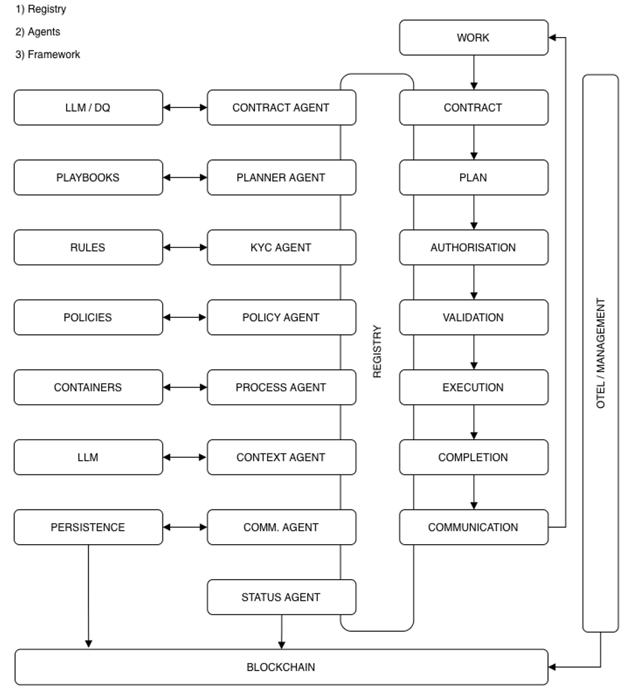
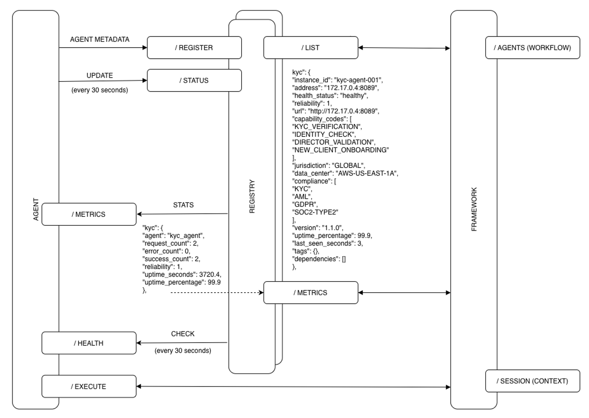
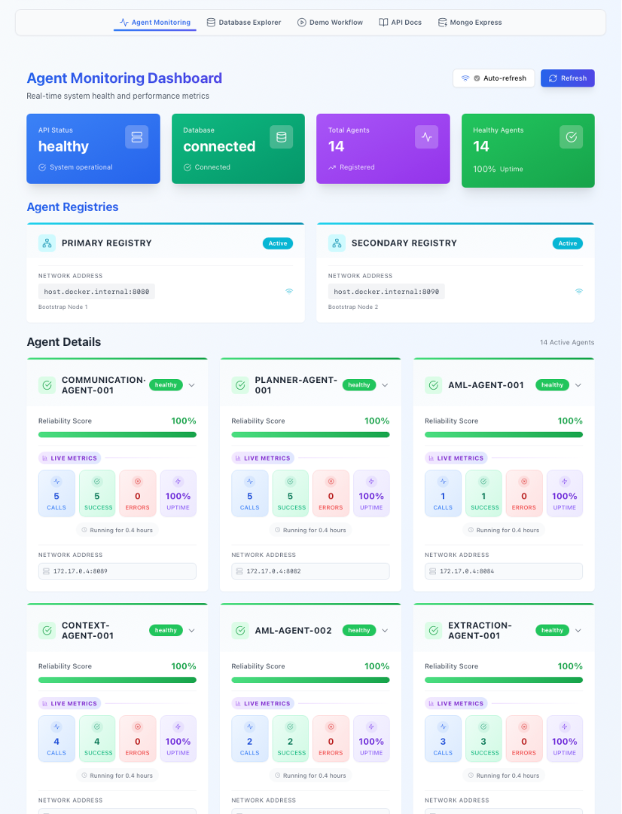
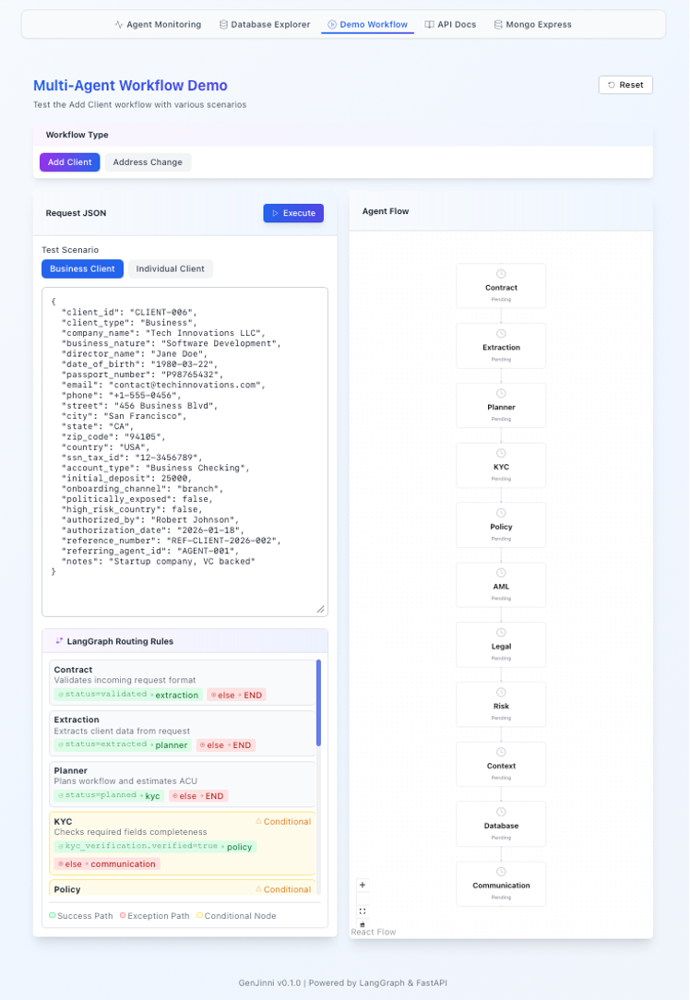
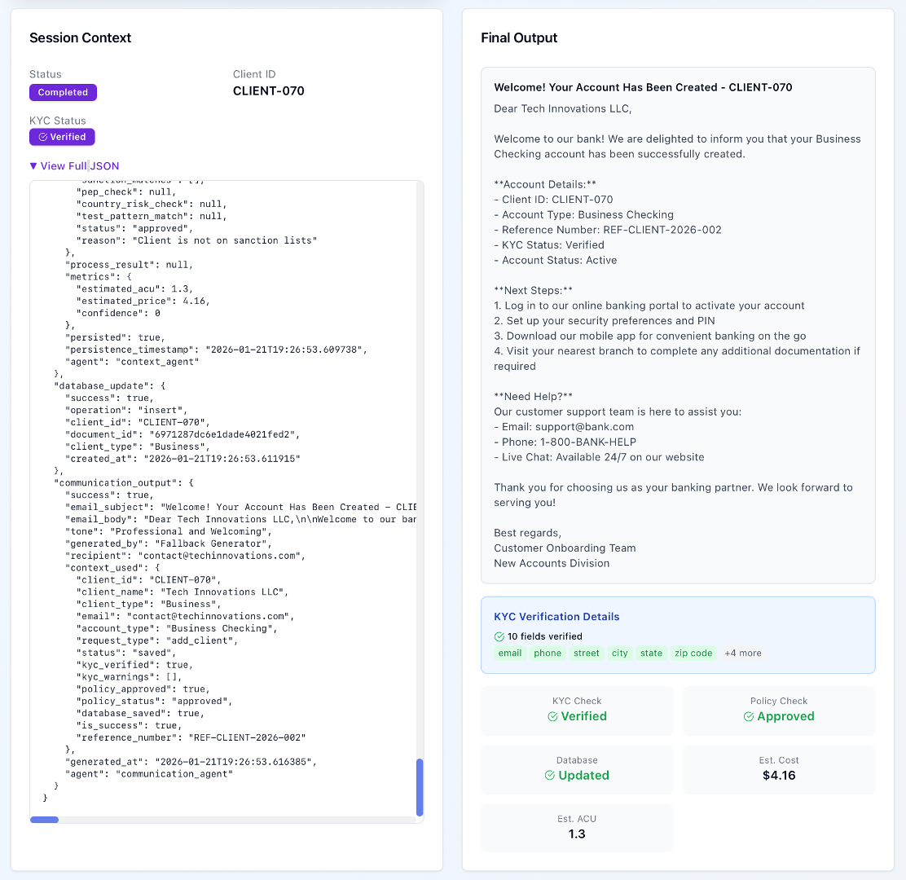

# Product Specification: OpenEMCP Registry

**Version:** 0.1.0  
**Status:** Active Development  
**Last Updated:** 2026-02-24  
**Authors:** OpenEMCP

---

## Table of Contents

1. [Executive Summary](#1-executive-summary)
2. [Problem Statement](#2-problem-statement)
3. [Goals and Non-Goals](#3-goals-and-non-goals)
4. [Target Users and Personas](#4-target-users-and-personas)
5. [Architecture Overview](#5-architecture-overview)
6. [Functional Requirements](#6-functional-requirements)
7. [API Specification](#7-api-specification)
8. [Data Model](#8-data-model)
9. [Security Requirements](#9-security-requirements)
10. [Non-Functional Requirements](#10-non-functional-requirements)
11. [Configuration Model](#11-configuration-model)
12. [Product Backlog and Known Gaps](#12-product-backlog-and-known-gaps)
13. [Roadmap](#13-roadmap)
14. [Acceptance Criteria](#14-acceptance-criteria)
15. [Constraints and Dependencies](#15-constraints-and-dependencies)
16. [Glossary](#16-glossary)

---

## 1. Executive Summary

**OpenEMCP Registry** is a distributed, decentralised, zero-trust service registry designed for agentic AI workloads. It enables AI agents and MCP/OpenEMCP workloads to discover, register, and authenticate each other in a dynamic, heterogeneous environment.

The registry uses **SPIFFE/SPIRE** for cryptographic workload identity, so agents authenticate with X.509 certificates rather than API keys or passwords. It supports a **bootstrap/node** topology where a set of well-known bootstrap servers maintain the authoritative registry, and subordinate nodes synchronize state at configurable intervals.

The current implementation is a working prototype written in **Rust** (actix-web) with a **Python** test-agent client. It exposes a JSON over HTTP(S) REST API, documented via OpenAPI/Swagger.

---

## 2. Problem Statement

AI agent networks face a fundamental service-discovery and trust problem:

| Challenge | Impact |
| --- | --- |
| Agents dynamically appear and disappear | Service lists go stale; agents cannot find peers |
| No strong workload identity | Any client can impersonate any agent |
| Heterogeneous infrastructure (cloud, on-premises, edge) | No single network perimeter to rely on |
| Compliance requirements (HIPAA, SOC 2) differ per region | Cannot assume agents are equivalent |
| Manual certificate rotation is operationally risky | Long-lived credentials accumulate risk over time |
| Lack of capability metadata | Orchestrators cannot make intelligent routing decisions |

Existing general-purpose service registries (Consul, Kubernetes Services, Eureka) do not model the agent-centric, compliance-aware, zero-trust requirements specific to MCP/agentic ecosystems.

---

## 3. Goals and Non-Goals

### Goals

- **G1** – Provide a REST API for agentic workloads to self-register, update status, and discover peers.
- **G2** – Enforce zero-trust authentication via SPIRE-issued X.509 SVIDs with mutual TLS (mTLS).
- **G3** – Support distributed registry topology: one or more bootstrap servers replicated by pull-based node synchronization.
- **G4** – Carry rich workload metadata: capabilities, compliance certifications, jurisdiction, geographic location, resource limits, and dependencies.
- **G5** – Automatically expire stale entries via configurable TTL-based eviction.
- **G6** – Provide a machine-readable OpenAPI specification for all endpoints.
- **G7** – Support automatic certificate rotation with zero-downtime cert refresh via SPIRE (48-hour TTL, auto-renewed).
- **G8** – Graceful HTTP fallback when SPIRE certificates are unavailable (development/testing environments).

### Non-Goals

- **NG1** – Load balancing or traffic routing (handled by consumers of the registry).
- **NG2** – Being a general-purpose key-value store.
- **NG3** – Managing SPIRE infrastructure itself (setup assistance via scripts is provided, but SPIRE is an external dependency).
- **NG4** – Replacing a full orchestration system (Kubernetes, Nomad) for long-running workload scheduling.
- **NG5** – Providing a UI beyond the Swagger documentation page.

---

## 4. Target Users and Personas

### Persona A: AI Agent Developer

> *"I'm building an MCP agent. I need it to announce itself to other agents and find compatible peers at startup without hard-coding any addresses."*

- Uses `POST /register` at startup with agent metadata.
- Uses `GET /list` with filtering to find compatible agents.
- Expects the SDK or config to abstract certificate management.

### Persona B: Platform / Infrastructure Engineer

> *"I operate the cluster. I need to deploy the registry, integrate it with SPIRE, and know which agents are healthy."*

- Configures bootstrap server topology and sync intervals.
- Manages SPIRE registration entries (SPIFFE ID → workload selector).
- Monitors health and staleness via `/health` and `/list`.

### Persona C: Compliance and Security Officer

> *"Our agents process HIPAA data. I need to know which registered agents are compliant, where they run, and that communication is encrypted and authenticated."*

- Queries `/list` to audit capability_codes, compliance, and jurisdiction fields.
- Relies on mTLS to ensure only SPIRE-attested agents can register.
- Needs audit logs for all registration and status change events.

### Persona D: Orchestrator / Scheduling System

> *"I want to dispatch tasks only to agents with specific capability codes and sufficient reliability."*

- Queries `/list` filtering by capability, reliability, and health_status.
- Reads resource_limits to avoid overloading agents.
- Subscribes to registry changes (future: push/webhook).

---

## 5. Architecture Overview

### 5.1 Diagrams

#### Registry in the Agentic Ecosystem



#### Registration process flow



#### Security architecture with SPIRE

```text
┌─────────────────┐
│  SPIRE Server   │
│  (Port 8081)    │
└────────┬────────┘
         │
         │ Trust Domain: example.org
         │
┌────────▼────────┐
│  SPIRE Agent    │
│  Workload API   │
│  /tmp/spire-    │
│  agent/public/  │
│  api.sock       │
└────┬────────────┘
     │
     ├──────────────┐
     │              │
┌────▼─────┐   ┌───▼──────┐
│ Registry │   │   New    │
│ (Rust)   │◄──┤  Agent   │
│ Port 8080│   │ (Python) │
│          │   │ Port 9000│
│ SPIFFE ID│   │ SPIFFE ID│
│ /registry│   │ /new-    │
│          │   │  agent   │
└──────────┘   └──────────┘

     mTLS Communication
```

### 5.2 Component Responsibilities

| Component | Language | Responsibility |
| --- | --- | --- |
| **Bootstrap Registry** | Rust (actix-web) | Authoritative registry; accepts `POST /register`; gossips URLs to nodes |
| **Node Registry** | Rust (actix-web) | Read-only replica (no `POST /register`); synchronizes from bootstrap via periodic re-registration |
| **SPIRE Server** | Go (external) | Certificate Authority; issues and signs X.509 SVIDs; stores registration entries in SQLite |
| **SPIRE Agent** | Go (external) | Per-node daemon; attests workloads; delivers SVIDs via Unix socket |
| **Mini Agent (test)** | Python | Reference MCP agent; demonstrates registration, heartbeat, and SPIRE integration patterns |

### 5.3 Key Flows

**Flow 1 – Agent Registration**:

1. Agent fetches SVID from SPIRE Agent via Workload API.
2. Agent calls `POST /register` on bootstrap registry with its address and metadata.
3. Registry validates client certificate (mTLS), stores metadata.
4. Registry returns known addresses and bootstrap URLs.
5. Agent stores known addresses for peer discovery.

**Flow 2 – Node Sync**:

1. Node registry wakes on `sync_interval` tick.
2. Re-registers with each known bootstrap URL using `POST /register`.
3. Receives updated address list and additional bootstrap URLs.
4. Merges new entries into local in-memory registry.

**Flow 3 – TTL Eviction**:

1. On every `GET /list` call, the cleanup routine runs.
2. Any entry where `current_time - last_seen > max_ttl` is removed.
3. Stale entries do not appear in responses.

---

## 6. Functional Requirements

### FR-1: Agent Self-Registration

| ID | Requirement | Priority | Status |
| --- | --- | --- | --- |
| FR-1.1 | Bootstrap server MUST accept `POST /register` with an `address` in `IP:PORT` format | P0 | Open |
| FR-1.2 | Registration request MAY include `agent_details` with capability, compliance, and resource metadata | P0 | Open |
| FR-1.3 | Non-bootstrap nodes MUST return `403 Forbidden` on `POST /register` | P0 | Open |
| FR-1.4 | Re-registering an existing address MUST update `last_seen` but preserve `reliability`, `health_status`, and `uptime_percentage` | P1 | Open |
| FR-1.5 | System MUST support registering agents without SPIRE in HTTP-only mode | P1 | Open |

### FR-2: Agent Discovery

| ID | Requirement | Priority | Status |
| --- | --- | --- | --- |
| FR-2.1 | All nodes MUST expose `GET /list` returning all non-expired agents | P0 | Open |
| FR-2.2 | `GET /list` MUST include `last_seen_seconds`, health, reliability, capabilities, and compliance per entry | P0 | Open |
| FR-2.3 | Bootstrap nodes MUST include known `bootstrap_urls` in list response | P1 | Open |
| FR-2.4 | `GET /list` MUST filter by capability code | P1 | Open |
| FR-2.5 | `GET /list` MUST support pagination (`limit` / `offset`) | P1 | Open |
| FR-2.6 | `GET /list` MUST support filtering by jurisdiction, compliance, and health_status | P2 | Open |

### FR-3: Status Management

| ID | Requirement | Priority | Status |
| --- | --- | --- | --- |
| FR-3.1 | System MUST expose `PUT /status` to update `reliability`, `health_status`, and `uptime_percentage` independently of re-registration | P0 | Open |
| FR-3.2 | `PUT /status` MUST validate `reliability` ∈ [0.0, 1.0] and `uptime_percentage` ∈ [0.0, 100.0] | P0 | Open |
| FR-3.3 | `PUT /status` MUST return `404` if the address is not registered | P0 | Open |
| FR-3.4 | System MUST expose `DELETE /register/{address}` for graceful deregistration | P0 | Open |
| FR-3.5 | System MUST expose `POST /heartbeat` as a lightweight keep-alive (no full payload) | P1 | Open |

### FR-4: Health Check

| ID | Requirement | Priority | Status |
| --- | --- | --- | --- |
| FR-4.1 | All modes MUST expose `GET /health` returning `{"status": "ok"}` | P0 | Open |
| FR-4.2 | Health endpoint MUST be reachable without mTLS client certificate (exempted from auth) | P1 | Open |

### FR-5: Bootstrap Topology

| ID | Requirement | Priority | Status |
| --- | --- | --- | --- |
| FR-5.1 | Nodes MUST periodically re-register with all known bootstrap URLs at configurable `sync_interval` | P0 | Open |
| FR-5.2 | Nodes MUST learn additional bootstrap URLs from any bootstrap's response | P1 | Open |
| FR-5.3 | Bootstrap servers MUST self-register on startup | P1 | Open |
| FR-5.4 | Node MUST tolerate individual bootstrap server failures without crashing | P1 | Open |
| FR-5.5 | Node MUST apply exponential back-off on repeated bootstrap sync failures | P2 | Open |

### FR-6: TTL and Expiry

| ID | Requirement | Priority | Status |
| --- | --- | --- | --- |
| FR-6.1 | Entries MUST expire after `max_ttl` seconds of inactivity (default: 60 s) | P0 | Open |
| FR-6.2 | Own local address MUST never be expired | P0 | Open |
| FR-6.3 | `max_ttl` MUST be configurable via YAML and CLI | P1 | Open |

### FR-7: Security and Identity

| ID | Requirement | Priority | Status |
| --- | --- | --- | --- |
| FR-7.1 | Registry MUST start HTTPS/mTLS automatically when SPIRE SVIDs are present | P0 | Open |
| FR-7.2 | Registry MUST require and validate client X.509 certificates when in mTLS mode | P0 | Open |
| FR-7.3 | Registry MUST fall back to plain HTTP when SPIRE certs are absent | P1 | Open |
| FR-7.4 | SVID path locations MUST be configurable (currently hard-coded to `/tmp/svid.0.*`) | P1 | Open |
| FR-7.5 | System MUST support dynamic SVID reload without server restart | P1 | Open |
| FR-7.6 | System MUST implement per-endpoint authorization based on SPIFFE ID of caller | P2 | Open |

### FR-8: Observability

| ID | Requirement | Priority | Status |
| --- | --- | --- | --- |
| FR-8.1 | All HTTP requests MUST be traced via structured tracing-actix-web middleware | P0 | Open |
| FR-8.2 | System MUST expose a `GET /metrics` Prometheus-compatible endpoint | P1 | Open |
| FR-8.3 | All registration, update, and deregistration events MUST produce structured log entries | P1 | Open |
| FR-8.4 | System MUST support distributed tracing with trace context propagation (e.g., W3C `traceparent`) | P2 | Open |

### FR-9: Documentation

| ID | Requirement | Priority | Status |
| --- | --- | --- | --- |
| FR-9.1 | System MUST expose an OpenAPI 3.0 spec at `GET /api-docs/openapi.json` | P0 | Open |
| FR-9.2 | System MUST serve Swagger UI at `GET /swagger-ui/` | P0 | Open |

---

## 7. API Specification

### Base URL

| Mode | URL |
| --- | --- |
| mTLS enabled | `https://<host>:<port>` |
| HTTP fallback | `http://<host>:<port>` |

Default port: **8443** (bootstrap), **8081** (node). Configurable.

### 7.1 `GET /health`

Health liveness probe. No authentication required.

**Response 200:**

```json
{ "status": "ok" }
```

---

### 7.2 `POST /register`

Register or refresh an agent entry. **Bootstrap servers only.**

**Request Body:**

```json
{
  "address": "192.168.1.100:8090",
  "known_bootstrap_urls": ["https://registry.example.com:8443"],
  "agent_details": {
    "instance_id": "agent-abc-001",
    "capability_codes": ["MCP_STDIO", "COMPUTE"],
    "jurisdiction": "US-EAST",
    "data_center": "dc1-nyc",
    "compliance": ["SOC2-TYPE2", "HIPAA"],
    "reliability": 0.99,
    "version": "1.2.0",
    "health_status": "healthy",
    "uptime_percentage": 99.7,
    "last_seen": 1706000000,
    "geographic_location": {
      "latitude": 40.7128,
      "longitude": -74.0060,
      "country_code": "US",
      "city": "New York",
      "region": "NY"
    },
    "resource_limits": {
      "max_cpu_cores": 4,
      "max_memory_mb": 8192,
      "max_connections": 100,
      "max_requests_per_second": 50
    },
    "endpoints": {
      "https": "https://192.168.1.100:8090",
      "grpc": "grpc://192.168.1.100:9090"
    },
    "tags": { "team": "ml-platform", "env": "production" },
    "dependencies": ["vector-db-001", "llm-gateway-prod"]
  }
}
```

**Response 200:**

```json
{
  "success": true,
  "message": "Address registered",
  "known_addresses": ["192.168.1.1:8443", "192.168.1.100:8090"],
  "bootstrap_urls": ["https://registry.example.com:8443"]
}
```

**Response 403:** Node-mode server (not a bootstrap).

---

### 7.3 `GET /list`

Returns all non-expired registered agents.

**Response 200:**

```json
{
  "count": 2,
  "addresses": [
    {
      "address": "192.168.1.100:8090",
      "last_seen_seconds": 12,
      "instance_id": "agent-abc-001",
      "capability_codes": ["MCP_STDIO", "COMPUTE"],
      "jurisdiction": "US-EAST",
      "data_center": "dc1-nyc",
      "compliance": ["SOC2-TYPE2", "HIPAA"],
      "reliability": 0.99,
      "version": "1.2.0",
      "health_status": "healthy",
      "uptime_percentage": 99.7,
      "registration_time": 1705999000,
      "geographic_location": { ... },
      "resource_limits": { ... },
      "endpoints": { ... },
      "tags": { ... },
      "dependencies": [...]
    }
  ],
  "bootstrap_urls": ["https://registry.example.com:8443"]
}
```

---

### 7.4 `PUT /status`

Update health and reliability fields for a registered agent. Does not require re-sending full agent details.

**Request Body:**

```json
{
  "address": "192.168.1.100:8090",
  "reliability": 0.95,
  "health_status": "degraded",
  "uptime_percentage": 97.5,
  "registration_time": 1705999000
}
```

**Response 200:**

```json
{
  "success": true,
  "message": "Updated: reliability: 0.95, health_status: degraded",
  "address": "192.168.1.100:8090",
  "reliability": 0.95,
  "health_status": "degraded",
  "uptime_percentage": 97.5
}
```

**Response 400:** Reliability or uptime out of range.  
**Response 404:** Address not registered.

---

### 7.5 `DELETE /register/{address}` *(Planned)*

Graceful deregistration of an agent.

**Path Parameter:** `address` (URL-encoded `IP:PORT`)

**Response 200:**

```json
{ "success": true, "message": "Address deregistered" }
```

**Response 404:** Address not registered.

---

### 7.6 `POST /heartbeat` *(Planned)*

Lightweight keep-alive. Updates `last_seen` without requiring full payload.

**Request Body:**

```json
{ "address": "192.168.1.100:8090" }
```

**Response 200:**

```json
{ "success": true, "last_seen": 1706001234 }
```

---

### 7.7 `GET /metrics` *(Planned)*

Prometheus-compatible metrics endpoint.

**Response 200 (text/plain):**

```text
# HELP registry_registered_agents Total registered agents
# TYPE registry_registered_agents gauge
registry_registered_agents 42

# HELP registry_registrations_total Total registration requests
# TYPE registry_registrations_total counter
registry_registrations_total 1024
```

---

## 8. Data Model

### 8.1 AgentDetails

Core entity stored per registered agent.

| Field | Type | Required | Description |
| --- | --- | --- | --- |
| `instance_id` | string | No | Unique human-readable identifier for the agent instance |
| `last_seen` | u64 (unix seconds) | Yes | Timestamp of last registration or heartbeat |
| `registration_time` | u64 (unix seconds) | No | First registration timestamp; immutable after set |
| `capability_codes` | string[] | No | Opaque codes describing agent capabilities (e.g., `MCP_STDIO`, `COMPUTE`, `REGISTRY`) |
| `health_status` | enum | No | `healthy` \| `degraded` \| `unhealthy` \| `unknown` |
| `reliability` | f64 [0.0–1.0] | No | Point-in-time reliability score |
| `uptime_percentage` | f64 [0.0–100.0] | No | Historical uptime percentage |
| `version` | string | No | Semantic version of the agent software |
| `jurisdiction` | string | No | Regulatory jurisdiction (e.g., `US-EAST`, `EU-WEST`) |
| `data_center` | string | No | Data center or cluster identifier |
| `compliance` | string[] | No | Compliance certifications (e.g., `HIPAA`, `SOC2-TYPE2`, `PCI-DSS`) |
| `geographic_location` | GeoLocation | No | Coordinates and region metadata |
| `endpoints` | ServiceEndpoints | No | HTTP, HTTPS, gRPC, WebSocket, custom URLs |
| `resource_limits` | ResourceLimits | No | CPU, memory, connection, request rate, storage caps |
| `dependencies` | string[] | No | Instance IDs of services this agent requires |
| `tags` | map[string]string | No | Free-form key-value metadata |
| `timestamp` | string | No | Human-readable timestamp string (YYYY-MM-DD HH:MM:SS tz) |

### 8.2 GeoLocation

| Field | Type | Required | Description |
| --- | --- | --- | --- |
| `latitude` | f64 | Yes | WGS-84 latitude |
| `longitude` | f64 | Yes | WGS-84 longitude |
| `country_code` | string | No | ISO 3166-1 alpha-2 |
| `city` | string | No | City name |
| `region` | string | No | State / province / region |

### 8.3 ServiceEndpoints

| Field | Type | Description |
| --- | --- | --- |
| `http` | string | HTTP URL |
| `https` | string | HTTPS URL |
| `grpc` | string | gRPC target |
| `websocket` | string | WebSocket URL |
| `custom` | map[string]string | Named custom endpoints |

### 8.4 ResourceLimits

| Field | Type | Description |
| --- | --- | --- |
| `max_cpu_cores` | u32 | Max available CPU cores |
| `max_memory_mb` | u64 | Max memory in megabytes |
| `max_connections` | u32 | Max concurrent connections |
| `max_requests_per_second` | u32 | Sustained request throughput limit |
| `max_storage_gb` | u64 | Max available storage in gigabytes |

### 8.5 AgentStatus Enum

| Value | Meaning |
| --- | --- |
| `healthy` | Fully operational |
| `degraded` | Operational but impaired (e.g., high latency, partial failure) |
| `unhealthy` | Not serving requests |
| `unknown` | Status not yet reported |

### 8.6 Internal Registry State

The registry maintains two in-memory data structures:

```text
registry:       HashMap<Address, AgentDetails>    // primary store
bootstrap_urls: HashSet<String>                   // known bootstrap server URLs
```

**Known Limitation:** Both structures are in-memory only. All data is lost on process restart.

---

## 9. Security Requirements

### 9.1 Mutual TLS via SPIRE

| Requirement | Description |
| --- | --- |
| SR-1 | Registry MUST use SPIRE-issued X.509 SVIDs as its server certificate |
| SR-2 | Registry MUST require and verify client certificates against the SPIRE CA bundle |
| SR-3 | SPIFFE Trust Domain MUST be `spiffe://example.org` (configurable in production) |
| SR-4 | Certificate TTL is 48 hours; SPIRE automatically rotates before expiry |
| SR-5 | mTLS uses TLS 1.2+ with Mozilla Intermediate cipher profile |

### 9.2 SPIFFE Identity Assignments

| Workload | SPIFFE ID | Selector |
| --- | --- | --- |
| Registry | `spiffe://example.org/registry` | `unix:uid:<registry-uid>` |
| Mini Agent | `spiffe://example.org/mini-agent` | `unix:uid:<agent-uid>` |
| Test Client | `spiffe://example.org/test-client` | `unix:uid:<test-uid>` |

### 9.3 Certificate File Locations

| File | Path | Description |
| --- | --- | --- |
| Server certificate | `/tmp/svid.0.pem` | X.509 SVID (server identity) |
| Private key | `/tmp/svid.0.key` | Private key for server cert |
| CA bundle | `/tmp/bundle.0.pem` | Trust root for client cert verification |

### 9.4 Security Gaps (Backlog)

| Gap | Risk | Priority |
| --- | --- | --- |
| No SPIFFE ID-based authorization (any valid cert can call any endpoint) | Medium | P1 |
| SVID path hard-coded to `/tmp/` | Low | P1 |
| No hot-reload of certificates without server restart | Medium | P1 |
| No rate limiting on `POST /register` (DoS risk) | High | P0 |
| No audit log for registration/deregistration events | High | P1 |
| HTTP fallback available in production | Medium | P2 |

---

## 10. Non-Functional Requirements

### 10.1 Performance

| NFR | Target |
| --- | --- |
| NFR-P1 | `POST /register` p99 latency < 50 ms under 100 concurrent agents |
| NFR-P2 | `GET /list` p99 latency < 20 ms for up to 1,000 registered agents |
| NFR-P3 | Node sync cycle overhead < 5% CPU on a single core |
| NFR-P4 | Bootstrap server MUST serve ≥ 500 requests/second on commodity hardware |

### 10.2 Reliability

| NFR | Target |
| --- | --- |
| NFR-R1 | Bootstrap server uptime target: 99.9% (excluding planned maintenance) |
| NFR-R2 | Node registry MUST continue serving `GET /list` from its last-known state even if all bootstrap servers are unreachable |
| NFR-R3 | Process MUST handle graceful shutdown without aborting in-flight requests |

### 10.3 Scalability

| NFR | Target |
| --- | --- |
| NFR-S1 | Support ≥ 10,000 concurrently registered agents per bootstrap server |
| NFR-S2 | Support ≥ 10 bootstrap servers in a federation without split-brain |
| NFR-S3 | `GET /list` response MUST support pagination before 10,000 agents are common |

### 10.4 Operability

| NFR | Target |
| --- | --- |
| NFR-O1 | Configuration via YAML file and CLI overrides, with documented precedence |
| NFR-O2 | Log output MUST be structured JSON in production mode |
| NFR-O3 | Metrics MUST be Prometheus-scrapable |
| NFR-O4 | Container image MUST be < 50 MB |

### 10.5 Compatibility

| NFR | Target |
| --- | --- |
| NFR-C1 | OpenAPI spec MUST remain backward-compatible across minor versions |
| NFR-C2 | Agent clients MUST be able to register in any supported language over the HTTP JSON API |

---

## 11. Configuration Model

### 11.1 Server Configuration

| Field | Type | Default | Description |
| --- | --- | --- | --- |
| `server.port` | u16 | `8080` | Listening port |
| `server.bootstrap` | bool | `false` | Run as bootstrap (accepts registrations) |
| `server.max_ttl` | u64 (seconds) | `60` | Time after which inactive entries are evicted |

### 11.2 Bootstrap Configuration

| Field | Type | Default | Description |
| --- | --- | --- | --- |
| `bootstrap.urls` | string[] | `[]` | Upstream bootstrap URLs to sync from |
| `bootstrap.sync_interval` | u64 (seconds) | `30` | How often to sync from bootstrap servers |

### 11.3 Agent Configuration

| Field | Type | Default | Description |
| --- | --- | --- | --- |
| `agent.instance_id` | string | null | Self-reported instance ID |
| `agent.capability_codes` | string[] | `[]` | Capabilities this registry node advertises |
| `agent.jurisdiction` | string | null | Regulatory jurisdiction |
| `agent.data_center` | string | null | Data center label |
| `agent.compliance` | string[] | `[]` | Compliance certifications |
| `agent.reliability` | f64 | null | Self-reported reliability [0.0–1.0] |
| `agent.version` | string | null | Software version |
| `agent.health_status` | enum | `unknown` | Self-reported health status |

### 11.4 CLI Override Precedence

```text
CLI args  >  config file  >  built-in defaults
```

CLI flags: `--port`, `--bootstrap`, `--bootstrap-url` (repeatable), `--sync-interval`, `-c / --config`.

---

## 12. Product Backlog and Known Gaps

### Priority Legend

| Symbol | Meaning |
| --- | --- |
| 🔴 P0 | Critical – required for production readiness |
| 🟠 P1 | High – required for full feature-completeness |
| 🟡 P2 | Medium – important quality-of-life improvement |
| 🟢 P3 | Low – nice to have |

---

### 12.1 Security Backlog

| ID | Title | Priority | Notes |
| --- | --- | --- | --- |
| SEC-1 | Rate limiting on `POST /register` and `PUT /status` | 🔴 P0 | Prevent DoS; suggest token-bucket per SPIFFE ID |
| SEC-2 | Audit log for every registration, update, and deregistration event | 🟠 P1 | Include caller identity (SPIFFE ID) when mTLS is active |
| SEC-3 | SPIFFE ID-based authorization per endpoint | 🟠 P1 | e.g., only `spiffe://…/registry` can call `POST /register` |
| SEC-4 | Configurable SVID certificate paths | 🟠 P1 | Remove `/tmp/` hard-coding; support env vars or YAML |
| SEC-5 | Hot-reload of SPIRE certificates without restart | 🟠 P1 | Watch file descriptor or SPIRE push API |
| SEC-6 | Disable HTTP fallback via a config flag for production deployments | 🟡 P2 | `server.require_mtls: true` |
| SEC-7 | Input validation and sanitization on all string fields | 🔴 P0 | Prevent injection attacks; enforce length limits |
| SEC-8 | Use SPIRE Workload API (gRPC) directly instead of file-based SVID delivery | 🟡 P2 | More robust rotation; eliminates `/tmp/` race conditions |

---

### 12.2 API Completeness Backlog

| ID | Title | Priority | Notes |
| --- | --- | --- | --- |
| API-1 | `DELETE /register/{address}` – graceful deregistration | 🔴 P0 | Currently agents can only be expired by TTL |
| API-2 | `POST /heartbeat` – lightweight keep-alive | 🟠 P1 | Avoids re-sending full payload on every heartbeat |
| API-3 | `GET /list` filtering by `capability_codes`, `jurisdiction`, `compliance`, `health_status` | 🟠 P1 | Query parameters: `?capability=MCP_STDIO&health=healthy` |
| API-4 | `GET /list` pagination via `?limit=N&offset=M` | 🟠 P1 | Required before 1,000+ agents are common |
| API-5 | `PATCH /agent/{address}` – partial update of agent metadata | 🟡 P2 | Allows updating tags or version without losing other fields |
| API-6 | `GET /agent/{address}` – single agent lookup | 🟡 P2 | Avoid pulling full list for one agent |
| API-7 | `GET /agent/{address}/history` – status change history | 🟢 P3 | Requires persistent storage |
| API-8 | Batch `POST /register/bulk` for mass registration | 🟢 P3 | Useful for orchestrators managing large fleets |

---

### 12.3 Data Persistence Backlog

| ID | Title | Priority | Notes |
| --- | --- | --- | --- |
| STORE-1 | Persist registry to disk on graceful shutdown and restore on startup | 🔴 P0 | Currently all data lost on restart |
| STORE-2 | SQLite-backed persistent store for single-node deployments | 🟠 P1 | Simple delta from current in-memory HashMap |
| STORE-3 | PostgreSQL or Redis backend for multi-node high-availability | 🟡 P2 | Required for active-active bootstrap topology |
| STORE-4 | Write-ahead log (WAL) / transaction support to eliminate race conditions | 🟡 P2 | Current `Mutex<HashMap>` is not transactional |
| STORE-5 | Backup and point-in-time recovery for registry state | 🟢 P3 | Required for strict SLA environments |

---

### 12.4 Observability Backlog

| ID | Title | Priority | Notes |
| --- | --- | --- | --- |
| OBS-1 | `GET /metrics` Prometheus endpoint | 🟠 P1 | Counters: registrations, heartbeats, evictions, sync failures |
| OBS-2 | Structured JSON logging with correlation IDs | 🟠 P1 | Attach `trace_id` to all log lines |
| OBS-3 | Distributed tracing with W3C `traceparent` propagation | 🟡 P2 | Integrate with Tempo/Jaeger |
| OBS-4 | Alerting hooks: emit events for agent going unhealthy or expiring | 🟡 P2 | Webhook or NATS pub/sub |
| OBS-5 | Admin dashboard (read-only) showing registry topology | 🟢 P3 | Could be a simple HTML page served by Swagger UI |

---

### 12.5 Resilience Backlog

| ID | Title | Priority | Notes |
| --- | --- | --- | --- |
| RES-1 | Exponential back-off with jitter for bootstrap sync failures | 🟠 P1 | Prevent thundering-herd on bootstrap restart |
| RES-2 | Circuit breaker for failed bootstrap connections | 🟠 P1 | Prevent flood of failed sync attempts |
| RES-3 | Graceful shutdown: persist state before exit | 🔴 P0 | Tied to STORE-1 |
| RES-4 | Node continues serving stale-but-valid data when bootstrap is unreachable | 🟠 P1 | Currently implemented; needs explicit TTL extension during partition |
| RES-5 | Configuration-driven bootstrap health check before sync | 🟡 P2 | Poll `/health` before registering to avoid wasted retries |

---

### 12.6 Capability and Discovery Backlog

| ID | Title | Priority | Notes |
| --- | --- | --- | --- |
| CAP-1 | Standardize `capability_codes` vocabulary with a published registry | 🟠 P1 | Clients cannot reliably filter without a shared vocabulary |
| CAP-2 | Capability version constraints (e.g., `MCP_STDIO>=1.2`) | 🟡 P2 | Semantic version matching in filter queries |
| CAP-3 | Push-based subscription to registry changes (SSE or WebSocket) | 🟡 P2 | Orchestrators should not poll; they should receive events |
| CAP-4 | Affinity and anti-affinity rules (e.g., "prefer same data center") | 🟢 P3 | Return scored/sorted results based on requester location |

---

## 13. Roadmap

### v0.1 – Current State (Prototype)

- [ ] Core registration / list / status endpoints
- [ ] Bootstrap / node topology with pull synchronization
- [ ] SPIRE mTLS integration (auto-detect and configure)
- [ ] TTL-based stale entry eviction
- [ ] OpenAPI / Swagger UI
- [ ] Structured tracing via `tracing-actix-web`
- [ ] Python reference agent with SPIRE support

### v0.2 – Production Security Baseline

**ETA: March 2026**:

- [ ] SEC-1: Rate limiting
- [ ] SEC-2: Audit logging with SPIFFE ID of caller
- [ ] SEC-7: Input validation on all string fields
- [ ] API-1: `DELETE /register/{address}`
- [ ] STORE-1: Persist state on graceful shutdown
- [ ] RES-3: Graceful shutdown with state flush
- [ ] FR-3.5: `POST /heartbeat` endpoint

### v0.3 – Operational Completeness

**ETA: April 2026**:

- [ ] OBS-1: Prometheus metrics
- [ ] API-2, API-3, API-4: Heartbeat, filtering, pagination
- [ ] STORE-2: SQLite persistence
- [ ] RES-1, RES-2: Exponential back-off and circuit breaker
- [ ] SEC-4: Configurable SVID paths
- [ ] SEC-5: Hot-reload of certificates

### v0.4 – Scale and Reliability

**ETA: June 2026**:

- [ ] STORE-3: PostgreSQL/Redis backend
- [ ] CAP-1: Standardized capability vocabulary
- [ ] CAP-3: Push-based subscription (SSE)
- [ ] OBS-2: Structured JSON logging with correlation IDs
- [ ] SEC-3: SPIFFE ID-based per-endpoint authorization
- [ ] Multi-region / multi-trust-domain federation

### v1.0 – GA Release

- All P0 and P1 requirements implemented and tested
- SLA documentation published
- Container image with multi-arch support (amd64, arm64)
- Helm chart for Kubernetes deployment
- Terraform module for SPIRE + Registry provisioning

---

## 14. Acceptance Criteria

### AC-1: Agent can register and be discovered

```gherkin
Given a bootstrap registry is running with mTLS enabled
When an agent calls POST /register with valid address and agent_details
Then the response status is 200
And the agent appears in GET /list within 1 second
And last_seen_seconds is ≤ 2
```

### AC-2: Stale entries are evicted

```gherkin
Given an agent is registered with max_ttl=10 seconds
When 15 seconds pass without re-registration
Then the agent does NOT appear in GET /list
```

### AC-3: mTLS enforced in SPIRE mode

```gherkin
Given the registry has valid SPIRE SVIDs
When a client calls POST /register without a client certificate
Then the response status is 400 (SSL handshake failure)
```

### AC-4: Non-bootstrap rejects registration

```gherkin
Given a node-mode registry instance
When a client calls POST /register
Then the response status is 403
```

### AC-5: Node sync propagates agents

```gherkin
Given agent A is registered with bootstrap B
And node N syncs from bootstrap B every 30 seconds
When agent A registers with B
Then after ≤ 30 seconds, agent A appears in GET /list on node N
```

### AC-6: Status update is isolated

```gherkin
Given agent A is registered
When PUT /status is called with reliability=0.5 and health_status=degraded
Then GET /list returns agent A with reliability=0.5 and health_status=degraded
And the instance_id, capability_codes, and compliance fields are unchanged
```

---

## 15. Constraints and Dependencies

### External Dependencies

| Dependency | Version | Purpose | Notes |
| --- | --- | --- | --- |
| SPIRE Server | 1.14.1+ | X.509 SVID issuance, workload attestation | Optional; HTTP fallback if absent |
| SPIRE Agent | 1.14.1+ | Per-node workload identity delivery | Must run as a sidecar / node daemon |
| OpenSSL | 0.10+ | TLS termination | Linked via Rust `openssl` crate |
| Tokio | 1.48+ | Async runtime for actix-web and background sync | |
| actix-web | 4.12+ | HTTP server framework | |
| reqwest | 0.12+ | HTTP client for bootstrap sync | |

### Runtime Constraints

- SPIRE Agent Unix socket: `/tmp/spire-agent/public/api.sock` (must be accessible to the registry process)
- SVID files: `/tmp/svid.0.pem`, `/tmp/svid.0.key`, `/tmp/bundle.0.pem` (writable by SPIRE Agent, readable by registry)
- The registry discovers its own IP using `local_ip_address`; multi-NIC environments may require explicit binding configuration
- Default `max_ttl=60 s` must be tuned for the expected heartbeat interval of agents

---

## 16. Glossary

| Term | Definition |
| --- | --- |
| **Agent** | A workload (AI agent, MCP server, microservice) that registers with and is discoverable through the registry |
| **Bootstrap Server** | A registry instance configured to accept `POST /register`; acts as the authoritative state store |
| **Capability Code** | An opaque string identifying a skill or interface an agent supports (e.g., `MCP_STDIO`, `COMPUTE`) |
| **MCP** | Model Context Protocol – an open protocol for AI agent tool-use and inter-agent communication |
| **mTLS** | Mutual TLS – both the client and server present X.509 certificates to authenticate each other |
| **Node** | A registry instance that syncs from bootstrap servers but does not accept new registrations |
| **SPIFFE** | Secure Production Identity Framework For Everyone – a standard for workload identity |
| **SPIFFE ID** | A URI uniquely identifying a workload, e.g., `spiffe://example.org/registry` |
| **SPIRE** | SPIFFE Runtime Environment – the reference implementation of the SPIFFE specification |
| **SVID** | SPIFFE Verifiable Identity Document – an X.509 certificate carrying a SPIFFE ID in its SAN field |
| **TTL** | Time To Live – maximum age of an unrefreshed agent entry before it is evicted |
| **Trust Domain** | The domain component of a SPIFFE ID (e.g., `example.org`); all SVIDs within a domain share a root CA |
| **Workload Attestation** | The process by which SPIRE Agent verifies the identity of a process before issuing it an SVID |
| **Zero Trust** | A security model that requires explicit verification of every request, regardless of network location |

---

## 17. Appendices - Ideas, Mockups, and Additional Context

### 17.1 UI Dashboard Mockup



### 17.2 UI Dashboard Execution



### 17.3 UI Dashboard Results



### 17.4 Comparison to other service discovery solutions

#### ERC8004

tbd

#### Gemini Enterprise Service Directory

tbd
