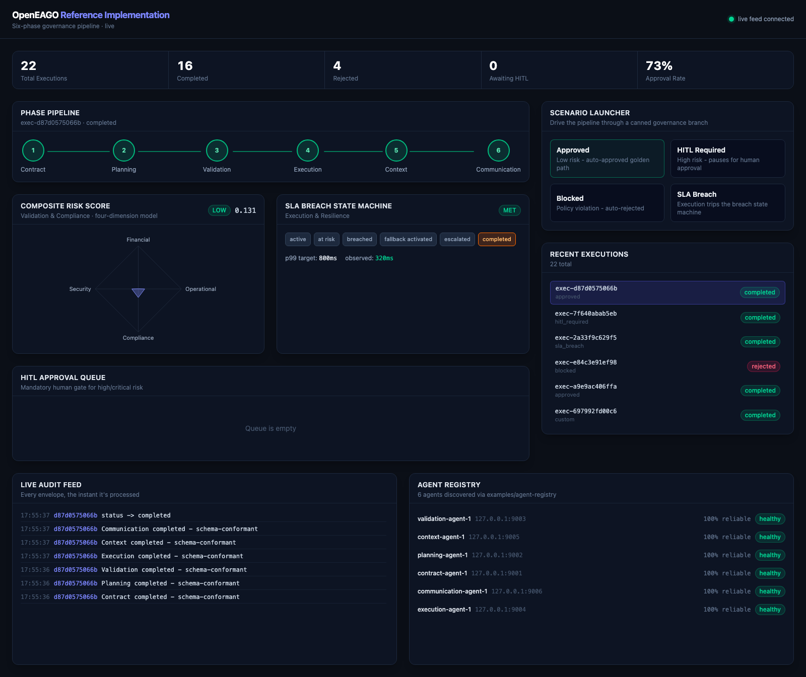
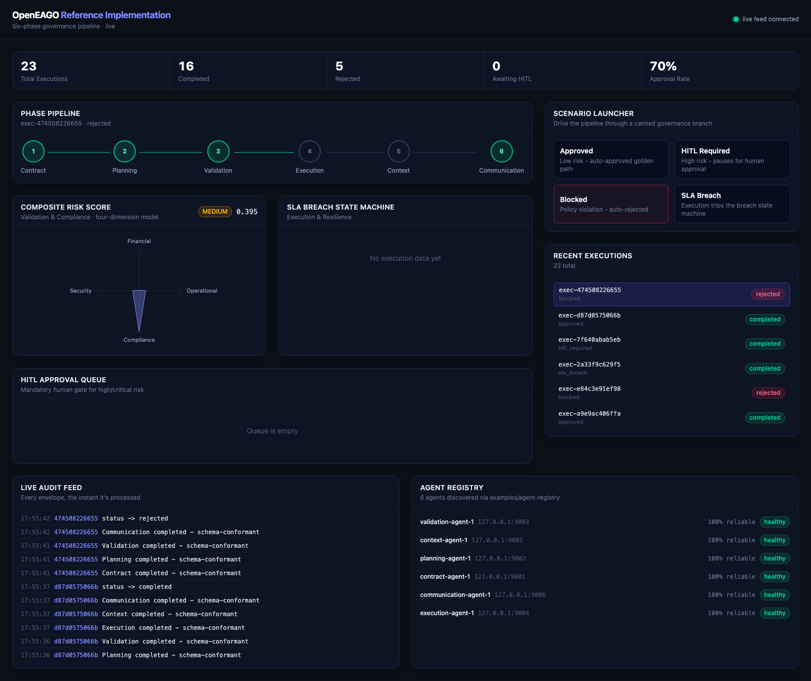
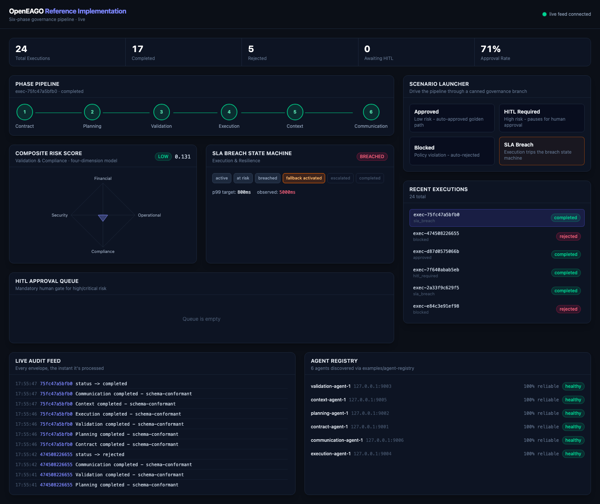
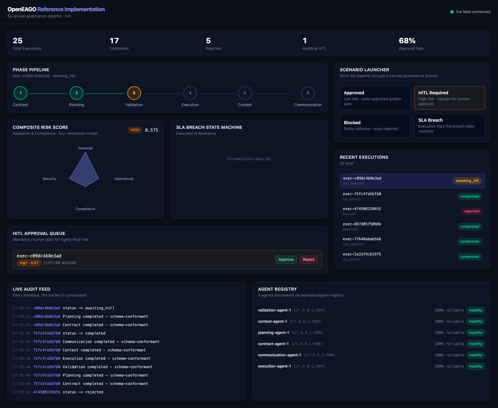

# OpenEAGO Reference Implementation

An end-to-end, runnable demonstration of the full six-phase OpenEAGO pipeline — six real agent processes, a real agent-registry, a LangGraph orchestrator, and a real-time governance dashboard — built entirely from existing repo components (`examples/agent-template`, `examples/agent-registry`) plus a new orchestrator and dashboard.

> **Reference implementation only.** Not for production use. mTLS/SPIRE is supported by the underlying components but this demo runs everything in `--allow-insecure` dev mode for ease of setup.

Inspired by [openemcp-genjinni](https://github.com/janrockdev/openemcp-genjinni) (an earlier implementation of an earlier, pre-formalization version of OpenEAGO), with two deliberate upgrades:

- **Phases instead of ad-hoc agents.** genjinni's flat agent list (`contract`, `planner`, `kyc`, `policy`, `aml`, `legal`, `risk`, `process`, `context`, `communication`) is replaced by the six canonical OpenEAGO phases, each agent producing output validated against the real `spec/v0.1.0/schemas/*.json` files — composite risk scoring, the mandatory HITL gate, and the SLA breach state machine are first-class, not afterthoughts.
- **Genuinely real-time.** genjinni's dashboard polled `GET /api/v1/.../{id}` in a loop and faked animation with `sleep()` between renders (`ui/dashboard/src/hooks/useWorkflowExecution.js`). This dashboard receives every phase transition over a WebSocket the instant the orchestrator processes it.

## Architecture

```text
docker compose (Mongo)
        |
agent-registry (Rust, --allow-insecure, bootstrap mode)  :8443
        ^ register/sync                          ^ discover
        |                                         |
  6x agent-template-based processes (Python)      |
  contract :9001  planning :9002  validation :9003
  execution :9004  context :9005  communication :9006  <--+
        | MCP JSON-RPC + EAGO envelope (/mcp)
        v
  orchestrator (FastAPI + LangGraph)                :8000
        - discovers agents via registry /discover
        - drives a StateGraph through the 6 phases
        - validates each payload against spec/v0.1.0/schemas/*
        - persists every step to MongoDB
        - broadcasts every transition over WebSocket
        v
  dashboard (React + Vite + Tailwind)               :5173
```

Each phase agent is a parameterized copy of `examples/agent-template` (vendored into `agents/_lib/`, with two small additions: pluggable tool handlers via `extra_handlers`, and a `spec_version` field on the envelope that the upstream template's `wrap_envelope()` didn't yet emit). The registry is `examples/agent-registry` used unmodified.

## Prerequisites

- Python 3.10+, Node.js 18+, Rust (stable), Docker & Docker Compose

## Running it

Every command below is given **from the repo root** so you can run them in any order of terminals without guessing what directory a previous step left you in. Steps 2, 4 (each agent), 5, and 6 are long-running processes that **must keep running** — give each its own terminal tab, or background it as shown.

### 1. MongoDB (Docker-managed, runs in the background)

```bash
cd examples/reference-implementation/db
docker compose up -d
```

### 2. Agent Registry — *new terminal, leave running*

```bash
cd examples/agent-registry
cargo build --release   # first time only, ~3 min
./target/release/OpenEAGO-registry --config config.bootstrap.yaml --allow-insecure
```

Wait for `Swagger UI : http://127.0.0.1:8080/swagger-ui/` in its output before continuing.

### 3. Python virtualenv (one-time setup, any terminal)

```bash
cd examples/reference-implementation
python3 -m venv .venv
./.venv/bin/pip install -r agents/requirements.txt -r orchestrator/requirements.txt
```

### 4. The six phase agents — *same or new terminal, backgrounded*

```bash
cd examples/reference-implementation
for name in contract planning validation execution context communication; do
  ( cd agents/$name && ../../.venv/bin/python3 server.py --allow-insecure & )
done
```

Each one self-registers with the registry on startup and re-syncs every 20s. (It takes ~90-100s before a freshly started agent is *discoverable* — see "Known operational quirk" below — but `check_environment.sh` will tell you exactly when it's ready.)

### 5. Orchestrator — *new terminal, leave running*

```bash
cd examples/reference-implementation/orchestrator
../.venv/bin/python3 -m uvicorn app.main:app --port 8000
```

### 6. Dashboard — *new terminal, leave running*

```bash
cd examples/reference-implementation/dashboard
npm install
npm run dev
```

### 7. Verify everything is ready

```bash
cd examples/reference-implementation
./scripts/check_environment.sh
```

This checks MongoDB, the registry (health + Swagger UI), all 6 agents' `/health`, that the registry's `/discover` actually returns all 6 (not just registered — discoverable), the orchestrator's `/health`, and the dashboard dev server — then prints `READY: all components up` or lists exactly which `[FAIL]` lines need fixing. Don't open the dashboard until this says `READY`.

```text
=== MongoDB ===
  [ok]   mongodb (eago-refimpl-mongodb container, ping)
=== Agent Registry ===
  [ok]   registry health (http://127.0.0.1:8443/health -> 200)
  [ok]   registry swagger UI (http://127.0.0.1:8080/swagger-ui/ -> 200)
=== Phase Agents ===
  [ok]   contract agent ... planning ... validation ... execution ... context ... communication agent
=== Registry discovery (agents actually findable, not just registered) ===
  [ok]   all 6 agents discoverable via /discover (count=6)
=== Orchestrator ===
  [ok]   orchestrator health: {"status":"healthy","mongodb":"connected","registered_agents":6}
=== Dashboard (dev server) ===
  [ok]   dashboard (http://localhost:5173/ -> 200)

READY: all components up. Open http://localhost:5173
```

### Testing the flow without the dashboard

```bash
cd examples/reference-implementation
./.venv/bin/python3 scripts/smoke_test_agents.py   # all 6 agents standalone, schema-validated
./.venv/bin/python3 scripts/smoke_test_ws.py        # confirms live WebSocket events during a run
./scripts/test_agentic_flow.sh                      # curated curl/jq walkthrough of the whole flow:
                                                      #   infra health -> registry /discover -> a raw
                                                      #   agent-to-agent MCP call -> all 4 scenarios
                                                      #   (including the HITL approval call) -> KPIs
```

### Shutting it all down

```bash
cd examples/reference-implementation
pkill -f "agents/.*/server.py"   # 6 phase agents
pkill -f "uvicorn app.main:app"  # orchestrator
pkill -f "OpenEAGO-registry"     # registry
cd db && docker compose down     # Mongo (add -v to also wipe the demo data)
```

The dashboard's `npm run dev` and the registry's foreground terminal just need Ctrl-C.

## The four canned scenarios

The dashboard's Scenario Launcher (and `POST /api/v1/executions {"scenario": "..."}`) drives the same "Customer Address Update" example used throughout `docs/capabilities/*` through four distinct governance branches (`orchestrator/app/seed_scenarios.py`):

| Scenario | What it exercises |
| --- | --- |
| `approved` | Low composite risk score -> auto-approved golden path, all 6 phases run, SLA met |
| `hitl_required` | High composite risk score -> pipeline pauses at Validation (`awaiting_hitl`) until a human calls `POST /api/v1/executions/{id}/hitl-decision` |
| `blocked` | Forced policy violation -> immediate rejection, short-circuits straight to Communication, Execution/Context are genuinely skipped |
| `sla_breach` | Simulated latency exceeds the negotiated SLA -> Execution phase trips the breach state machine (`fallback_activated`, `overall_sla_status: breached`) |

### Approved

All 6 phases complete, risk tier `low`, SLA `met`.



### Blocked

Validation rejects the request; Execution and Context are skipped entirely; SLA panel correctly shows no execution data.



### SLA Breach

Pipeline completes, but the breach state machine lands on `fallback_activated` with `overall_sla_status: breached`.



### HITL Required

Pipeline pauses after Validation (`awaiting_hitl`, risk tier `high`); the item appears in the HITL Approval Queue awaiting a human `Approve`/`Reject` decision.



## Conformance

Every phase artifact is validated against `spec/v0.1.0/schemas/*.json` (the same schemas and the same `jsonschema` approach as `tests/run_conformance.py`) before being persisted and broadcast. The orchestrator's `GET /api/v1/executions/{id}` response includes a `conformant: bool` per phase, and the dashboard's audit feed labels each event accordingly - this is a live conformance demonstration, not just a workflow visualizer.

## Known operational quirk

`agent-registry`'s `/discover` enforces the spec's reliability/uptime floors (0.95 / 99.0%) regardless of what's requested. A freshly (re)started agent's self-reported `uptime_percentage` starts low and needs roughly 90-100 seconds of continuous uptime to clear the 99.0% floor - it will appear in `/list` immediately but not in `/discover` results until then. This is correct, spec-conformant registry behavior, not a bug; just don't restart an agent and expect the orchestrator to find it within the first ~100 seconds.

## What's NOT covered

- mTLS/SPIRE (supported by `agent-template`/`agent-registry`, intentionally disabled here for setup simplicity - see those examples' READMEs to enable it)
- Persistence beyond a single Mongo collection per execution (no sharding, no replica set)
- Authentication/authorization on the orchestrator's own REST/WebSocket API (it's a local demo surface)
