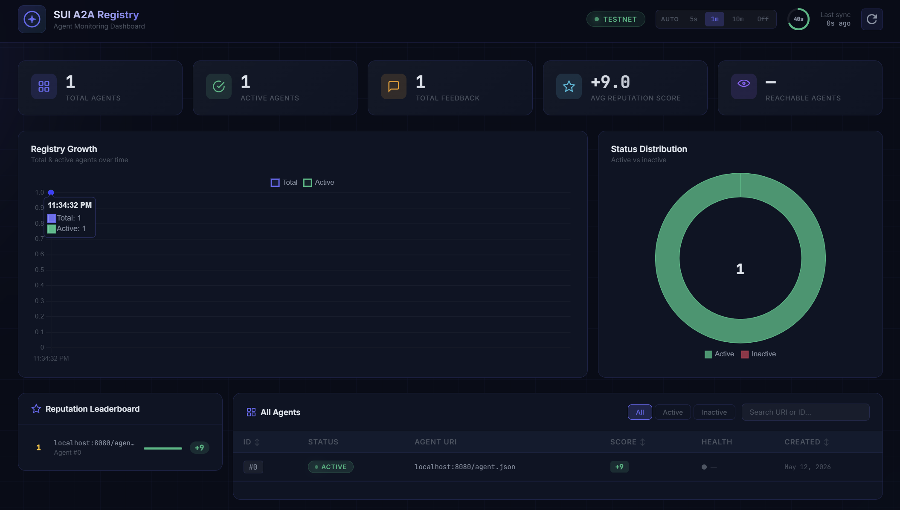

# SUI Agentic Registry

> An on-chain agent registration and discovery system for the SUI blockchain.
> Inspired by [ERC-8004 (Trustless Agents)](https://eips.ethereum.org/EIPS/eip-8004) and [FINOS OpenEAGO](https://github.com/finos/openeago).



---

## Testnet Deployment

The registry is live on SUI testnet. Use these IDs directly — no deployment needed.

| Object | ID |
|---|---|
| Package | [`0xe7e6bfd3bfb1bb93accb07da8f3bfa95ed7aa70c231dc3d784a7052e1d336775`](https://suiscan.xyz/testnet/object/0xe7e6bfd3bfb1bb93accb07da8f3bfa95ed7aa70c231dc3d784a7052e1d336775) |
| IdentityRegistry | [`0xa7ab6d000862a7b30ed1b2e7d02baa131fa9530a9d4c67b39a1a1804b5b21193`](https://suiscan.xyz/testnet/object/0xa7ab6d000862a7b30ed1b2e7d02baa131fa9530a9d4c67b39a1a1804b5b21193) |
| ReputationRegistry | [`0x8b3507234e8d98d235e395f0a42f6ea3e803d4524ff4e48539fb6fc6c79b3ac7`](https://suiscan.xyz/testnet/object/0x8b3507234e8d98d235e395f0a42f6ea3e803d4524ff4e48539fb6fc6c79b3ac7) |
| ValidationRegistry | [`0xf9527c669e6a0952053b0cfa91fe3429b2f39c8844f148b1e78132141f049048`](https://suiscan.xyz/testnet/object/0xf9527c669e6a0952053b0cfa91fe3429b2f39c8844f148b1e78132141f049048) |

Browse all registered agents on SuiScan → open the IdentityRegistry object → **Dynamic Fields** tab.

---

## Overview

The SUI Agentic Registry provides a complete, permissionless infrastructure for registering, discovering, evaluating, and validating AI agents on the SUI blockchain. It consists of three registries:

| Registry | Purpose |
|---|---|
| **Identity** | Agent registration, ownership (via `AgentCap`), URI and metadata |
| **Reputation** | Client feedback, signed scores, revocation, tag-based summaries |
| **Validation** | Third-party validator requests and 0–100 scoring responses |

Global agent IDs follow the format: `sui:{network}:{identityRegistryObjectId}:{agentId}`

---

## Repository Structure

```
sui-a2a-registry/
├── Move.toml                    # SUI package manifest
├── Published.toml               # Deployed package + object IDs (testnet)
├── sources/
│   ├── types.move               # Shared error codes, constants, utilities
│   ├── identity_registry.move   # Identity Registry
│   ├── reputation_registry.move # Reputation Registry
│   └── validation_registry.move # Validation Registry
├── tests/
│   ├── identity_tests.move
│   ├── reputation_tests.move
│   └── validation_tests.move
├── scripts/                     # Ready-to-run CLI scripts (no build step)
│   ├── agent.json               # Example agent card (A2A format)
│   ├── serve.mjs                # HTTP server for agent.json (Node.js)
│   ├── register.mjs             # Register an agent on-chain (Node.js)
│   ├── read-agent.mjs           # Read any agent by ID (Node.js)
│   ├── package.json
│   ├── sui_rpc.py               # Shared SUI JSON-RPC helpers (Python, stdlib only)
│   ├── register.py              # Register an agent on-chain (Python)
│   ├── read_agent.py            # Read any agent by ID (Python)
│   ├── list_agents.py           # List all registered agents (Python)
│   ├── update_agent_uri.py      # Update agent URI using AgentCap (Python)
│   ├── give_feedback.py         # Submit reputation feedback for an agent (Python)
│   ├── reputation_summary.py    # Show full reputation summary for an agent (Python)
│   ├── deregister_agent.py      # Deactivate an agent using AgentCap (Python)
│   └── health_check.py          # Probe availability + reputation, flag/deactivate (Python)
├── sdk/                         # TypeScript SDK (@sui-a2a/registry-sdk)
│   ├── src/
│   │   ├── types.ts
│   │   ├── identity.ts
│   │   ├── reputation.ts
│   │   ├── validation.ts
│   │   ├── client.ts            # SuiAgentRegistryClient
│   │   └── index.ts
│   ├── package.json
│   └── tsconfig.json
├── server/                      # REST API discovery server
│   ├── src/
│   │   ├── index.ts             # Fastify entry point
│   │   ├── config.ts            # YAML + env config loader
│   │   ├── registry-sync.ts     # SUI event indexer
│   │   ├── store/
│   │   │   └── agent-store.ts   # In-memory agent index
│   │   └── routes/
│   │       ├── health.ts
│   │       ├── agents.ts
│   │       └── discover.ts
│   ├── config.yaml
│   └── package.json
└── docs/
    ├── SPECIFICATION.md
    └── agent-registration-format.md
```

---

## Quick Start

> **Already deployed on testnet?** Jump straight to [Register an agent](#register-an-agent) — no build or deploy steps needed.

### 0. Install required tools

**SUI CLI**

```bash
# Download a pre-built binary from GitHub Releases (Linux / macOS)
# Replace <VERSION> with the latest tag, e.g. testnet-v1.40.1
# Find releases at: https://github.com/MystenLabs/sui/releases
curl -L https://github.com/MystenLabs/sui/releases/download/mainnet-v1.71.1/sui-mainnet-v1.71.1-ubuntu-x86_64.tgz | tar -xz
sudo mv sui /usr/local/bin/sui

# Verify
sui --version
```

**Rust toolchain** (required to build the SUI CLI from source, or for local Move prover)

```bash
curl --proto '=https' --tlsv1.2 -sSf https://sh.rustup.rs | sh
rustup update stable
```

**Node.js ≥ 20** (required for the TypeScript SDK and discovery server)

```bash
# Via nvm (recommended)
curl -o- https://raw.githubusercontent.com/nvm-sh/nvm/v0.39.7/install.sh | bash
nvm install 20
nvm use 20

# Verify
node --version   # v20.x.x
npm --version
```

**Configure a SUI wallet and request testnet tokens**

```bash
# Create a new keypair
sui client new-address ed25519

# Switch to testnet
sui client switch --env testnet

# Request SUI from the faucet
sui client faucet
```

---

### 1. Register an agent (testnet — no deployment needed)

The `scripts/` directory contains ready-to-run Node.js scripts. No build step required.

```bash
cd scripts
npm install
```

**Step 1 — Edit your agent card**

Open `scripts/agent.json` and fill in your agent's name, description, skills, and service endpoint.

**Step 2 — Serve the agent card locally**

```bash
node serve.mjs
# http://localhost:8080/agent.json
# http://localhost:8080/.well-known/agent.json
```

**Step 3 — Register on-chain**

```bash
node register.mjs http://localhost:8080/agent.json
```

```
✓ Transaction submitted: DuLXEevw2sEDdqLjS3aTgfuinP3PBf7Ty6zvwzACy8ub
✓ AgentCap created  : 0xbd215ec4...566c
✓ AgentEntry created: 0x14493f2c...822

  globalId  : sui:testnet:0xa69208da...fadbc:0
  agentId   : 0
  owner     : 0xa17d...416b9
  agentUri  : http://localhost:8080/agent.json
  active    : true
  createdAt : 2026-05-10T12:48:46.350Z

  AgentCap ID: 0xbd215ec4ac9a1910a6c0d7bd97bc44729dee88cd3537ed7f5cd5853a0af7566c
```

Save the `AgentCap` ID — it is the ownership proof required to update or deregister.

**Step 4 — Read any agent back**

```bash
node read-agent.mjs 0
```

Prints the on-chain entry and fetches the live `agent.json` from the stored URI.

---

### 1b. Register an agent — Python scripts

All Python scripts use the standard library only — no `pip install` needed. They share `sui_rpc.py` for JSON-RPC communication.

**Register**

```bash
# Serve agent.json first (use Node.js serve.mjs or any HTTP server)
node serve.mjs &

python3 register.py http://localhost:8080/agent.json
```

```
============================================================
SUI Agentic Registry — Agent Registration (Python)
============================================================
✓ Transaction submitted: DuLXEevw2sEDdqLjS3aTgfuinP3PBf7Ty6zvwzACy8ub
  https://suiscan.xyz/testnet/tx/DuLXEevw2sEDdqLjS3aTgfuinP3PBf7Ty6zvwzACy8ub
✓ AgentCap created  : 0xbd215ec4...566c
✓ AgentEntry created: 0x14493f2c...822

  globalId  : sui:testnet:0xa69208da...fadbc:0
  agentId   : 0
  owner     : 0xa17d...416b9
  agentUri  : http://localhost:8080/agent.json
  active    : True
  createdAt : 2026-05-10T12:48:46+00:00

  AgentCap ID: 0xbd215ec4ac9a1910a6c0d7bd97bc44729dee88cd3537ed7f5cd5853a0af7566c
```

**Read a single agent**

```bash
python3 read_agent.py 0
```

Fetches on-chain fields and retrieves the live `agent.json` card from the stored URI.

**List all agents**

```bash
python3 list_agents.py

# Machine-readable JSON:
python3 list_agents.py --json
```

```
[   0] active    http://localhost:8080/agent.json
       globalId : sui:testnet:0xa69208da...fadbc:0
       owner    : 0xa17d...416b9
       suiscan  : https://suiscan.xyz/testnet/account/0xa17d...416b9

Total: 1 agent(s)
```

**Update agent URI** (requires your `AgentCap` ID)

```bash
python3 update_agent_uri.py 0xbd215ec4...566c https://myagent.example.com/agent.json
```

**Python RPC library** (`sui_rpc.py`)

All scripts import from `sui_rpc.py`, which you can use directly in your own code:

```python
from sui_rpc import get_agent_entry, get_registry_info, fetch_agent_card

# Read registry stats
info = get_registry_info()
print(f"{info['counter']} agents registered")

# Read a specific agent
agent = get_agent_entry(0)
print(agent["global_id"])   # sui:testnet:0xa69208da...:0
print(agent["agent_uri"])   # http://localhost:8080/agent.json

# Fetch its agent.json card
card = fetch_agent_card(agent["agent_uri"])
print(card["name"])         # TestAgent
```

---

### 1c. Reputation — Python scripts

Reputation feedback is submitted by any address that is **not** the agent owner. Scores are stored on-chain and can be read back at any time via events.

**Submit feedback** (run as a different wallet from the agent owner)

```bash
# Positive feedback: +10 for quality
python3 give_feedback.py 0 10 --tag1 quality

# Negative feedback: -5 for reliability issues
python3 give_feedback.py 0 5 --negative --tag1 reliability --tag2 downtime

# Precise score: +7.5 (magnitude=75, decimals=1)
python3 give_feedback.py 0 75 --decimals 1 --tag1 quality
```

**View reputation summary**

```bash
python3 reputation_summary.py 0
```

```
============================================================
Reputation Summary — Agent 0
============================================================
  globalId  : sui:testnet:0xa69208da...fadbc:0
  active    : True

  Total feedback : 3
  Positive sum   : +20
  Negative sum   : -5
  Net score      : +15

  Tag breakdown:
    quality              count=2  pos=+17  neg=+0   net=+17
    reliability          count=1  pos=+0   neg=-5   net=-5

  #    Client               Score      Tag1           Tag2
  1    0x8ef5...22d8         +10        quality
  2    0x8ef5...22d8         +75e-1     quality
  3    0x8ef5...22d8         -5         reliability    downtime
```

```bash
# Filter by tag
python3 reputation_summary.py 0 --tag reliability

# Raw JSON output
python3 reputation_summary.py 0 --json
```

---

### 1d. Deregistration — Python scripts

An agent can be deactivated in two ways:

#### Manual deregistration (owner)

The owner uses their `AgentCap` to set `active = false`. This is a permanent on-chain operation.

```bash
python3 deregister_agent.py 0xbd215ec4ac9a1910a6c0d7bd97bc44729dee88cd3537ed7f5cd5853a0af7566c
```

```
Deactivate agent 0 (http://localhost:8080/agent.json)? [y/N] y
✓ Transaction submitted: ...
  Agent 0 status: inactive ✓
```

Skip the confirmation prompt:
```bash
python3 deregister_agent.py <AGENT_CAP_ID> --yes
```

#### Automated deregistration via health check

`health_check.py` probes every registered agent for two failure conditions:

| Condition | Description |
|---|---|
| `UNREACHABLE` | HTTP request to `agentUri` fails or returns non-200 |
| `LOW_REP` | Net reputation score is below the threshold (default: `< -5`) |

```bash
# Check a single agent
python3 health_check.py --agent-id 0

# Check all agents
python3 health_check.py --all
```

```
[0] ✓ OK
      URI       : http://localhost:8080/agent.json
      Reachable : True  (OK)
      Net score : +15  (3 feedback(s))

[1] ✗ UNREACHABLE
      URI       : http://offline-agent.example.com/agent.json
      Reachable : False  (Connection refused)
      Net score : -8  (2 feedback(s))

Result: 2 checked  |  1 flagged
```

Auto-deactivate flagged agents (requires owning the `AgentCap`):

```bash
python3 health_check.py --all \
  --deactivate --agent-cap 0xbd215ec4...566c \
  --yes
```

Adjust thresholds:

```bash
# Flag agents with net score below -10, 10s HTTP timeout
python3 health_check.py --all --rep-threshold -10 --timeout 10

# JSON report (e.g. for CI pipelines or monitoring)
python3 health_check.py --all --json
```

The JSON report output:

```json
{
  "checked_at": "2026-05-10T13:42:43+00:00",
  "total": 2,
  "flagged": 1,
  "rep_threshold": -5,
  "agents": [
    {
      "agent_id": 0,
      "active": true,
      "reachable": true,
      "net_score": 15,
      "flags": [],
      "status": "OK"
    },
    {
      "agent_id": 1,
      "active": true,
      "reachable": false,
      "net_score": -8,
      "flags": ["UNREACHABLE", "LOW_REP(net=-8)"],
      "status": "UNREACHABLE | LOW_REP(net=-8)"
    }
  ]
}
```

---

### View on SuiScan

| What | URL |
|---|---|
| Transaction | `https://suiscan.xyz/testnet/tx/<TX_DIGEST>` |
| AgentEntry object | `https://suiscan.xyz/testnet/object/<AGENT_ENTRY_ID>` |
| AgentCap (ownership) | `https://suiscan.xyz/testnet/object/<AGENT_CAP_ID>` |
| All registered agents | [IdentityRegistry → Dynamic Fields tab](https://suiscan.xyz/testnet/object/0xa7ab6d000862a7b30ed1b2e7d02baa131fa9530a9d4c67b39a1a1804b5b21193) |
| Your wallet | `https://suiscan.xyz/testnet/account/<YOUR_ADDRESS>` |

---

### 2. Use the TypeScript SDK

```bash
cd sdk
npm install
npm run build
```

```typescript
import { SuiAgentRegistryClient } from "@sui-a2a/registry-sdk";

const PACKAGE_ID  = "0xe7e6bfd3bfb1bb93accb07da8f3bfa95ed7aa70c231dc3d784a7052e1d336775";
const IDENTITY_ID = "0xa7ab6d000862a7b30ed1b2e7d02baa131fa9530a9d4c67b39a1a1804b5b21193";

const client = new SuiAgentRegistryClient({
  rpcUrl: "https://fullnode.testnet.sui.io:443",
  network: "testnet",
  packageId: PACKAGE_ID,
  registryObjectIds: {
    identity:   IDENTITY_ID,
    reputation: "0x8b3507234e8d98d235e395f0a42f6ea3e803d4524ff4e48539fb6fc6c79b3ac7",
    validation: "0xf9527c669e6a0952053b0cfa91fe3429b2f39c8844f148b1e78132141f049048",
  },
});

// Build a registration transaction and sign/execute it with your wallet
const tx = client.buildRegisterTx("https://example.com/.well-known/agent.json");
// const result = await yourWallet.signAndExecuteTransaction({ transaction: tx });

// Read an agent
const agent = await client.getAgent(0);
console.log(agent?.globalId); // "sui:testnet:0xa69208da...fadbc:0"

// Feedback summary
const summary = await client.getReputationSummary(0);
console.log(`${summary.count} reviews, net score: ${summary.positiveSum - summary.negativeSum}`);
```

### 3. Start the discovery server

```bash
cd server
npm install

# Edit config.yaml with your deployed object IDs, then:
npm run dev
# → http://localhost:3000
# → Swagger UI at http://localhost:3000/docs
```

---

## Deploy Your Own Registry

### Build and test the Move contracts

```bash
sui move build
sui move test
```

### Publish

```bash
sui client publish

# Note the published package ID and object IDs for:
# - IdentityRegistry (shared)
# - ReputationRegistry (shared)
# - ValidationRegistry (shared)
```

### Post-deployment setup

Reputation and Validation registries must be linked to the Identity Registry:

```bash
sui client call \
  --package <PACKAGE_ID> \
  --module reputation_registry \
  --function initialize \
  --args <REPUTATION_REGISTRY_ID> <IDENTITY_REGISTRY_ID>

sui client call \
  --package <PACKAGE_ID> \
  --module validation_registry \
  --function initialize \
  --args <VALIDATION_REGISTRY_ID> <IDENTITY_REGISTRY_ID>
```

---

## REST API

| Method | Path | Description |
|--------|------|-------------|
| `GET` | `/health` | Server health, agent count |
| `GET` | `/agents` | Paginated agent list |
| `GET` | `/agents/:agentId` | Agent detail |
| `POST` | `/discover` | Filtered discovery (see below) |

### POST /discover

```json
{
  "capability_codes": ["text-generation", "tool-use"],
  "compliance": ["SOC2"],
  "min_reliability": 0.97,
  "min_uptime_pct": 99.5,
  "max_latency_p99_ms": 500,
  "exclude_status": ["suspended"],
  "page": 1,
  "limit": 10
}
```

Response:
```json
{
  "data": [...],
  "total": 3,
  "filtered_out": 12,
  "page": 1,
  "limit": 10
}
```

> `filtered_out` shows how many agents were excluded by the filter — an OpenEAGO-inspired field for transparency.

> Minimum reliability (0.95) and uptime (99.0%) are always enforced regardless of the filter values provided.

---

## Agent Registration File

Agents should publish a `.well-known/agent.json` file at their `agentUri`. See [docs/agent-registration-format.md](docs/agent-registration-format.md) for the full format.

---

## Architecture

```
┌─────────────────────────────────────────────────────────────────┐
│  SUI Blockchain                                                 │
│                                                                 │
│  ┌──────────────────┐  ┌───────────────────┐  ┌──────────────┐  │
│  │ identity_registry│  │reputation_registry│  │ validation_  │  │
│  │                  │  │                   │  │ registry     │  │
│  │ AgentRegistry    │  │ ReputationRegistry│  │ Validation-  │  │
│  │ (shared object)  │  │ (shared object)   │  │ Registry     │  │
│  └──────────────────┘  └───────────────────┘  └──────────────┘  │
│           ▲                      ▲                    ▲         │
└───────────┼──────────────────────┼────────────────────┼─────────┘
            │  PTB Transactions    │                    │
┌───────────┼──────────────────────┼────────────────────┼─────────┐
│  SDK      │                      │                    │         │
│  SuiAgentRegistryClient.buildXxxTx() → sign → execute           │
└─────────────────────────────────────────────────────────────────┘
            │  Event Queries
┌───────────▼─────────────────────────────────────────────────────┐
│  Discovery Server                                               │
│  RegistrySync (polls SUI events) → AgentStore                   │
│  Fastify REST API → GET /agents, POST /discover                 │
└─────────────────────────────────────────────────────────────────┘
```

---

## References

- [ERC-8004: Trustless Agents](https://eips.ethereum.org/EIPS/eip-8004)
- [FINOS OpenEAGO](https://github.com/finos/openeago)
- [Google A2A AgentCard spec](https://google.github.io/A2A/)
- [SUI Move documentation](https://docs.sui.io/concepts/sui-move-concepts)
