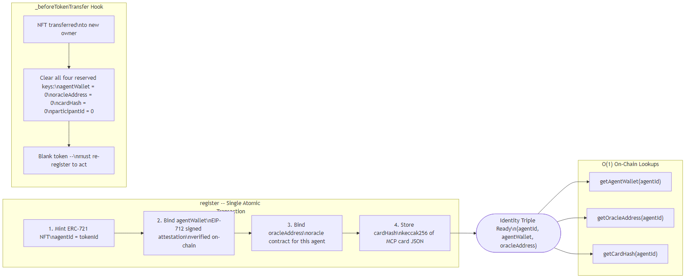
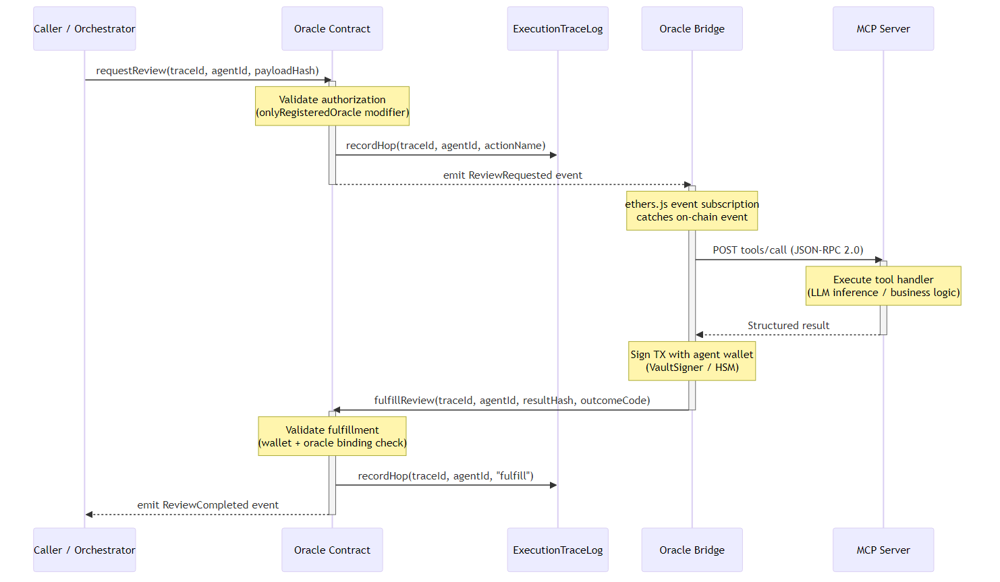
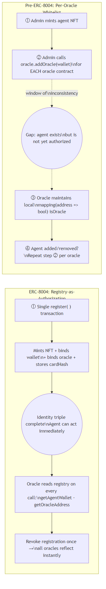
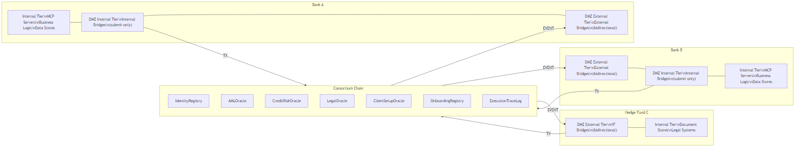
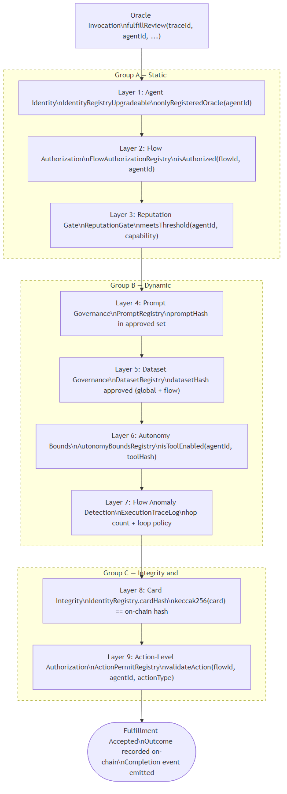
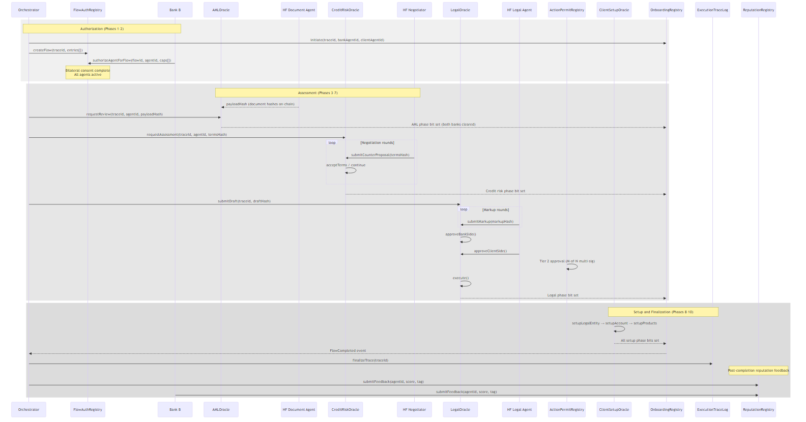
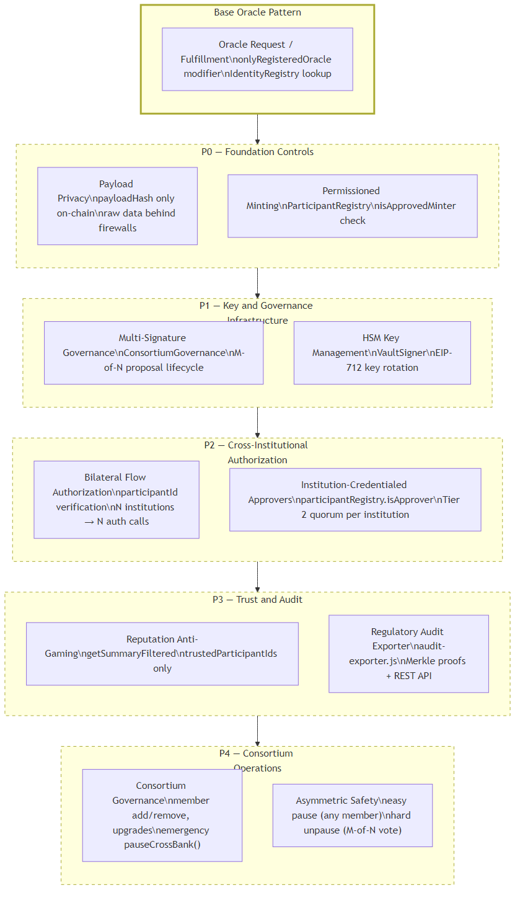
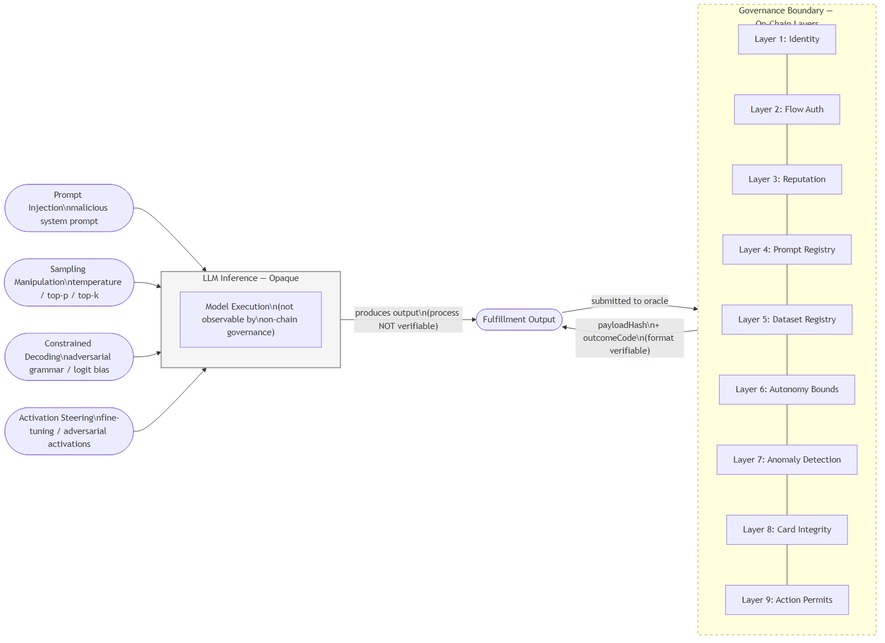

# Securing Enterprise Agentic Workflows: On-Chain Identity, MCP Governance, and Cross-Institutional Authorization

---

## Abstract

Enterprise deployment of multi-agent AI systems is outpacing the governance frameworks available to constrain them: 
existing invocation standards specify how agents are called but say nothing about who may call them, what actions 
they may take, or how their behavior can be revoked. We present an architecture that extends both ERC-8004 and the 
Model Context Protocol (MCP) to close these gaps. On the ERC-8004 side, we introduce reserved identity fields for 
card integrity (`cardHash`) and institutional affiliation (`participantId`), and an `onlyRegisteredOracle` 
authorization pattern that makes on-chain registration the sole trust root, eliminating post-deployment whitelists. 
On the MCP side, we define `autonomy_bounds` and `action_permits` specification blocks that bind governance policy 
to tool declarations, and extend the `tools/list` response with suspension state that bridges can enforce before any 
fulfillment transaction is submitted.  
Together, these two extended standards create nine independently activatable governance layers: static 
authorization, flow-scoped consent, reputation gating, prompt and dataset governance, dynamic revocation, anomaly 
detection, card integrity, and action-level tiering, which are enforced at every oracle invocation. 
We validate the approach through a complete reference implementation of cross-bank institutional client onboarding, 
demonstrating that a public blockchain can function as a neutral, cryptographically auditable DMZ between 
institutions that share no direct trust root and no private communication. 

---

## 1. Introduction

### 1.1 The Rise of Agentic Complexity

The prevailing model of enterprise AI deployment - a single stateless LLM call returning a string - is giving way to something structurally different: multistep, multi-agent workflows in which each step has real-world side effects. Code is merged to production repositories. SQL statements are executed against live databases. Contracts are countersigned. Funds are transferred between accounts. Each of these actions is a point of no return, and in a multi-agent pipeline the sequence of decisions that leads to any one of them may span dozens of hops across agents that were never designed to interact directly with one another.

The complexity of these systems scales along three independent axes. First, the number of agents: a single workflow may invoke a negotiator, an AML screener, a credit risk assessor, a legal reviewer, and a sequence of setup agents, each with its own LLM backend and its own failure modes. Second, the hop depth: a single business process may traverse the same oracle contract multiple times as a negotiation loop converges. Third, the institutional scope: in the most demanding deployments, agents acting on behalf of one bank must coordinate with agents acting on behalf of a counterparty bank, with no direct channel between the two institutions' internal systems. We describe a reference implementation that sits at the hardest point of all three axes in Section 5.

### 1.2 Why Enterprise Deployment Raises the Stakes

When an individual uses an AI assistant, the consequences of misbehavior are bounded by the individual's own authority. When an agent acts on behalf of an institution - a bank, an asset manager, a law firm - the blast radius of a mistake is bounded only by the agent's delegated authority, which in enterprise settings can be very large indeed. A legal agent with authority to execute counterparty agreements, a credit agent with authority to approve lending terms, or a setup agent with authority to provision accounts can each cause irreversible harm if they are compromised, misconfigured, or manipulated.

Beyond harm prevention, enterprise deployments carry regulatory obligations. Financial institutions are subject to AML requirements, credit risk capital rules, and contract execution standards that demand not merely that the right thing happened, but that it can be demonstrated to have happened through an immutable, inspectable audit trail. Off-chain audit logs satisfy neither requirement: they are mutable, they are institution-local, and they carry no cryptographic proof of integrity that would survive a dispute between counterparties or a regulatory examination.

The current MCP specification addresses none of this. It defines how an agent's tools are discovered and invoked over HTTP/JSON-RPC 2.0. It does not define how a caller verifies that the agent it is invoking is the agent it believes it is, how an action can be revoked mid-flow, how a per-action authorization decision is recorded, or how two institutions can establish mutual consent for agent participation without a direct communication channel. These gaps are not implementation details; they are architectural requirements for any serious enterprise deployment.

### 1.3 B2B Is the Hardest Case

Cross-institutional agentic workflows expose every weakness in the current model simultaneously. There is no shared trust root: Bank A and Bank B each maintain their own identity infrastructure, their own certificate authorities, their own key management systems. There is no direct channel: Bank A's internal MCP servers are not reachable from Bank B's network by design, and allowing such connectivity would violate every principle of defense-in-depth. Regulatory obligations vary by jurisdiction: the AML checks required by Bank A's regulator may differ from those required by Bank B's, yet both banks must be able to demonstrate compliance independently. And reputation gaming is a live threat: if Bank A's agents are rated by Bank B's agents in a shared reputation system, Bank A has an obvious incentive to self-inflate.

The cross-bank institutional client onboarding scenario - in which Bank A onboards Hedge Fund C as a new client with Bank B acting as correspondent - makes all of these problems concrete simultaneously. It is the scenario we use throughout this paper as the reference implementation.

### 1.4 Contributions

We make four contributions. 
- First, we describe an **identity-binding architecture** in which ERC-8004 agent identity, MCP invocation, and 
  Solidity 
oracle contracts are composed such that agent authorization is a single on-chain fact established at registration 
time, with no post-deployment whitelist and no administrative step.
- Second, we present **nine independently composable governance layers (§5)** that enforce authorization, revocation, 
integrity, and action-level control at every oracle invocation without requiring modification to any other layer. 
- Third, we specify a bilateral consent protocol for **cross-institutional agent participation that uses the blockchain 
as a neutral DMZ**, requiring no direct inter-institution communication channel.
- Fourth, we present a **gap analysis of LLM inference attacks** that are architecturally outside the reach of all nine 
governance layers, and describe the current best practice for blast-radius limitation in the absence of 
inference-layer proofs.  

---

## 2. Background and Related Work

### 2.1 Model Context Protocol

The Model Context Protocol (MCP) is an HTTP/JSON-RPC 2.0 standard for AI agent invocation. An agent declares its capabilities in a card document containing a list of tools (callable functions with JSON Schema input definitions), resources (data sources), and prompts (template declarations). Clients discover available tools via a `tools/list` request and invoke them via `tools/call`. The protocol is deliberately minimal: it specifies the wire format and the discovery mechanism, but not the security model.

This minimality is a reasonable design choice for the protocol's original scope - single-institution, developer-controlled deployments - but it creates a structural gap when MCP is used as the invocation layer for enterprise workflows. The gap is that MCP specifies how agents are discovered and invoked, but delegates authorization, auditability, and revocation entirely to the deployer - without even defining extension points for them. Our architecture fills these gaps at the layer above MCP, using the oracle contract as the authorization and audit boundary, without modifying the MCP protocol itself.

### 2.2 ERC-721 as Identity Substrate

ERC-721 non-fungible tokens provide a natural substrate for agent identity. Each token has a globally unique `tokenId`, an immutable on-chain record of its existence, and transfer semantics that can be extended with application-specific invariants. We use ERC-721 as the basis for ERC-8004, treating the token ID as the agent's persistent identity (`agentId`) and using the token's metadata storage to bind a cryptographically verified wallet address, an oracle contract address, and a content hash of the agent's MCP card.

The transfer semantics of ERC-721 create a security seam that must be handled explicitly. If an agent NFT is transferred to a new owner, the new owner should not inherit the previous owner's oracle bindings or wallet associations. Our implementation handles this by clearing the `agentWallet`, `oracleAddress`, and `cardHash` reserved metadata keys in the `_beforeTokenTransfer` hook, ensuring that a transferred identity requires fresh binding before it can act.

### 2.3 On-Chain Oracle Patterns

The oracle pattern - in which an on-chain contract emits a request event, an off-chain process fulfills the request, and the fulfillment is submitted back on-chain - is well established. Chainlink generalized this pattern for external data feeds in 2019; UMA applied a variant to dispute resolution. Our oracle contracts use the same structural pattern but fulfill a different class of requests: AI agent tasks. Where a Chainlink oracle resolves a price feed, our oracles resolve AML screening decisions, credit risk assessments, legal review approvals, and client setup confirmations. The economic and security assumptions differ accordingly: our oracles are not general-purpose permissionless networks but tightly permissioned single-agent fulfillment contracts where authorization flows directly from the identity registry.

### 2.4 Enterprise AI Governance

The NIST AI Risk Management Framework and the EU AI Act both identify auditability, accountability, and human oversight as requirements for high-risk AI deployments. Both frameworks, however, operate at the organizational level: they specify what institutions must do, not how on-chain systems can enforce it. Model cards provide static capability declarations but cannot attest to runtime behavior. Role-based access control systems can restrict which users invoke which capabilities but do not record the invocation chain through a multi-agent flow. Off-chain audit logs can record what happened but are mutable and institution-local. None of these mechanisms provides the combination of immutability, cryptographic verifiability, and cross-institutional accessibility that a blockchain-based audit trail provides. Closing this gap is the central motivation for our architecture. Off-chain agent frameworks such as LangChain, CrewAI, and AutoGen provide tool permission models and execution tracing within a single deployment boundary, but none provides cross-institutional, tamper-evident, cryptographically verifiable authorization records - the gap that on-chain governance fills.

### 2.5 Threat Model

We characterize the adversary landscape against which the architecture is designed to provide guarantees.

**Rogue agent operator.** An operator registers an agent with a forged capability declaration, or swaps the MCP card after registration to claim capabilities that were not reviewed. The `cardHash` reserved key (Layer 8) binds the on-chain identity to a specific card version at registration time; any card substitution produces a hash mismatch that the bridge detects at startup. Permissioned minting (P0) prevents unregistered institutions from entering agents into the consortium in the first place.

**Compromised bridge.** A bridge process is compromised and attempts to submit a malicious fulfillment - using the wrong wallet, routing to the wrong oracle, or injecting adversarial data. The `onlyRegisteredOracle(agentId)` modifier (Layer 1) enforces simultaneously that the signing wallet matches the registered `agentWallet` and that the receiving oracle is the one bound to that agent. Neither condition can be satisfied by an attacker who does not hold the registered agent's private key. HSM key management (P1) ensures that private key material is never accessible in plaintext to bridge processes.

**Malicious consortium member.** A member bank submits inflated reputation scores for its own agents, deflated scores for competitors, blocks legitimate flows by withholding bilateral authorization, or votes to upgrade contracts to insert a backdoor. Reputation anti-gaming (`getSummaryFiltered`, P3) excludes self-affiliated or colluding feedback from any institution's reputation view. Bilateral flow authorization (Layer 2) requires each institution to authorize only its own agents, not its counterparty's. `ConsortiumGovernance` M-of-N voting (P4) prevents any single member from unilaterally upgrading contracts; the emergency pause asymmetry limits the damage a colluding minority can cause.

**External attacker.** An attacker with no registered agent attempts oracle fulfillment, injects adversarial data into an MCP server, or attempts inference-layer manipulation. Layers 1–9 enforce identity, flow participation, reputation, prompt and dataset approval, tool-level bounds, anomaly detection, card integrity, and action tiering at every oracle invocation - an attacker without a registered identity triple cannot satisfy Layer 1 and cannot proceed. Inference-layer attacks (adversarial prompts, sampling manipulation, activation steering) are not preventable at the protocol layer; §8 covers this gap explicitly and describes the blast-radius limitation strategy.

---

## 3. Extensions to ERC-8004 and MCP

ERC-8004 and MCP as described in §2 are foundational standards; this section catalogues the specific extensions this work introduces to each. All extensions are additive and backward-compatible: base ERC-721 semantics are preserved, and compliant MCP clients silently ignore unknown fields.

### 3.1 ERC-8004: Extensions to the Identity Registry

The `IdentityRegistryUpgradeable` contract extends base ERC-8004 / ERC-721 with seven additions:

| Extension | Introduced | Description | §5 Layer |
|---|---|---|---|
| Reserved metadata keys | v3.0.0 | Four keys (`agentWallet`, `oracleAddress`, `cardHash`, `participantId`) are blocked from generic `setMetadata()` writes; each has a typed getter/setter and its own event | 1, 2, 8 |
| `oracleAddress` first-class binding | v3.0.0 | `getOracleAddress(agentId)` called O(1) by oracle `onlyRegisteredOracle` modifier; set atomically in `register()` | 1 |
| One-shot `register()` overload | v3.0.0 | Single tx establishes: NFT mint, card URI, `agentWallet`, `oracleAddress`, arbitrary metadata | 1 |
| Transfer-clearing semantics | v3.0.0 | `_update()` hook clears all four reserved keys on NFT transfer; transferred identity cannot act until re-registered | 1 |
| EIP-712 signed wallet binding | v3.0.0 | `setAgentWallet` requires a typed structured-data signature from the new wallet - unsigned wallet claims are rejected | 1 |
| `cardHash` integrity commitment | v4.0.0 | `bytes32 keccak256(cardJSON)` stored as reserved key; verified by bridges at startup; optional per-fulfillment check in oracle contracts; cleared on transfer | 8 |
| `participantId` institution affiliation | B2B | Auto-recorded at mint via `_checkAndRecordParticipant` when `ParticipantRegistry` is configured; used by `FlowAuthorizationRegistry` bilateral consent check; cannot be set via generic `setMetadata()` | 2 |

The `_requireNotReserved()` guard is called by the generic `setMetadata()` function and reverts if the caller attempts to write any of the four reserved keys directly. The `IIdentityRegistry` minimal interface - exposing `getAgentWallet`, `getOracleAddress`, `getCardHash`, and `ownerOf` - is consumed by all oracle contracts in their authorization modifiers, keeping the oracle dependency surface narrow and upgradeable independently of the full registry implementation.

UUPS upgradeability (ERC-1967 proxy) means that new storage slots are not needed for any of the above: all reserved keys share the existing `_metadata` mapping under typed string keys, so the storage layout is unchanged across upgrades.

### 3.2 MCP Specification Extensions (`agents/mcp/*.mcp.json`)

Per-tool extension blocks sit alongside the standard `inputSchema` and `outputSchema` fields in each MCP spec file. Standard MCP clients silently ignore them. Three blocks are defined:

**`autonomy_bounds`** - four sub-signals controlling dynamic revocation:

| Sub-signal | Fields | On-chain effect | Off-chain effect | §5 Layer |
|---|---|---|---|---|
| `reputation` | `min_score`, `min_score_decimals`, `min_feedback_count`, `tag` | `ReputationGate.setThreshold()` via `sync-autonomy-bounds.js` | Gate checked at every oracle invocation | 3 |
| `anomaly` | `max_error_rate_pct`, `window_requests` | - | `bounds-monitor.js` calls `disableTool()` when window ratio exceeded | 6 |
| `performance` | `min_success_rate_pct`, `window_requests` | - | Same monitor, complement metric | 6 |
| `flow` | `max_hops`, `loop_detection`, `max_requests_per_minute`, `response_timeout_seconds` | `ExecutionTraceLog.setMaxHops()` + `setLoopDetection()` via `sync-autonomy-bounds.js` | Monitor enforces burst and timeout limits | 7 |

**`action_permits`** - per-tool action classification driving `ActionPermitRegistry` (§5 Layer 9):

| Field | Description |
|---|---|
| `classification` | Human-readable category (`"pr_action"`, `"sql_action"`) |
| `tool_action` | Pattern ID matched in `action-patterns.json` (e.g. `"PR:APPROVE"`, `"SQL:DROP"`) |
| `default_tier` | 0 = read-only, 1 = reversible, 2 = destructive/multi-sig, 3 = forbidden |
| `approval_timeout_seconds` | Tier 2: how long `action-gateway.js` polls for multi-sig approval |
| `violation_threshold` | `ActionBlocked` event count before `bounds-monitor.js` calls `disableTool()` |

### 3.3 MCP Protocol Extensions (Server-Side Behavior)

Two protocol-level additions are consumed by ERC-8004-aware clients; standard MCP clients silently ignore them.

**`tools/list` response** - suspended tools include additional fields:
```json
{ "x_suspended": true, "x_suspension_reason": "..." }
```

**`tools/call` response** - calling a suspended tool returns JSON-RPC error code `-32001` (in the application-defined range; MCP reserves -32000 to -32099).

Suspension state is persisted in `bounds-state.json`, written by `bounds-monitor.js` and read by MCP servers on every request. Both additions are the client-visible surface of §5 Layers 6 and 7.

#### 3.3.1 The Bounds Monitor

`bounds-monitor.js` is a shared sidecar process that runs alongside both the Node.js and Python oracle bridges. It is the sole writer of `bounds-state.json` and the sole caller of `disableTool` / `enableTool` on `AutonomyBoundsRegistry`. Its inputs are tool call outcome reports submitted by bridges via a local HTTP control API (`POST /report`); its outputs are a state file read by every MCP server and, when on-chain governance is configured, transactions to `AutonomyBoundsRegistry`. Both runtimes consume this shared service: Python bridges report via `shared/bounds_monitor_client.py`, which POSTs to the same `:9090/report` endpoint, and Python MCP servers read `bounds-state.json` through the `@suspended_when_revoked` decorator in `server_base.py`.

The report contract is minimal: `{ toolName, success, latencyMs }`. A bridge submits one report after each oracle fulfillment cycle completes, setting `success: false` on any exception (MCP error, contract revert, network failure) and supplying the wall-clock latency of the MCP server round-trip. The monitor does not need visibility into fulfillment transaction outcomes; it observes the quality of the tool execution, not the on-chain settlement.

#### 3.3.2 Layer 6 — Tool-Level Metric Revocation

Layer 6 is responsible for performance and anomaly signals defined in the `autonomy_bounds` block of each MCP tool declaration. Each tool carries two independent sliding windows:

- **`anomaly` window** — tracks the error rate (fraction of `success: false` reports) over the last `window_requests` calls. When the rate exceeds `max_error_rate_pct`, the monitor suspends the tool.
- **`performance` window** — tracks the success rate over the last `window_requests` calls. When it falls below `min_success_rate_pct`, the monitor suspends the tool.

Both windows use the same per-call report stream but are sized and thresholded independently, so an operator can configure a tight anomaly window (e.g. 10 % error rate over 50 calls) alongside a looser performance window (e.g. 90 % success rate over 100 calls) without conflating burst failures with sustained degradation.

On threshold breach the monitor: (1) writes `enabled: false` and a human-readable `disabledReason` to `bounds-state.json`; (2) optionally calls `disableTool(agentId, toolHash, reason)` on `AutonomyBoundsRegistry` so that the oracle contract also rejects fulfilment transactions (via `isToolEnabled` in the bridge's governance preflight). Suspension is self-healing: the monitor continues recording outcomes for suspended tools, and once the sliding window recovers within bounds it calls `enableTool` and updates the state file.

#### 3.3.3 Layer 7 — Flow-Level Time-Relative Policies

Layer 7 covers policies that are inherently time-relative and therefore cannot be enforced on-chain: burst rate limiting and response timeouts. Both are drawn from the `autonomy_bounds.flow` block:

- **`max_requests_per_minute`** — the monitor maintains a per-tool timestamp buffer of all reports in the last 60 seconds. If a new report arrives when the buffer count already exceeds the limit, the monitor immediately suspends the tool with a burst-violation reason.
- **`response_timeout_seconds`** — if the `latencyMs` value in a report exceeds the configured timeout, the call is treated as a violation regardless of whether `success` is true.

Both violations trigger the same suspension path as Layer 6: `bounds-state.json` is updated and `disableTool` is called on-chain if configured. The on-chain complement of Layer 7 — `maxHopsPerTrace` and `loopDetectionEnabled` in `ExecutionTraceLog` — enforces structural flow policies (hop count, loop detection) that can be checked synchronously during the fulfilment transaction itself. The two halves are complementary: the on-chain registry enforces what can be known from the transaction context; the off-chain monitor enforces what can only be known from wall-clock time and accumulated call history.

#### 3.3.4 Propagation to MCP Clients

When a bridge calls `tools/list` on an MCP server before invoking a tool, the server reads `bounds-state.json` synchronously and annotates any suspended tool with `x_suspended: true` and `x_suspension_reason`. An ERC-8004-aware bridge treats a suspended tool as a pre-flight failure and skips the oracle fulfilment transaction entirely, avoiding a wasted gas spend. Standard MCP clients that do not inspect the `x_` fields will encounter the `-32001` error at `tools/call` time instead, with the reason string available in the error message. In both cases the oracle contract itself provides a final backstop: the bridge's governance preflight calls `isToolEnabled` before submitting any transaction, so a suspended tool cannot be fulfilled even if the client bypasses the protocol-level signal.

### 3.4 Agent Card Extensions (`agents/*.json`)

Two fields are added to agent cards beyond the base MCP/A2A discovery spec:

| Field | Description | §5 Layer |
|---|---|---|
| `institution` | Operating institution identifier (e.g. `"ACME_BANK"`) - machine-readable affiliate tag; matched against the `participantId` recorded in the agent NFT at mint time | 2 |
| `dmzTier` | Deployment tier (`"BANK_EXTERNAL"`, `"BANK_INTERNAL"`, `"CLIENT_EXTERNAL"`) - used by infrastructure tooling to verify correct network placement; no on-chain enforcement | - |

---

## 4. Architecture Foundation

### 4.1 The ERC-8004 Identity Model

At the center of the architecture is `IdentityRegistryUpgradeable`, an ERC-721 contract in which each token represents one AI agent. The token ID (`agentId`) is the agent's persistent, globally unique identifier. Four metadata keys are reserved and cannot be set through the generic `setMetadata` interface: `agentWallet`, `oracleAddress`, `cardHash`, and `participantId`.

The `agentWallet` binding is established through an EIP-712 signed message: the wallet that will submit oracle fulfillment transactions signs a typed payload attesting to its binding with the agent NFT, and that signature is verified on-chain during `setAgentWallet`. This prevents an oracle operator from claiming an agent wallet they do not control. The `oracleAddress` binding is set in the same `register(string, (string,bytes)[], address)` transaction that mints the NFT, establishing a three-way triple - `(agentId, agentWallet, oracleAddress)` - in a single atomic operation. The `cardHash` key stores a `bytes32` keccak256 hash of the agent's MCP card JSON; it pins the agent's capability declaration to its on-chain identity and is checked by bridges at startup and optionally by oracle contracts at fulfillment time.

Transfer semantics are handled explicitly. The `_beforeTokenTransfer` hook clears all four reserved keys whenever an agent NFT changes hands. (In OpenZeppelin v5, this hook is replaced by `_update()`; the clearing invariant holds under either implementation.) A transferred identity carries no oracle binding, no wallet association, and no card hash - it is a blank token that must be re-registered before it can act. This invariant means that purchasing or transferring an agent NFT cannot be used to inherit the previous owner's authorization.

Typed getters - `getAgentWallet(agentId)`, `getOracleAddress(agentId)`, `getCardHash(agentId)` - provide O(1) lookups that oracle contracts call in their authorization modifiers.



### 4.2 The MCP Oracle Pipeline

The binding between MCP and the blockchain is established through a three-component pipeline: an on-chain oracle contract, an off-chain MCP server, and a bridge process that connects them.

```
Agent Card  (agents/*.json)
  └── mcpSpec ──► agents/mcp/*.mcp.json
                    ├── Solidity Oracle  (contracts/oracles/)
                    │     on-chain request / fulfillment lifecycle
                    ├── MCP Server  (agents_implementation/*-server.js
                    │               agents_implementation_py/servers/*_server.py)
                    │     off-chain tool handler
                    └── Oracle Bridge  (agents_implementation/*-bridge.js
                                        agents_implementation_py/bridges/*_bridge.py)
                          event watcher + fulfillment tx submitter
```



The flow proceeds as follows. A caller (another contract, a human initiator, or an orchestrator agent) invokes a write method on the oracle contract - for example, `AMLOracle.requestReview(traceId, bankAgentId, clientAgentId, payloadHash)`. The oracle validates the caller's authorization, records the request, and emits a `ReviewRequested` event. The bridge process, which maintains a persistent web3.py `AsyncWeb3` event subscription, catches the event, extracts the request parameters, and calls the corresponding MCP tool on the agent's HTTP server via a JSON-RPC `tools/call` POST. The server executes the tool handler - in production this drives an LLM inference call or an internal workflow - and returns a structured result. The bridge signs and submits a fulfillment transaction back to the oracle contract, which validates the fulfillment, records the outcome, and emits a completion event that downstream contracts can act on.

The critical authorization check lives in the `onlyRegisteredOracle(agentId)` modifier, applied to every fulfillment function:

```solidity
modifier onlyRegisteredOracle(uint256 agentId) {
    require(
        identityRegistry.getAgentWallet(agentId) == msg.sender,
        "Not agent wallet"
    );
    require(
        identityRegistry.getOracleAddress(agentId) == address(this),
        "Not bound oracle"
    );
    _;
}
```

Two conditions must hold simultaneously: the transaction signer must be the registered wallet for the agent NFT, and the oracle contract receiving the fulfillment must be the one bound to that agent. An agent cannot fulfill requests to an oracle it is not bound to, and a wallet that does not hold a registered agent NFT cannot fulfill requests to any oracle. The identity registry is the sole authorization mechanism; there is no separate whitelist, no admin key that can grant fulfillment rights, and no way to bypass the check.

### 4.3 The Registry-as-Authorization Principle

Before ERC-8004, oracle contracts maintained their own authorization state: a `mapping(address => bool) isOracle` whitelist that contract owners updated post-deployment as agents were added or removed. This creates a two-step process in which minting an agent NFT and granting it oracle authority are separate operations, opening a window in which an agent exists but is not authorized, or is authorized but no longer exists. It also creates per-contract administrative overhead that scales with the number of oracles in the system.

The registry-as-authorization principle eliminates both problems. `register()` is a single transaction that mints the NFT, records the wallet binding, and records the oracle binding simultaneously. From the moment the transaction is confirmed, the agent identity triple is complete and the agent can fulfill requests to its bound oracle. No post-deployment administrative step is required. No owner needs to update a whitelist. Authorization is a fact about the registry state, not a fact about each oracle contract's local storage.

This also means that de-authorization is equally clean. The `AutonomyBoundsRegistry` can suspend specific tools without revoking the agent's identity. The `FlowAuthorizationRegistry` can exclude an agent from a specific flow without revoking global authority. And if an agent's registration is revoked entirely, every oracle that calls `getAgentWallet` or `getOracleAddress` immediately reflects the revocation with no per-oracle update required.



### 4.4 Distributed Tracing

Every on-chain request carries a `bytes32 traceId` - a correlation token generated at flow initiation and propagated unchanged through every oracle invocation in the workflow. The `ExecutionTraceLog` contract maintains an append-only, ordered log of hops:

```solidity
struct Hop {
    address callingOracle;
    uint256 agentId;
    string  actionName;
    uint256 timestamp;
}
mapping(bytes32 => Hop[]) private _trace;
```

Oracle contracts call `ExecutionTraceLog.recordHop(traceId, agentId, actionName)` at each fulfillment step. Because the log is append-only and stored on-chain, it provides a tamper-evident, cross-institutional, immutable record of every agent action in the workflow. Any party with access to the chain - including regulators, auditors, and counterparty institutions - can call `getTrace(traceId)` and retrieve the complete ordered sequence of who did what and when, without relying on any institution's self-reported logs.

The trace log also serves as the foundation for flow anomaly detection (Layer 7): the contract owner can configure `maxHopsPerTrace` and `loopDetectionEnabled`, causing the contract to revert hop recordings that exceed policy limits. Off-chain, the `bounds-monitor.js` process watches the trace log for burst rate violations and response timeouts that cannot be detected on-chain.

### 4.5 What Goes On-Chain vs. Behind Firewalls

The architecture draws a deliberate boundary between what is stored on-chain and what remains behind institutional firewalls. On-chain: agent NFT IDs, wallet addresses, `bytes32` content hashes, authorization decisions, fulfillment outcome codes, and the ordered audit trail. Behind firewalls: agent business logic, LLM inference calls, raw payload content, private key material, and institution-internal data.

This boundary is not merely a privacy design choice - it is what makes cross-institutional coordination possible without a direct communication channel. Bank A's internal systems never need to connect to Bank B's internal systems. Both banks' bridges subscribe to the same public chain events. Both banks' agents submit fulfillments to the same oracle contracts. The blockchain is the shared state machine; each institution's internal systems interact with it independently. No firewall rules need to change, no VPN tunnel needs to be established, and no institution needs to expose its internal services to any external party.

### 4.6 Architecture Overview

The three-tier network topology that results from this design separates each institution's infrastructure into internal services (MCP servers, business logic, data stores), an internal bridge tier that submits transactions to the chain but does not accept inbound connections from counterparties, and an external bridge tier that subscribes to chain events originating from counterparty contracts:

```
BANK A                              CONSORTIUM CHAIN              BANK B
  Internal:                                                        Internal:
    MCP Servers                                                       MCP Servers
    Business Logic                                                    Business Logic
  DMZ (internal tier):          IdentityRegistry                  DMZ (internal tier):
    Internal Bridges    ──TX──► AMLOracle          ◄──TX──           Internal Bridges
                                CreditRiskOracle
  DMZ (external tier):          LegalOracle         ──EVENT──►    DMZ (external tier):
    External Bridges  ◄─EVENT── OnboardingRegistry               External Bridges
                                ExecutionTraceLog
              HF CLIENT
                Internal:
                  Document stores, legal systems
                DMZ (external tier):
                  HF Bridges  ◄─EVENT──────────────────TX──►
```



Internal bridges operate in submit-only mode: they watch for internal oracle events and submit fulfillments, but they do not need to be reachable from outside the institution's network. External bridges are bidirectional: they subscribe to events from counterparty oracle contracts and may also submit fulfillments on behalf of their institution's agents. The chain is the only point of shared state; all inter-institution communication flows through it.

---

## 5. Nine Governance Layers

Each of the nine governance layers described in this section is independently opt-in: setting the relevant contract address to `address(0)` disables the layer at zero gas overhead, because the oracle checks the address before making any external call. Layers compose on every oracle invocation in the order listed, and all nine can be simultaneously active. No layer assumes the presence of any other; each can be enabled or disabled without modifying oracle contracts.

### Group A - Static Authorization (Who May Act at All)

#### Layer 1: On-Chain Agent Identity

The `onlyRegisteredOracle(agentId)` modifier, described in §4.2, is the 
foundation on which all other layers rest. It establishes that the fulfillment submitter is the registered wallet for the agent NFT and that the oracle contract is the one bound to that agent. No fulfillment can proceed without passing this check. The identity is institutional and pseudonymous: the `agentId` is a public, stable identifier that can be correlated across the full audit trail, but the wallet address does not by itself reveal the institution behind the agent.

#### Layer 2: Flow-Scoped Authorization

The `FlowAuthorizationRegistry` implements least-privilege agent participation at the flow level. When an orchestrator initiates a workflow, it calls `createFlow(traceId, AuthorizationEntry[])` to declare which agents are authorized to act in that flow and which capabilities they are authorized to exercise. An agent that is globally registered can still be blocked from participating in a specific flow if it was not included in that flow's authorization policy. The entry list is stored on-chain alongside the trace, creating an audit record not just of what agents did but of what they were permitted to do.

In cross-institutional deployments, this layer gains a bilateral consent mechanism. `authorizeAgentForFlow(flowId, agentId, capabilities[])` verifies on-chain that the caller's `participantId` matches the `participantId` recorded in the agent NFT's metadata. Bank A can authorize Bank A's agents; it cannot authorize Bank B's agents. A flow that spans two institutions requires two authorization calls - one from each institution - before all agents in the flow are active. This is the chain-mediated equivalent of a countersignature: both parties must affirmatively consent before the workflow can proceed.

#### Layer 3: Reputation Gating

The `ReputationGate` contract provides a configurable threshold check on agent reputation before any oracle invocation is allowed to proceed. Institution administrators call `setThreshold(capability, minScore, scoreDecimals, minCount, tag)` to define the minimum acceptable reputation for a given capability. The gate queries `ReputationRegistryUpgradeable.getSummaryFiltered(agentId, trustedParticipantIds[], participantRegistry, tag1, tag2)` to retrieve the agent's reputation score, filtered to feedback submitted only by institutions in a trusted participant list. Feedback from untrusted or self-affiliated participants is excluded, preventing reputation inflation through self-review or colluding institutions.

### Group B - Dynamic Correction (Revocation During Execution)

#### Layer 4: Prompt Governance

The `PromptRegistry` contract maintains a catalogue of approved prompt hashes. 
Oracle fulfillment functions can optionally check that the `promptHash` submitted alongside a fulfillment matches a registered, approved prompt template. This prevents a compromised or manipulated agent from using a non-canonical prompt - one that has not been reviewed and approved - while still producing syntactically valid outputs that pass all other checks. Prompt templates are registered with version tracking, so changes to approved prompts produce a new hash and require a new registration rather than silently replacing existing approvals. It is worth noting that hash verification constrains which prompt templates reach the fulfillment record; it cannot verify that the prompt was not modified between hash computation and LLM invocation - a limitation addressed directly in §8.

#### Layer 5: Dataset Governance

The `DatasetRegistry` operates at two levels: a global catalogue of approved dataset hashes, and a flow-scoped approval layer that permits dataset use within a specific flow. Oracle fulfillment structures that include a `datasetHashes` array can be checked against both levels. The distinction between global and flow-scoped approval is important: a dataset that is approved for use in AML screening may not be approved for use in credit risk assessment in the same flow. Flow-scoped approval allows this distinction to be enforced without requiring separate globally-approved entries for each possible usage context. As with Layer 4, the guarantee is input-space containment - hash verification cannot attest to inference-time behavior given the approved inputs.

#### Layer 6: Autonomy Bounds

The `AutonomyBoundsRegistry` provides tool-level revocation that can be applied faster than a governance vote and more precisely than revoking the agent's entire registration. The `disableTool(agentId, toolHash)` function - where `toolHash = keccak256(bytes(toolName))` - suspends a specific tool for a specific agent. Oracle contracts call `isToolEnabled(agentId, toolHash)` on every request; a `false` result causes the request to revert before any fulfillment is possible.

The bounds monitor automates revocation decisions based on observed sliding-window metrics. It tracks error rates, success rates, and response latencies over configurable windows drawn from the MCP spec's `autonomy_bounds` block. When error rate exceeds `max_error_rate_pct` over `window_requests` requests, or success rate falls below `min_success_rate_pct`, the monitor calls `disableTool` on-chain. MCP servers surface the suspended state in their `tools/list` response with an `x_suspended: true` field and an `x_suspension_reason` message, giving callers a human-readable explanation rather than an opaque error. In production, the bounds monitor is a single point of failure for Layers 6 and 7 dynamic revocation; redundant monitor instances with leader-election coordination are recommended to maintain liveness guarantees.

**Layer 7: Flow Anomaly Detection.** The `ExecutionTraceLog` enforces two on-chain flow policies: `maxHopsPerTrace` and `loopDetectionEnabled`. If `recordHop` is called with a `traceId` whose hop count has reached the maximum, the call reverts - no further actions can be recorded for that flow. Loop detection identifies repeated `(agentId, actionName)` pairs within the same trace and reverts on the second occurrence if enabled. Both policies are configurable by the contract owner without redeploying.

Off-chain, the bounds monitor enforces two additional policies that cannot be checked on-chain because they are time-relative: burst rate limiting (`max_requests_per_minute` from the MCP spec's `autonomy_bounds.flow` block) and response timeouts (`response_timeout_seconds`). Burst violations and timeout violations are treated the same as performance violations: the monitor calls `disableTool` on the offending agent's tool, and the oracle reverts on the next invocation attempt.

### Group C - Integrity and Action Control

#### Layer 8: Agent Card Integrity

The `cardHash` reserved key in `IdentityRegistryUpgradeable` binds the on-chain agent identity to a specific version of its MCP card. Every bridge process performs a startup integrity check: it reads the local card JSON file, computes `keccak256(bytes(cardJson))`, calls `getCardHash(agentId)`, and aborts startup if they do not match. This ensures that a bridge cannot accidentally operate against a card file that differs from the one the agent was registered with.

For stronger runtime guarantees, oracle fulfillment functions can call `_checkCardHash(agentId, cardHash_)` as an optional per-fulfillment check. When `cardHash_` is `bytes32(0)` the check is skipped, preserving gas efficiency for flows where startup verification is sufficient. When a non-zero value is provided, the oracle verifies the submitted hash against the registry on every fulfillment call, providing continuous card integrity attestation through the lifetime of the flow.

#### Layer 9: Action-Level Authorization

The `ActionPermitRegistry` provides the finest-grained authorization 
control in the stack. It classifies every action in the system into one of four tiers: Tier 0 (read-only, permissive), Tier 1 (reversible, requires flow authorization), Tier 2 (destructive or high-stakes, requires multi-signature human approval), and Tier 3 (permanently forbidden in the current context). Action types are identified by `keccak256(patternId)` - for example, `keccak256("review_pr")`, `keccak256("SQL:DROP")`, or `keccak256("legal:execute_contract")`.

The hot path is `validateAction(flowId, agentId, actionType) view returns (bool)`, which resolves in three or fewer storage reads (SLOADs): one for the flow's permit entry, one for the tier classification, and one for any multi-sig approval record. When `validateAction` returns `false`, the oracle emits an `ActionBlocked(traceId, agentId, actionType)` event before reverting. This event is recorded in the execution context even though the action failed, providing a complete audit trail of attempted but blocked actions.

The off-chain counterpart is an action gateway integrated into each bridge's governance preflight. In the Node.js runtime this is `action-gateway.js`, which provides an `ActionGateway` class; in the Python runtime the equivalent check is performed directly by `governance_preflight()` in `bridge_base.py` via `ActionPermitRegistry.validateAction()`. Before the bridge calls `tools/call` on the MCP server, the gateway calls `validateAction` on-chain. If the action is blocked, the bridge does not invoke the tool and records the block locally. For Tier 2 actions, the gateway initiates an approval request workflow and polls for the required multi-signature approval before proceeding.

### Summary
The table below summarizes all nine layers with their governing contracts and the scope of control each provides. All nine layers are active simultaneously in the reference implementation described in §6; each oracle invocation traverses the full stack in order.

| Layer | Contract / Component | What It Controls |
|---|---|---|
| 1 | `IdentityRegistryUpgradeable` | Who the agent is; wallet and oracle binding (`onlyRegisteredOracle`) |
| 2 | `FlowAuthorizationRegistry` | Which agents may act in this specific flow |
| 3 | `ReputationGate` | Minimum reputation score to act |
| 4 | `PromptRegistry` | Which prompt templates are approved |
| 5 | `DatasetRegistry` | Which datasets are approved (global + flow-scoped) |
| 6 | `AutonomyBoundsRegistry` + `bounds-monitor.js` | Tool-level revocation on performance degradation |
| 7 | `ExecutionTraceLog` + `bounds-monitor.js` | Flow-level anomaly policy (hops, loops, burst, timeout) |
| 8 | `IdentityRegistry.cardHash` | MCP card content integrity at startup and per-fulfillment |
| 9 | `ActionPermitRegistry` + action gateway (`action-gateway.js` / `bridge_base.py`) | Action-type tiering and multi-sig approval for Tier 2 |

No single layer is sufficient on its own. Identity without flow scoping permits any registered agent to participate in any workflow. Flow scoping without action tiering permits authorized agents to perform any action within the flow. Action tiering without card integrity permits the action classification to be circumvented by swapping the agent's card to one with a different capability declaration. The architecture is robust because the layers are not alternatives - they are defenses-in-depth applied sequentially to every invocation.



---

## 6. Reference Implementation: Cross-Bank Institutional Client Onboarding

### 6.1 Scenario

Bank A seeks to onboard Hedge Fund C as an institutional client. Bank B is a correspondent bank whose own AML and credit risk assessments are required as a condition of the onboarding. The scenario involves ten agents: on the Bank A side, a bank-onboarding-orchestrator (port 8013), a bank-aml-agent (8010), a bank-credit-risk-agent (8011), a bank-legal-agent (8012), a bank-legal-entity-setup-agent (8014), a bank-account-setup-agent (8015), and a bank-product-setup-agent (8016); on the HF side, an hf-document-agent (8020), an hf-credit-negotiator-agent (8021), and an hf-legal-agent (8022). Four oracle contracts govern the workflow: `AMLOracle`, `CreditRiskOracle`, `LegalOracle`, and `ClientSetupOracle`.

The `OnboardingRegistry` serves as the central coordination contract. It maintains a 6-bit phase bitmask per flow, with each bit representing a required phase: AML cleared, credit risk approved, legal executed, legal entity set up, account set up, products set up. Phases must be completed in dependency order; `ClientSetupOracle` checks that the appropriate bits are set before allowing each setup step to proceed. The flow can be terminated at any point by either bank, and termination is final - the `OnboardingRegistry.terminate(flowId)` call is irreversible.

### 6.2 Network Topology

The three-tier separation described in §4.6 is instantiated concretely as follows. Bank A's MCP servers run entirely within Bank A's private network and are not reachable from Bank B or from the hedge fund. Bank A's internal bridges subscribe to `AMLOracle`, `CreditRiskOracle`, `LegalOracle`, and `ClientSetupOracle` events and submit Bank A agent fulfillments. Bank A's external bridges additionally subscribe to events emitted by Bank B's agents' fulfillments and relay relevant status to internal systems. Bank B mirrors this topology independently. The hedge fund operates external bridges only: they subscribe to document request events and submit HF agent fulfillments. All three parties read from and write to the same consortium chain, using it as the sole coordination point (§4.5).

### 6.3 Flow Walkthrough



The reference implementation uses Python (`agents_implementation_py/`) with web3.py `AsyncWeb3` for event watching and LangChain LCEL chains (`ChatPromptTemplate | ChatOpenAI.with_structured_output`) for LLM inference. The Node.js reference implementation has been archived (git tag: `node-js-runtime-archive`).

Each bridge is an event-driven Python process (launched by `launch_bridges.py`) that subscribes to one or more oracle contract events, calls the corresponding MCP tool via HTTP/JSON-RPC 2.0, and submits an on-chain fulfillment transaction. Each MCP server is a stateless FastMCP process (launched by `launch_servers.py`) that exposes tools over a fixed port. Before every fulfillment transaction, the bridge calls `governance_preflight()` from `bridge_base.py` to run all configured governance checks. After every MCP tool call completes, the bridge posts `POST http://localhost:9090/report { toolName, success, latencyMs }` to the bounds monitor, which updates its sliding windows and may write `bounds-state.json` to suspend the tool if a Layer 6 or 7 threshold is breached.

**Phase 1: Flow Initiation and Authorization.** The bank-onboarding-orchestrator creates the flow by calling `OnboardingRegistry.initiate(traceId, bankAgentId, clientAgentId)` and simultaneously calls `FlowAuthorizationRegistry.createFlow(traceId, entries[])` to declare the complete agent authorization policy for this flow. The policy specifies which agents from Bank A, Bank B, and the hedge fund are authorized and which capabilities they may exercise. Bank B's agents are listed in the policy but are not yet authorized - authorization requires Bank B to counter-sign by calling `authorizeAgentForFlow` with its own participant credentials.

*Call sequence:* `onboarding-orchestrator-bridge` receives a REST `POST /initiate` and calls the `initiate_onboarding` tool on `onboarding-orchestrator-server` (:8013), passing `{ flow_id, client_address, bank_aml_agent_id, bank_credit_agent_id, bank_legal_agent_id, hf_doc_agent_id, hf_credit_agent_id, hf_legal_agent_id }`. The bridge then submits three on-chain transactions in parallel: `AMLOracle.requestAMLReview(flowId, bankAmlAgentId, hfDocAgentId)`, `CreditRiskOracle.requestCreditReview(flowId, bankCreditAgentId, hfCreditAgentId)`, and `LegalOracle.requestLegalReview(flowId, bankLegalAgentId, hfLegalAgentId)`. Each of these emits its respective `*ReviewRequested` event, starting the three parallel review tracks simultaneously.

**Phase 2: Bilateral Authorization.** Bank B's orchestrator, having observed the flow initiation event on-chain, reviews the proposed authorization policy and calls `FlowAuthorizationRegistry.authorizeAgentForFlow(flowId, agentId, capabilities[])` for each of its agents. The registry verifies on-chain that the caller's `participantId` matches the `participantId` recorded in each agent NFT. Once both banks have authorized their respective agents, all participants in the flow are active. Neither bank has been required to communicate directly with the other; the chain mediates the consent exchange. The protocol has a liveness dependency: if Bank B does not respond, the flow stalls at Phase 2. The initiating bank may call `OnboardingRegistry.terminate()` to cancel the flow, releasing any locked resources, and emitting a `FlowTerminated` event that both parties can observe.

*Call sequence:* No bridge is involved on the Bank A side. Bank B's operator (or Bank B's own orchestrator bridge) calls `FlowAuthorizationRegistry.authorizeAgentForFlow(flowId, agentId, capability)` directly for each Bank B agent. The `participantId` check is enforced entirely on-chain.

**Phase 3: Document Exchange.** The hf-document-agent responds to document request events by retrieving the requested documents from Hedge Fund C's internal systems and submitting their `bytes32 payloadHash` values on-chain. Raw document content never touches the chain. Bank A's and Bank B's bridges observe the hash submissions and retrieve the actual documents through a separately arranged encrypted channel (email, secure file transfer, or a bilateral data room). The chain provides integrity attestation - if Bank A receives a document whose hash does not match the on-chain record, the discrepancy is provable to any third party.

*Call sequence:* `hf-document-bridge` listens for `DataRequested` events emitted by both `AMLOracle` and `CreditRiskOracle`. On each event it calls the `assemble_documents` tool on `hf-document-server` (:8020) with `{ flow_id, request_id, oracle_type: 'aml'|'credit', spec_hash, round }`, where `spec_hash` is the `dataSpecHash` field from the event. The server returns `{ data_hash }` — the keccak256 of the assembled document bundle; raw bytes are stored off-chain. The bridge then submits `AMLOracle.fulfillDataRequest(requestId, clientAgentId, dataHash)` or `CreditRiskOracle.fulfillDataRequest(...)` depending on which oracle emitted the event, and reports the outcome to the bounds monitor.

**Phase 4: AML Screening.** `AMLOracle.requestReview(traceId, bankAgentId, clientAgentId, payloadHash)` is called independently by both banks. The two AML screening processes are independent: Bank A's bank-aml-agent and Bank B's correspondent AML agent each fulfill their respective requests with `AMLStatus` outcomes (Cleared, Rejected, InHumanReview, or Escalated). The AML oracle implements a state machine with a `DataRequested` intermediate state for cases where the agent requires additional information from the hedge fund; the hf-document-agent listens for `DataRequested` events and responds accordingly. Both AML requests must reach `Cleared` status before `OnboardingRegistry` will set the AML phase bit, which is a prerequisite for the credit risk phase.

*Call sequence:* `aml-bridge` listens for `AMLReviewRequested` events. On each event it calls the `screen_client` tool on `aml-server` (:8010) with `{ flow_id, request_id, client_agent_id, trace_id }`. The server returns an `action` field that branches the bridge's response: if `action === 'request_documents'`, the response includes `{ spec_hash }` and the bridge submits `AMLOracle.requestClientData(requestId, bankAgentId, specHash)`, which emits `DataRequested` and hands off to `hf-document-bridge` (Phase 3); if `action === 'submit_recommendation'`, the response includes `{ result_hash, cleared }` and the bridge submits `AMLOracle.submitRecommendation(requestId, bankAgentId, resultHash)`. When the HF side responds and `AMLOracle` emits `DataFulfilled`, `aml-bridge` resumes by calling the `continue_screening` tool with `{ flow_id, request_id, data_hash, round }` and follows the same branch logic. After each MCP call, the bridge posts to the bounds monitor; the `screen_client` and `continue_screening` tools are each tracked against the `anomaly` and `performance` sliding windows defined in `aml-review.mcp.json`.

**Phase 5: Credit Risk Assessment and Negotiation.** `CreditRiskOracle` implements a negotiation loop: the bank-credit-risk-agent submits initial terms, the hf-credit-negotiator-agent may call `submitCounterProposal`, and the bank-credit-risk-agent may call `acceptTerms` or continue negotiating. Each round of negotiation is recorded on-chain with a `payloadHash` representing the term sheet. The `ReputationGate` check at this layer verifies that the hf-credit-negotiator-agent meets the minimum reputation threshold for the `credit_negotiation` capability before allowing counter-proposals.

*Call sequence (bank side):* `credit-risk-bridge` listens for `CreditReviewRequested` and `CounterProposed` events. On `CreditReviewRequested` it calls `assess_credit` on `credit-risk-server` (:8011) with `{ flow_id, request_id, client_agent_id }`. The response `action` field routes to: `request_documents` → `CreditRiskOracle.requestClientData(requestId, bankAgentId, specHash)`; `propose_terms` → `CreditRiskOracle.proposeTerms(requestId, bankAgentId, termsHash)`; `accept_terms` → `CreditRiskOracle.acceptTerms(requestId, bankAgentId, agreedHash)` followed by `submitRecommendation`. On `CounterProposed` the bridge reads the current `negotiationRound` from the oracle via `getRequest(requestId)` and calls `continue_assessment` with `{ flow_id, request_id, trigger: 'counter_proposed', data_hash: proposalHash, current_round }`.

*Call sequence (HF side):* `hf-credit-negotiator-bridge` listens for `TermsProposed` events from `CreditRiskOracle`. It calls the `negotiate_terms` tool on `hf-credit-negotiator-server` (:8021) with `{ flow_id, request_id, terms_hash, round }`, receives `{ proposal_hash }`, and submits `CreditRiskOracle.submitCounterProposal(requestId, clientAgentId, proposalHash)`. Both bridges report outcomes to the bounds monitor against their respective tool windows.

**Phase 6: Legal Review and Markup Negotiation.** `LegalOracle` implements a multi-round markup negotiation. The bank-legal-agent submits an initial draft hash; the hf-legal-agent submits a markup hash; rounds continue until both parties call their respective approval functions (`approveBankSide()` and `approveClientSide()`). The `LegalOracle.execute()` function is only available once both `bankApproved` and `clientApproved` flags are true - bilateral execution cannot be triggered unilaterally by either party.

*Call sequence (bank side):* `legal-bridge` listens for `LegalReviewRequested` and `MarkupSubmitted` events. On `LegalReviewRequested` it calls `issue_initial_draft` on `legal-server` (:8012) with `{ flow_id, request_id, client_agent_id }`, receives `{ draft_hash }`, and submits `LegalOracle.issueDraft(requestId, bankAgentId, draftHash)`. On each `MarkupSubmitted` event it calls `review_markup_and_respond` with `{ flow_id, request_id, markup_hash, round }`. The response routes to: `issue_revised_draft` → `LegalOracle.issueDraft(requestId, bankAgentId, revisedDraftHash)` for another negotiation round; or `submit_recommendation` → `LegalOracle.submitRecommendation(requestId, bankAgentId, finalHash)` followed by `approveBankSide()`.

*Call sequence (HF side):* `hf-legal-bridge` listens for `DraftIssued` events. It calls `review_draft` on `hf-legal-server` (:8022) with `{ flow_id, request_id, draft_hash, round }`, receives `{ markup_hash }`, and submits `LegalOracle.submitMarkup(requestId, clientAgentId, markupHash)`. Once the HF side is satisfied, it calls `approveClientSide()` directly.

**Phase 7: Tier 2 Action Approval.** Before `LegalOracle.execute()` can proceed, the `ActionPermitRegistry` requires Tier 2 approval for the `legal:execute_contract` action type. The bridge's action gateway (Node.js: `action-gateway.js`; Python: direct `ActionPermitRegistry.validateAction()` in `governance_preflight()`) detects that the action is Tier 2 and initiates a `MockMultiSig` approval request. Authorized human signers from both institutions submit their signatures; the M-of-N threshold must be reached before the gateway permits the fulfillment transaction to be submitted. The `ActionBlocked` event is emitted if the fulfillment is attempted before approval is complete, providing a visible on-chain record of the blocked attempt.

*Call sequence:* No additional MCP tool call is made for the approval step itself. Inside `legal-bridge`, the action classification step resolves `legal:execute_contract` to Tier 2 (via `action-gateway.js` in the Node.js runtime, or direct `ActionPermitRegistry.validateAction()` in `governance_preflight()` in the Python runtime) and calls `ActionPermitRegistry.grantPermit(flowId, agentId, actionType, tier, requiredApprovals)`. The bridge then polls `getPermit(flowId, agentId, actionType)` at a configurable interval until `approved === true` or the `approval_timeout_seconds` deadline is reached. Once approved, the bridge submits `LegalOracle.execute(requestId, bankAgentId, finalHash)`.

**Phase 8: Sequential Client Setup.** Once `LegalOracle.execute()` succeeds and the legal phase bit is set in `OnboardingRegistry`, the `ClientSetupOracle` accepts setup requests in sequence: `setupLegalEntity`, then `setupAccount` (gated on the legal entity phase bit), then `setupProducts` (gated on the account phase bit). Each step is fulfilled by a dedicated bank setup agent - bank-legal-entity-setup-agent, bank-account-setup-agent, and bank-product-setup-agent respectively. The `client-setup-bridge` watches `PhaseCompleted` events from `OnboardingRegistry` and triggers each subsequent setup step automatically.

*Call sequence:* `client-setup-bridge` listens for `PhaseCompleted` events from `OnboardingRegistry`. On each event it reads the current `phaseBitmask` and selects the next pending step: if `ALL_REVIEWS_DONE` bits are set and `ENTITY_SETUP_DONE` is not, it calls the `setup_legal_entity` tool on `client-setup-server` (:8014) with `{ flow_id }` and submits `ClientSetupOracle.setupLegalEntity(flowId, entityAgentId, entitySpecHash)`; once `ENTITY_SETUP_DONE` is set, it calls `setup_account` → `setupAccount(flowId, accountAgentId, accountSpecHash)`; once `ACCOUNT_SETUP_DONE` is set, it calls `setup_products` → `setupProducts(flowId, productAgentId, productSpecHash)`. All three tools share the same MCP server process on port 8014 but carry distinct `agentId` values (4, 5, and 6 respectively). Each tool call outcome is reported to the bounds monitor.

**Phase 9: Trace Finalization.** Once all six phase bits are set, `OnboardingRegistry` emits a `FlowCompleted` event. The orchestrator calls `ExecutionTraceLog.finalizeTrace(traceId)`, which closes the trace to further hop recordings. The complete ordered hop log - spanning all ten agents, four oracle contracts, and multiple negotiation rounds - is now permanently available on-chain for regulatory review or dispute resolution.

*Call sequence:* No MCP tool call is made. `onboarding-orchestrator-bridge` listens for `FlowCompleted` and submits `ExecutionTraceLog.finalizeTrace(traceId)` directly.

**Phase 10: Reputation Update.** Post-completion, each institution's reputation infrastructure submits feedback on the agents from the counterparty institution. Feedback is recorded in `ReputationRegistryUpgradeable` with the submitting `participantId` tagged to each score. Future calls to `getSummaryFiltered` will include these scores in each agent's reputation summary, filtered by the requesting institution's trusted participant list.

*Call sequence:* No bridge is involved. Each institution calls `ReputationRegistryUpgradeable.recordFeedback(agentId, score, capabilityTag, participantId)` directly from its own credentialed account.

**Component summary.** Table 2 maps every bridge to the events it consumes, the MCP server and port it targets, the tool names it calls, and the on-chain functions it submits. The full governance preflight sequence (`governancePreflight()` in `bridge-base.js` / `bridge_base.py`) runs before every on-chain transaction listed in the table. Bridge and server names below are runtime-neutral; the Node.js runtime appends `.js`, the Python runtime uses underscores and `.py`.

| Bridge | Trigger event(s) | MCP server (:port) | Tool(s) | On-chain function(s) |
|---|---|---|---|---|
| `onboarding-orchestrator-bridge` | REST POST /initiate | `onboarding-orchestrator-server` (:8013) | `initiate_onboarding` | `AMLOracle.requestAMLReview`, `CreditRiskOracle.requestCreditReview`, `LegalOracle.requestLegalReview` |
| `aml-bridge` | `AMLReviewRequested`, `DataFulfilled` | `aml-server` (:8010) | `screen_client`, `continue_screening` | `AMLOracle.requestClientData`, `AMLOracle.submitRecommendation` |
| `credit-risk-bridge` | `CreditReviewRequested`, `DataFulfilled`, `CounterProposed` | `credit-risk-server` (:8011) | `assess_credit`, `continue_assessment` | `CreditRiskOracle.requestClientData`, `.proposeTerms`, `.acceptTerms`, `.submitRecommendation` |
| `legal-bridge` | `LegalReviewRequested`, `MarkupSubmitted` | `legal-server` (:8012) | `issue_initial_draft`, `review_markup_and_respond` | `LegalOracle.issueDraft`, `.submitRecommendation`, `.execute` |
| `client-setup-bridge` | `PhaseCompleted` (OnboardingRegistry) | `client-setup-server` (:8014) | `setup_legal_entity`, `setup_account`, `setup_products` | `ClientSetupOracle.setupLegalEntity`, `.setupAccount`, `.setupProducts` |
| `hf-document-bridge` | `DataRequested` (AML & Credit) | `hf-document-server` (:8020) | `assemble_documents` | `AMLOracle.fulfillDataRequest`, `CreditRiskOracle.fulfillDataRequest` |
| `hf-credit-negotiator-bridge` | `TermsProposed` | `hf-credit-negotiator-server` (:8021) | `negotiate_terms` | `CreditRiskOracle.submitCounterProposal` |
| `hf-legal-bridge` | `DraftIssued` | `hf-legal-server` (:8022) | `review_draft` | `LegalOracle.submitMarkup` |

### 6.4 All Nine Layers Applied

The reference flow exercises every governance layer concretely. Layer 1 blocks a rogue wallet from submitting a fulfillment as bank-aml-agent: the `onlyRegisteredOracle` check would fail because the rogue wallet is not the registered `agentWallet` for that `agentId`. Layer 2 blocks Bank B's AML agent from acting before Bank B calls `authorizeAgentForFlow`: the flow auth check reverts even though the agent is globally registered. Layer 3 blocks the hf-credit-negotiator-agent from submitting a counter-proposal if its reputation score for `credit_negotiation` has fallen below the configured threshold. Layer 4 blocks a fulfillment that submits a prompt hash not present in `PromptRegistry`, preventing the use of a non-reviewed system prompt. Layer 5 blocks a fulfillment that references a dataset hash not approved for this flow, preventing the credit risk agent from reasoning over injected data. Layer 6 suspends a specific tool on the hf-document-agent if its error rate exceeds the configured threshold, with the suspension surfaced in the agent's `tools/list` response. Layer 7 reverts a hop recording if the AML negotiation loop exceeds `maxHopsPerTrace`, preventing an infinite data-request cycle. Layer 8 causes the bank-aml-agent's bridge to abort startup if the local card file hash does not match `getCardHash()`, preventing operation against a diverged capability declaration. Layer 9 requires M-of-N multi-signature approval before the `legal:execute_contract` action is permitted, with an `ActionBlocked` event emitted on each premature attempt. Together, all nine layers apply sequentially to every oracle invocation in the flow.

---

## 7. B2B Cross-Institutional Extension

### 7.1 What the Base Architecture Already Handles

The base architecture described in §4 and §5 already addresses the majority of cross-institutional governance requirements without modification. Agent identity is institution-neutral: an `agentId` NFT minted by Bank B is recognized by the same oracle contracts that recognize Bank A's agents. The oracle binding, audit trail, nine governance layers, MCP spec format, and bridge architecture all function identically regardless of which institution operates the agent. The chain-as-DMZ pattern established in §4.5 means that no direct network connectivity between institutions is required in the base design. The B2B controls described in §7.2 are additive: an implementation can adopt permissioned minting (P0) first and add consortium governance (P4) incrementally as the membership model matures, without modifying any core contract.

### 7.2 P0–P4 Controls for Enterprise Cross-Institutional Deployment

The following controls address threats and compliance requirements that arise specifically in multi-institution deployments. They are additive: none of them modify the core oracle pattern.



**P0 - Payload Privacy.** The base architecture already avoids storing raw payloads on-chain by design: `AMLOracle`, `CreditRiskOracle`, `LegalOracle`, and `ClientSetupOracle` all accept `payloadHash` parameters rather than raw data. This is enforced uniformly: no oracle contract stores raw payload content. Each institution maintains its own encrypted payload store keyed by `payloadHash`. The chain provides integrity attestation; institution-controlled infrastructure provides confidentiality. This separation satisfies financial data residency requirements by ensuring that no institution's confidential data is ever written to a shared public ledger.

**P0 - Permissioned Agent Minting.** The `ParticipantRegistry` contract implements a permissioned institution registry. Each entry records a `participantType` (BANK or CLIENT), a `deploymentTier` (INTERNAL, DMZ_INTERNAL, or DMZ_EXTERNAL), and an approval status. `IdentityRegistryUpgradeable.register()` checks `isApprovedMinter(msg.sender)` against the `ParticipantRegistry` before minting any agent NFT. An institution that has not been admitted to the `ParticipantRegistry` cannot register agents on the consortium chain, preventing rogue agent registration by unauthorized parties. The `deploymentTier` field is machine-readable metadata that infrastructure tooling can use to verify that each agent is deployed in the correct network tier.

**P1 - Multi-Signature Governance.** The `ConsortiumGovernance` contract replaces single-owner authority over critical registry operations with M-of-N consortium voting. Member banks are added via `bootstrapAddMember` during initial setup, with `renounceBootstrap` permanently disabling the bootstrap mechanism once the initial membership is established. Governance proposals - covering member addition and removal, parameter changes, contract upgrades, and emergency pause/unpause operations - follow a `createProposal` / `castVote` / `executeProposal` lifecycle with a configurable voting period and quorum. The `MockMultiSig` contract provides a lightweight M-of-N threshold signature scheme for Tier 2 action approvals, using an ascending-address ordering convention and nonce replay protection.

**P1 - HSM Key Management.** Bridge processes sign fulfillment transactions using `VaultSigner`, which extends `ethers.AbstractSigner` with a pluggable backend. In development and testing, the backend reads a raw private key from an environment variable. In production, the backend calls an HSM API (e.g., HashiCorp Vault's Transit engine or a cloud KMS) and never has access to raw key material. Key rotation is handled through the EIP-712 `setAgentWallet` flow: the new wallet signs a typed payload, the registry updates the binding, and no oracle contract redeploy is required. This allows cryptographic key rotation to proceed without disrupting running oracle contracts or agent identity.

**P2 - Bilateral Flow Authorization.** As described in §5 Layer 2, `FlowAuthorizationRegistry.authorizeAgentForFlow` verifies that the caller's `participantId` matches the agent NFT's recorded `participantId`. This check is enforced on-chain: it is not possible for Bank A to authorize Bank B's agents on Bank B's behalf. A flow spanning N institutions requires N authorization calls from N distinct participant accounts. This bilateral (or multilateral) consent mechanism is the chain-mediated equivalent of a countersignature protocol, with the chain providing the notarial function.

**P2 - Institution-Credentialed Approvers.** For Tier 2 action approvals, `ActionPermitRegistry.approveAction()` requires that `msg.sender` satisfy `participantRegistry.isApprover(participantId, msg.sender)`. This prevents an individual from self-designating as a Tier 2 approver: only accounts that have been credentialed as approvers by their institution's participant registry entry can submit approval signatures. In cross-institutional actions - where the action requires approval from both counterparties - the approval quorum must include credentialed approvers from each relevant institution.

**P3 - Reputation Anti-Gaming.** `ReputationRegistryUpgradeable.getSummaryFiltered(agentId, trustedParticipantIds[], participantRegistry, tag1, tag2)` computes a reputation summary that includes only feedback submitted by institutions in the `trustedParticipantIds` array. A bank that submits inflated scores for its own agents or deflated scores for counterparty agents does not influence the filtered summaries seen by institutions that exclude it from their trusted list. Each institution maintains its own trusted participant list, creating an independent reputation view that is resistant to coalition attacks.

**P3 - Regulatory Audit Exporter.** The `audit-exporter.js` process maintains an off-chain indexed copy of all chain events relevant to a given institution. It subscribes to events from `ExecutionTraceLog`, `IdentityRegistryUpgradeable`, `ParticipantRegistry`, `AutonomyBoundsRegistry`, `ActionPermitRegistry`, and any deployed oracle contracts. Events are indexed into a structured store (Postgres or Elasticsearch) keyed by `traceId`, `agentId`, and block number. The exporter exposes a REST API that returns structured JSON event records alongside Merkle proofs of the originating block, providing cryptographically verifiable audit records that satisfy data residency requirements: each institution runs its own exporter, and no cross-institution data sharing is required to produce the audit report.

**P4 - Consortium Governance.** `ConsortiumGovernance` provides the governance layer for changes that affect all members of the consortium: adding or removing member banks, changing system parameters (quorum ratios, voting periods, upgrade timelocks), upgrading UUPS-upgradeable contracts, and managing emergency circuit breakers. Any single member bank can call `pauseCrossBank()` to suspend cross-bank oracle fulfillments in an emergency; restoring operation requires an M-of-N `UNPAUSE` proposal to pass. This asymmetry - easy pause, hard unpause - reflects the risk profile of cross-institutional AI workflows: the cost of a false positive pause is low relative to the cost of a false negative on a genuine security incident.


---

## 8. The LLM Inference Gap

### 8.1 The Gap

All nine governance layers described in §5 operate at the contract/protocol boundary: they evaluate who is submitting a fulfillment, whether that agent is authorized in this flow, whether the submitted hashes match approved templates and datasets, and whether the action type is permitted. What they cannot evaluate is what happened inside the LLM inference call that produced the fulfillment payload. The oracle contract receives a `payloadHash` and an outcome code; it has no visibility into the chain of reasoning, the retrieved context, the sampling parameters, or the intermediate activations that produced those values. A sufficiently sophisticated attack on the LLM inference step can produce outputs that are syntactically correct, semantically plausible, and hash-verifiable against an approved template - while encoding the attacker's intended outcome.

This is not a deficiency unique to our architecture; it is a structural property of any governance framework that operates at the protocol layer while LLM inference remains opaque. We characterize it explicitly because it represents the boundary of what on-chain governance can provide, and because understanding the boundary is necessary for deployers to make informed decisions about residual risk.



### 8.2 Four Attack Directions

**System Prompt Injection.** The most accessible attack vector is injection of malicious instructions into the system prompt provided to the LLM at inference time. A `PromptRegistry` check verifies that the prompt template hash matches an approved entry, but it cannot verify that the runtime system prompt was not modified in transit between the bridge and the MCP server, or between the MCP server and the model API. If an attacker can intercept or modify the prompt after the hash was computed but before inference occurs, the governance check passes while the inference step operates under adversarial instructions.

**Sampling Parameter Manipulation.** LLM outputs are stochastic functions of sampling parameters: temperature, top-p, top-k, frequency penalties. An attacker with access to the inference configuration can manipulate these parameters to induce creative deviation from intended behavior while keeping outputs within the syntactic constraints defined by the output schema. At high temperatures, a model will more frequently sample low-probability completions - including ones that encode attacker-preferred outcomes - while remaining structurally valid. The oracle has no mechanism to verify that the sampling parameters used for inference matched any approved configuration.

**Constrained Decoding Attacks.** Modern LLM serving infrastructure often supports constrained decoding: forcing outputs to conform to a JSON schema, a grammar, or a finite state machine. This is used legitimately to ensure structured outputs, but it can also be used adversarially to steer outputs into an attacker-controlled subspace. An attacker who controls the decoding constraints - through access to the serving infrastructure or through a model jailbreak that influences the logit bias - can constrain the model's output to a set that passes all on-chain checks while guaranteeing the attacker's preferred value in a specific field.

**Activation Steering.** The most technically sophisticated attack direction operates on the internal activations of the model rather than its inputs or outputs. Adversarial prompts, fine-tuning on attacker-controlled data, or direct activation injection (in research settings) can steer a model's behavior persistently across inference calls. An agent model that has been subjected to activation steering may behave correctly on all benchmarks and spot-checks while consistently encoding a bias in specific decision contexts - for example, always approving a credit risk request from a specific counterparty regardless of the submitted data.

### 8.3 Partial Mitigations Within the Current Stack

The current architecture provides four partial mitigations that reduce the attack surface without closing the inference gap entirely. The `cardHash` check ensures that the MCP spec driving the agent - including its tool definitions, its output schemas, and its autonomy bounds configuration - has not changed since registration. This limits the attacker's ability to modify the agent's declared behavior without triggering a card hash mismatch. The `PromptRegistry` ensures that only approved prompt templates can be submitted as part of a fulfillment; it does not prevent runtime modification of the prompt but does raise the cost of a silent template substitution. The `DatasetRegistry` ensures that the agent is reasoning over approved datasets rather than adversarially injected corpora; it limits the data-poisoning attack surface without preventing in-context manipulation. The `ActionPermitRegistry` Tier 2 human gate ensures that the most consequential actions - contract execution, account provisioning with large credit limits, dataset registration - require human review before taking effect, providing a human-in-the-loop checkpoint that can detect anomalous outputs before they are acted upon.

### 8.4 Open Problem

Closing the inference gap requires attestation at the model layer itself. Active research directions include zkML (zero-knowledge proofs of model execution, e.g., EZKL), cryptographic model commitments (hashing model weights and verifying the hash at inference time), and trusted execution environments (running inference inside an SGX or TDX enclave with remote attestation). Each of these approaches carries significant computational overhead, and none is currently deployable at a production scale for the model sizes relevant to enterprise agentic workflows. The current best practice is blast-radius limitation rather than inference-layer proof: action tiering prevents a compromised inference step from causing catastrophic harm, autonomy bounds ensure that anomalous behavior triggers revocation quickly, and flow-scoped authorization limits the set of actions a compromised agent can take within any given workflow. This is defense-in-depth at the protocol layer, not an inference-layer guarantee.

---

## 9. Design Tensions and Tradeoffs

**On-Chain Cost vs. Auditability.** Every active governance layer adds at least one external call and one storage read (SLOAD) to every oracle invocation. We have optimized the hot path: `validateAction` in `ActionPermitRegistry` resolves in three or fewer SLOADs; `isToolEnabled` in `AutonomyBoundsRegistry` is a single SLOAD; setting a layer's address to `address(0)` eliminates its overhead entirely. A cold SLOAD costs approximately 2,100 gas (EIP-2929); a warm SLOAD costs approximately 100 gas. With all nine layers active, a typical oracle invocation incurs roughly 20,000–25,000 gas of governance overhead above the base transaction cost. At 30 gwei and ETH = $3,000, this amounts to less than $2 per invocation - acceptable for high-value B2B workflows such as legal contract execution or AML clearance, but potentially significant for high-frequency low-value flows, where selective layer disabling is the recommended mitigation. Deployers should consider which layers are mandatory for their compliance requirements and which can be elided for low-stakes flows.

**Immutability vs. Revocability.** The architecture expresses two distinct trust models that are in tension. Flow authorization and card hash records, once written, are immutable on-chain: they represent commitments made at a point in time that cannot be retroactively altered. Autonomy bounds, by contrast, are dynamically revocable: `disableTool` can suspend an agent mid-flow without revoking its identity. These models serve different purposes - immutability for audit integrity, revocability for safety - but they create a design seam: an agent can be revoked at the autonomy bounds layer while remaining formally authorized at the flow auth layer. Deployers should decide which layer represents the authoritative authorization state for their operational processes.

**Bilateral Consent vs. Flow Latency.** The bilateral flow authorization protocol described in §5 Layer 2 and §7.2 requires one authorization call per institution per flow. In high-frequency workflows, this authorization step adds latency and transaction cost to every new flow instance. The practical mitigation is pre-authorization of standing agents: an institution can authorize its correspondent bank's standard agents once per standing relationship rather than per flow, amortizing the cost over many workflow instances. This reduces bilateral consent to an occasional relationship management operation rather than a per-flow overhead.

**Payload Privacy vs. Smart Contract Verifiability.** Storing only `bytes32 payloadHash` on-chain satisfies financial data residency requirements and prevents confidential data from appearing in a public ledger, but it means that oracle contracts cannot reason over payload content. A contract cannot verify that an AML clearance was reached on the basis of specific sanctions-list data, or that a credit risk approval used the correct risk model. Hash verification attests to integrity (the fulfillment was based on the data that produced this hash) but not to validity (the data that produced this hash was correct). Deployers who require content verification must choose between on-chain content storage (with its privacy and cost implications) and trusted off-chain auditors who can access decrypted content.

**Per-Agent Oracle vs. Shared Oracle.** The reference implementation deploys one oracle contract per agent role - `AMLOracle`, `CreditRiskOracle`, `LegalOracle`, `ClientSetupOracle`. This gives clean authorization boundaries and independent upgradeability but multiplies deployment cost with the number of distinct agent roles; an enterprise with 50 agent roles requires 50 oracle contracts under the current design. This is a current deployment limitation, not merely a future optimization concern. An alternative design routes multiple agent types through a shared oracle with `agentId`-based dispatch. The shared oracle reduces deployment cost and simplifies the contract surface but complicates the authorization model: the `onlyRegisteredOracle` check would need to verify that the agent's oracle address matches the shared oracle rather than a role-specific contract. Batch fulfillment (multiple agent results in a single transaction) would further reduce per-invocation cost in high-throughput deployments.

**LLM Opacity vs. Governance Depth.** The more governance layers an operator activates, the more they must trust 
that the LLM inference step - which is opaque to all of them - is producing outputs that are genuinely aligned with the governance intent and not merely syntactically compliant. A governance framework that classifies and gates actions at great depth may create a false sense of security if the inference step can be manipulated to produce apparently compliant outputs that encode adversarial intent. We reiterate the conclusion of §8: governance depth is not a substitute for inference-layer attestation; it is a complement to it that limits the blast radius of a successful inference-layer attack.

---

## 10. Conclusion and Future Work

### 10.1 Summary

We have presented a complete architecture for securing enterprise agentic workflows through the composition of ERC-8004 on-chain agent identity, MCP-based oracle invocation, and nine independently composable governance layers — static authorization, flow-scoped consent, reputation gating, prompt and dataset governance, dynamic revocation, anomaly detection, card integrity, and action-level tiering — enforced at every oracle invocation. The architecture establishes agent authorization as a single on-chain fact - eliminating post-deployment whitelist management - and records every agent action in an immutable, cross-institutionally accessible audit trail. We have validated the architecture through a reference implementation of cross-bank institutional client onboarding involving ten agents, four oracle contracts, and a ten-phase workflow that exercises all nine governance layers concretely, demonstrating that a public blockchain can function as a neutral, cryptographically auditable DMZ between institutions that share no direct trust root and require no direct network communication channel.

### 10.2 Future Work

Several open problems remain. On the inference layer, zkML output proofs and cryptographic model commitments represent the most promising path to closing the inference gap identified in §8; we anticipate that advances in proof generation efficiency will make inference attestation practical for production model sizes within the next few years. On the economic layer, reputation weighting should be stake-weighted rather than equal-weight: an institution's feedback should carry a weight proportional to its stake in the consortium, providing a Sybil-resistance mechanism for the reputation system. On the delegation layer, multi-agent workflows frequently spawn sub-agents dynamically; a formal sub-agent delegation protocol that allows a parent agent to spawn a child with inherited but not expanded flow authorization would support more complex agentic patterns without requiring the flow initiator to pre-declare every agent in the workflow. On the scaling layer, shared oracle contracts with `agentId`-based routing and batch fulfillment (multiple agent results in a single transaction) would reduce per-invocation gas costs in high-throughput deployments. On the identity layer, as multi-chain deployments become common, cross-chain identity bridges that allow an ERC-8004 agent registered on one chain to be recognized by oracle contracts on another would enable the architecture to span heterogeneous chain environments without requiring duplicate registration on each chain.

